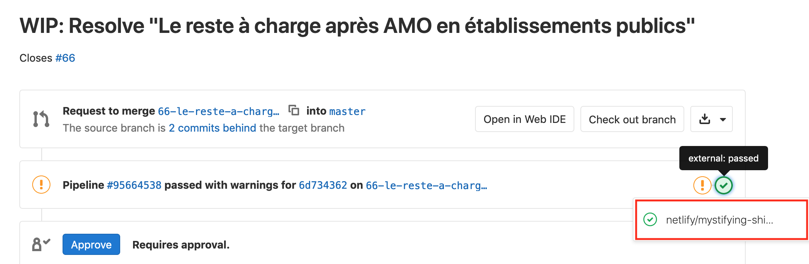

# Guide de contribution
<!-- SPDX-License-Identifier: MPL-2.0 -->

**Sommaire**

[[_TOC_]]

## Comment utiliser Gitlab pour contribuer
Toute personne souhaitant contribuer est invitée à le faire. Les contributions peuvent porter sur la correction des erreurs, la mise à jour de certains champs, compléter des pages existantes, et en créer de nouvelles. Toutes améliorations, même d'apparence mineure comme la correction de fautes d'orthographe, améliorent pour tous la qualité du contenu. Un processus de relecture et de validation a été mis en place afin de garantir un contenu de qualité. Merci de s'y [référer]() avant toute contribution. 

Il est possible de contribuer de plusieurs manières : 
- en créant un ticket pour signaler une erreur, proposer une nouvelle idée de fiche par exemple
- en modifiant une à plusieurs fois une [fiche] 
- en créant une nouvelle fiche
- en partageant des [programmes]()

## Créer un ticket
Les tickets sont des outils de communications autour du projet. Ils peuvent être attribués à une ou plusieurs personnes en désignant des assignés.

Des étiquettes peuvent être ajoutées pour décrire les tickets. Dans le cadre de la documentation collaborative, les étiquettes disponibles sont Rédaction, Développement, Bug, A faire, En cours, Prêt fusion

Les tickets peuvent être visualisés sous la forme de [liste](https://gitlab.com/healthdatahub/documentation-snds/-/issues), [tableaux](https://gitlab.com/healthdatahub/documentation-snds/-/boards/1086586?&label_name[]=D%C3%A9veloppement) où il est possible de trier par étiquette.

### Comment créer un ticket
Pour créer un ticket : aller dans `Tickets` > `Nouveau ticket`. 
Une fenêtre s'ouvre, permettant de décrire le ticket à créer.

1. Donner un titre
2. Faire une courte description
3. Vous assigner pour retrouver facilement votre ticket et assigner les personnes avec qui vous collaborez
4. Ajouter des étiquettes (label)
5. Enregistrer le ticket

### Retrouver un ticket créé
Pour retrouver un ticket dans lequel on s'est assigné, il faut aller dans la barre de navigation de Gitlab et cliquer sur la l'onglet `Tickets` (cet onglet est juste à droite de la barre de recherche)

### Naviguer dans le ticket créé
Une fois, le ticket validé, ce dernier comporte un titre, une description. Une liste des personnes assignées est disponible dans l'onglet à droite et est éditable en cliquant sur `éditer`. Il est également possible d'éditer les étiquettes. Une conversation peut démarrer en utilisant l'outils `commentaire` (le format markdown peut être utilisé lors d'édition de commentaires). 

Chaque ticket comporte un numéro qui lui ait propre et qui permet de l'identifier. Il est possible de faire référence à un ticket dans une demande de fusion en indiquant `#numéro du ticket` en commentaire ou dans la description de la demande de fusion.

## Modifier une fiche

### 1. Créer un Ticket  
Avant de modifier directement une fiche, il est conseillé de créer avant tout un ticket. 

Si les modifications proposées sont jugées mineures (fautes d'orthographes, *etc.*) par le contributeur, l'étape de la création de ticket peut être sautée.

Si la modification est plus importante (ajout de code, d’un paragraphe, mise à jour etc.), il est utile de créer un ticket décrivant les modifications qui vont être apportées. Cela permet d'informer la communauté sur l'évolution du projet de documentation.

### 2. Ouvrir et éditer le fichier en mode édition
Il y a deux manières d'éditer un fichier : en passant par le site de la documentation, ou en accédant à l'interface d'édition par Gitlab.

En bas de chaque page de la documentation se trouve un lien, vous invitant à éditer la fiche sur Gitlab. Ce lien redirige directement vers l'interface de Gitlab.

La seconde option pour modifier une fiche est de trouver la fiche à modifier dans le dépôt sur Gitlab et d'ouvir l'interface d'édition avec le bouton `Editer`.

Dans l'interface d'édition, il est possible de modifier le nom d'une fiche, modifier le texte en utilisant le format markdown. 

::: Tips
- le nom d'une fiche doit obligatoirement se terminer par `.md`
- le texte est rédigé au format markdown. Il est possible d'utiliser la barre d'édition de texte pour s'aider pendant la rédaction
- Cliquer sur Soft wrap pour éviter que la longueur des lignes soit supérieure à celle de l’écran.  
- En cliquant sur `Aperçu`, une prévisualisation de la fiche peut être obtenue (certaines images peuvent ne pas s'afficher. Les blocs d'information étant des objets View Press, la prévisualisation ne pourra pas se faire.)
:::

Vous pouvez vous reporter aux fiches [inclure une image](), [Tutoriel Markdown]() pour aller plus loin.

### 3. Enregistrer les modifications apportées
Un formulaire en bas de la page éditée permet d'enregistrer vos modifications dans un commit. 
- Ecrivez un message décrivant les modifications apportées : une description courte, puis éventuellement une description plus longue séparée par une ligne vide.
- Choississez le nom d'une nouvelle branche de travail, **avec un nom explicite**. N'oubliez pas de remplacer les espaces par des tirets, sinon un message d'erreur s'affichera.

En bas de page, la case `créer une nouvelle demande de fusion` est automatiquement cochée. Laissez cette case cochée. Cela permettra une fois une fois les modifications enregistrées dans une branche cible, de demander à incorporer les modification effectuée dans la branche cible dans la branche master. Cela permettra également de discuter et valider les modifications apportées avant de les inclures dans la documentation.

- Cliquer sur `Commit Changes`

### 4. Ouverture d'une demande de fusion (merge-request)
Une page s'ouvre alors pour configurer cette merge-request.

- Donner un titre, remplir la description
- Ajouter des assignés pour la [relecture et validation]()
- Si le travail n’est pas fini et que des modifications seront apportées ultérieurement, cocher la case `Start the title with WIP`
- Soumettre votre merge-request en bas de page.

::: Tips
Enregistrer une demande de fusion ne veut pas dire que la fusion se lancera automatiquement après cette demande. L'incorporation des modifications proposées dans la documentation nécessite une [validation] de certains membres sur Health Data Hub. Des modifications peuvent toujours être apportées sur la même fiche, dans la même demande de fusion (et donc sur la même branche). 

Les demandes de fusions sont validées par certains membres de HDH. 
:::

### 5. Naviguer dans une demande de fusion (merge-request)

* Onglet `Vue d'ensemble``

L'onglet vue d'ensemble permet d'avoir accès une visualisation générale de la demande de fusion. L'interface est très proche de celle des tickets.
On y retrouve le titre, la description remplie lors de l'ouverture de demande de fusion. Il est possible de rajouter des assignés et des étiquettes dans le panneau de droite. La boite de dialogue peut être utilisée comme dans les tickets pour des discussions autour des modifications apportées. 

En cliquant sur le bouton `Edit` il est possible d'éditer la demande de fusion (changer le titre, la description principale, ou encore ajouter/enlever le statut `WIP`)

Des icônes rondes (de couleur verte, orange, rouge, bleue) sont présntes. Ces icones correspondent à des pipelines. Se référer au point pipelines ci-dessous pour plus de détails.

* Onglet `Commits`

En allant sur l'onglet `Commits`, l’historique des commits et donc des modifications s'affiche. On retrouve également les icônes rondes des pipelines. 

* Onglet `Pipelines`

En allant sur l'onglet `Pipelines`, on retrouve les icônes rondes rencontrées dans les onglets `Vue d'ensemble`et `Commits`. 
Lorsqu'une merge-request est ouverte, un "`pipeline`" est démarré pour effectuer des tests sur les liens hypertextes, la licence et construire une prévisualisation du site de la documentation. Ces 2 étapes sont symbolisées par des icônes rondes (la première icône correspond aux tests et la seconde à la prévisualisation du site de la documentation)

Les tests permettent de vérifier que les liens externes et internes sont valides. Il y a également un test permettant de vérifier que l'identifiant de la licence est bien présent. En cas d’échec, des icônes oranges apparaissent pour les tests des lien externes et de la licence et une icône rouge apparaît pour le test des liens internes. 

La [fiche]() reprenant les erreurs courantes rencontrées peut être utilisée pour corriger de manière autonome ces tests si le contributeur se sent à l'aise. 

Avant d’accepter une demande de fusion, ces tests sont toujours verifiés par les mainteneurs et les corrections nécessaires sont apportées en cas d’échec.

Lorsque la prévisualisation est construite, la deuxième icône passe au vert. 
Cliquer dessus permet d'ouvrir la prévisalisation du site. 

À chaque nouveau commit sur la branche, le pipeline est relancé, et la prévisualisation est mise à jour avec la même url.

* Onglet `Changes`

### 6. Apporter des modifications supplémentaires dans la même demande de fusion

### 7. Suggérer des modifications

### 8. Incorporation des modifications dans le projet

## Créer une fiche

## Partager un programme

### 4- Prévisualisation d'une merge-request

Lorsqu'une merge-request est ouverte, un "`pipeline`" est démarré pour effectuer des tests sur les liens hypertextes, et construire une prévisualisation du site. 
Ces 2 étapes sont symbolisées par des icônes rondes.

Lorsque la prévisualisation est construite, la deuxième icône passe au vert. 
Cliquer dessus permet d'ouvrir la prévisalisation du site. 

À chaque nouveau commit sur la branche, le pipeline est relancé, et la prévisualisation est mise à jour avec la même url.

### 5- Ajouter des commits sur une branche existante

Il est possible d'ajouter des commits sur une branche de travail existante. 
Il faut pour cela sélectionner la branche de travail dans la vue fichier. 

On peut alors éditer de nouveaux documents. Les nouveaux commits apparaîtront alors dans la merge request associée à cette branche.