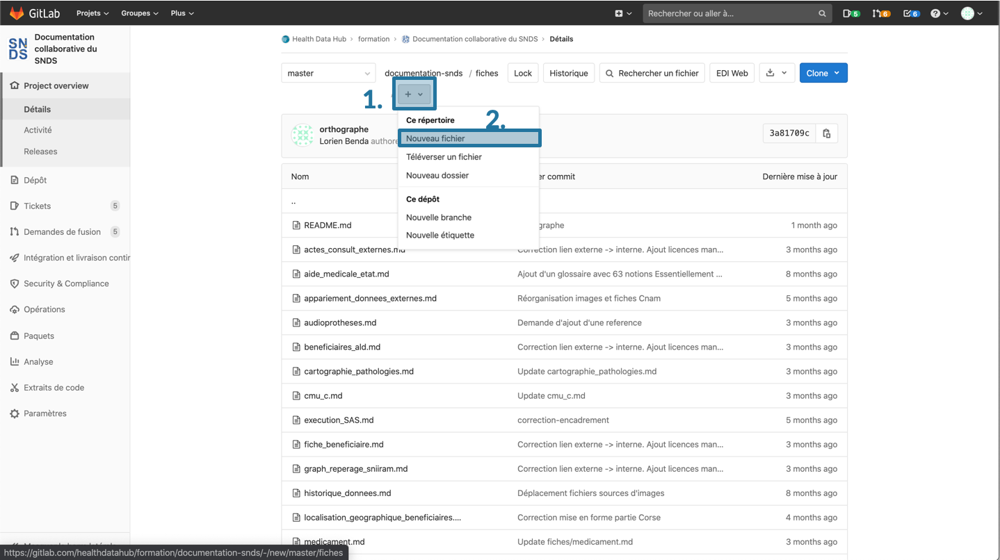
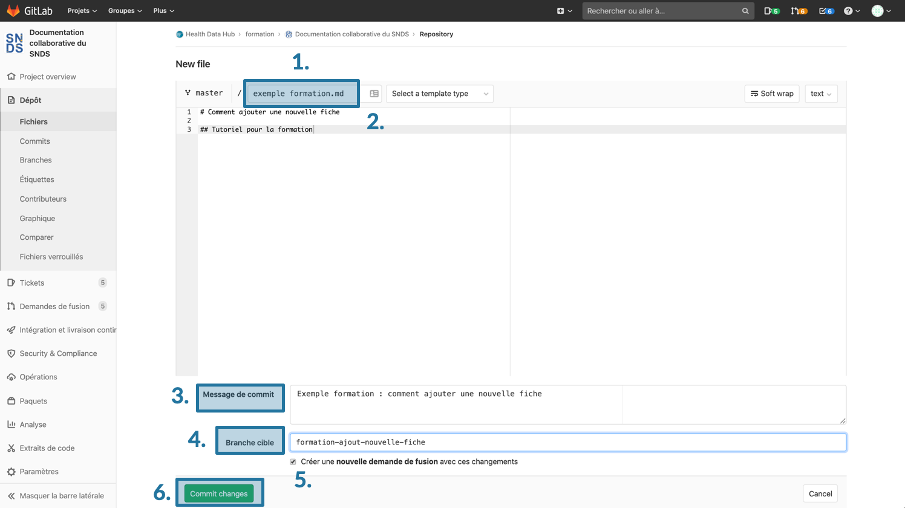

# Créer une fiche
<!-- SPDX-License-Identifier: MPL-2.0 -->

Les pages du site internet sont des fichiers textuels, stockés dans différents dossiers à la racine, principalement `introduction` pour les tutoriels haut niveau, `fiches` pour les fiches thématiques, et `glossaire`.

## Créer un Ticket  
Avant de créer une fiche, un [ticket](Ticket.md) décrivant une proposition de fiche doit être créé. Les personnes susceptibles de pouvoir participer à la fiche soit en tant que contributeurs, soit en tant que relecteur, peuvent être mentionnées dans le ticket. Cela permet d'informer la communauté sur l'évolution du projet de documentation.

## Créer une nouvelle fiche
Après avoir créé un ticket, retourner dans le menu principal `Dépot`. Allez dans le dossier `fiches` ou `glossaire` selon le type de fiche que vous souhaitez créer. Cliquer sur l'onglet `+` et choisir `nouveau fichier`. 

<p style="text-align:center;">

</p>

Une fenêtre d'édition s'ouvre. Celle-ci est identique à celle lors de la [modification de fiche](Modifier_une_fiche.md).

* Mettre un nom de fichier finissant par `.md`
* Écrire la fiche au format Markdown, en mettant cette ligne de commentaire après le titre.
```
<!-- SPDX-License-Identifier: MPL-2.0 -->
```

::: tip
- le nom d'une fiche doit obligatoirement se terminer par `.md` pour indiquer à Gitlab le format du fichier. Le nom doit être en minuscule (sauf sigle) et sans espace, pour simplifier les liens internes. 
- le texte est rédigé au format markdown. Lorsque la fiche est créée, la barre d'édition Markdown n'est pas visible. Elle appraitra une fois le premier commit et la demande de fusion enregistrés.
- Cliquer sur Soft wrap pour éviter que la longueur des lignes soit supérieure à celle de l’écran.  
- La fonction `Aperçu` (prévisualisation de la fiche) n'est pas disponible. Elle le sera une fois le premier commit et la demande de fusion enregistrés.
:::

Un formulaire en bas de la page éditée permet d'enregistrer vos modifications dans un commit :  
* Écrivez un message décrivant les modifications apportées: une description courte, puis éventuellement une description plus longue séparée par une ligne vide.
* Choisissez le nom d'une nouvelle branche de travail, **avec un nom explicite**. N'oubliez pas de remplacer les espaces par des tirets, sinon un message d'erreur s'affichera.
* En bas de page, la case `créer une nouvelle demande de fusion` est automatiquement cochée. Laissez cette case cochée. 

<p style="text-align:center;">

</p>

## Enregistrer la fiche (demande de fusion ou merge)
Une page s'ouvre alors pour configurer la demande de fusion.

- Donner un titre, remplir la description
- Ajouter des assignés pour la [relecture et validation](../A_lire)
- Si le travail n’est pas fini et que des modifications seront apportées ultérieurement, cocher la case `Start the title with WIP`
- Soumettre votre merge-request en bas de page.

::: tip
Enregistrer une demande de fusion ne veut pas dire que la fusion se lancera automatiquement après cette demande. L'incorporation des modifications proposées dans la documentation nécessite une [validation](../A_lire/README.md) de certains membres sur Health Data Hub. Des modifications peuvent toujours être apportées sur la même fiche, dans la même demande de fusion (et donc sur la même branche). 


Les demandes de fusions sont validées par [certains membres de HDH](../A_lire/README.md). 
:::

## Naviguer dans une demande de fusion (merge-request)
Pour apprendre à naviguer dans une demande de fusion, se reporter à la fiche [dédiée](demande_fusion.md).

## Apporter des modifications supplémentaires dans la même demande de fusion
Ce processus est décrit dans la fiche [Modifier une fiche](Modifier_une_fiche.md#apporter-des-modifications-supplémentaires-dans-la-même-demande-de-fusion)

## Suggérer des modifications
Lors du [processus de relecture](../A_lire/README.md#processus-de-relecture-et-validation), des modifications peuvent être suggérées par le relecteur. 

Se référer à la fiche [processus de relecture](processus_relecture.md) dédiée.

## Incorporation des modifications dans le projet
Lorsque le [processus de relecture](../A_lire/README.md#processus-de-relecture-et-validation) est terminé, les modifications peuvent être incorporées dans la documentation. Aller dans l'onglet `Vue d'ensemble` de la demande de fusion. Enlever l'étiquettes `Etape: en cours` si elle a été mise. Enlever le statut `WIP` en allant dans le bouton `Editer`. Ajouter l'étiquette `Etape : Prêt fusion`. 

Cela permet aux mainteneurs du projet de savoir visuellement quelles demandes de fusion sont prêtes à être incorporées à la documentation.
Une description complète des demandes de fusion est disponible dans la fiche [dédiée](demande_fusion.md)