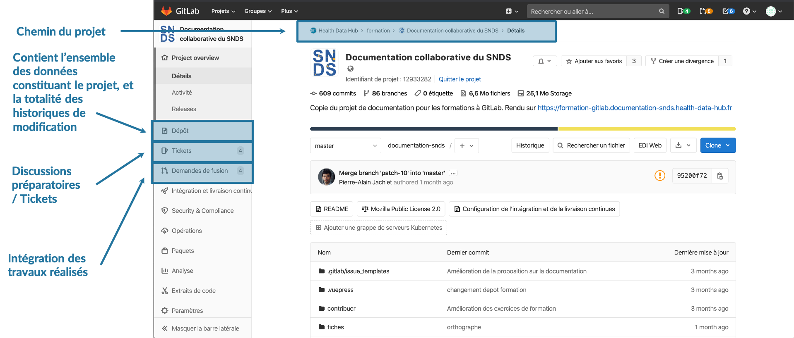
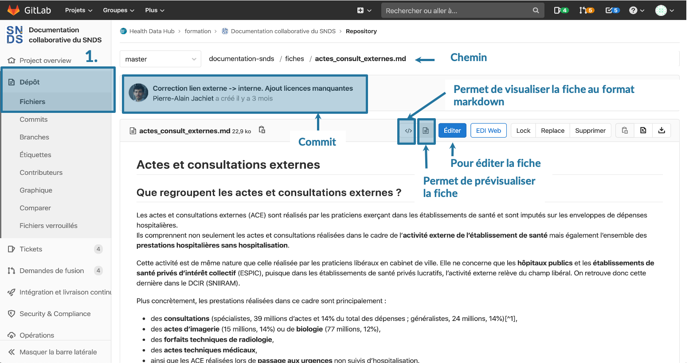
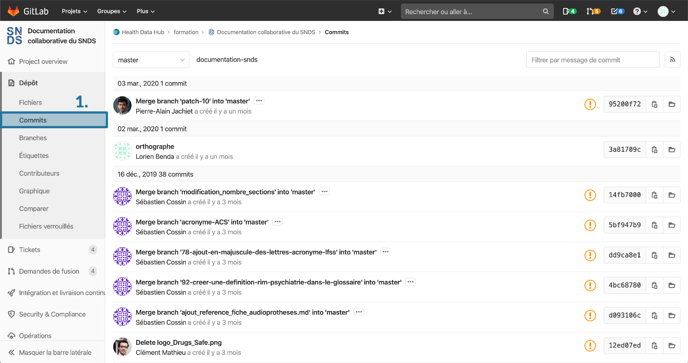
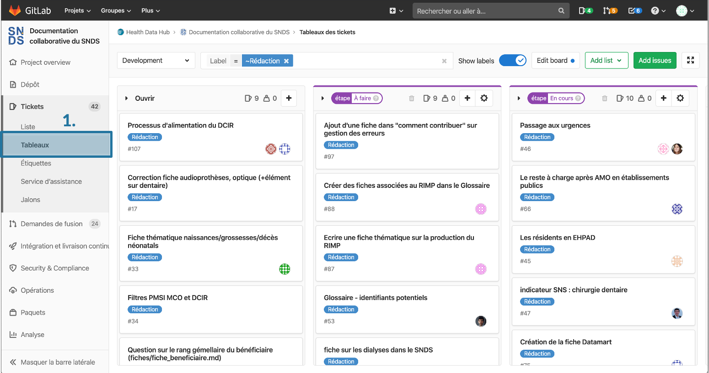
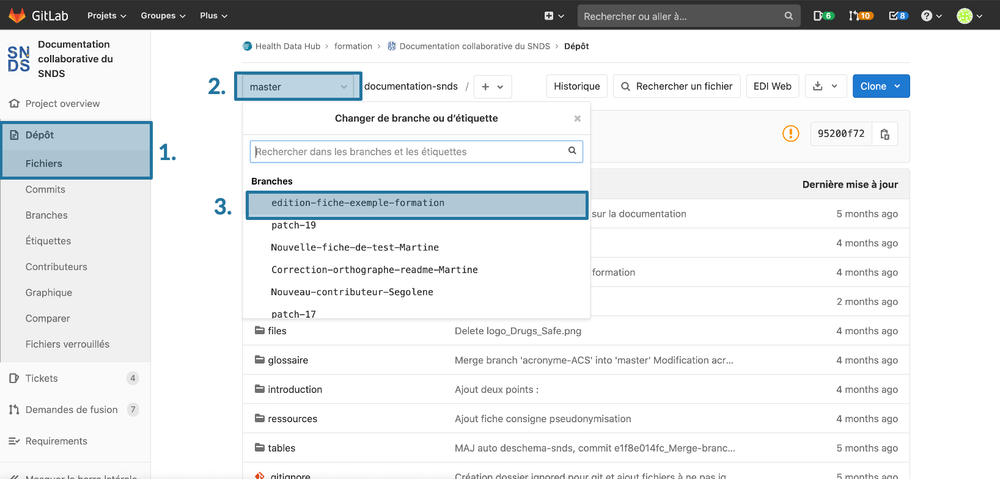
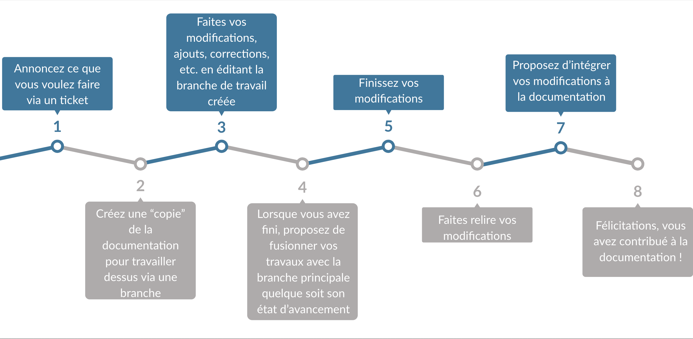

# Introduction à GitLab
<!-- SPDX-License-Identifier: MPL-2.0 -->

La documentation du SNDS est réalisée collaborativement sur [GitLab](https://gitlab.com/healthdatahub/documentation-snds).

Une formation est préférable pour manipuler facilement cette plateforme.
Les mainteneurs du projet organisent régulièrement des journées de formation (gratuites), via le [groupe Meetup Health-Data-Hub](https://www.meetup.com/fr-FR/Health-Data-Hub/). 

N'hésitez pas à nous solliciter pour en organiser d'autres !

Nous présentons ici une introduction à GitLab pour les autodidactes, ou comme mémo après une formation.  

## Texte Markdown

La documentation est écrit en texte "brute", avec un balisage léger appelé **Markdown**, qui permet d'indiquer la mise en page.
 
Se référer au [Tutoriel Markdown](tutoriel_markdown.md) pour plus de détails. 
 
## Concepts clés de git et GitLab
Gitlab est une plateforme opensource et collaborative de développement basé sur Git. Gitlab permet d'héberger des projets web, du code, de la documentation. La gestion des différentes versions et conflits est prise en compte dans Gitlab et permet le travail de nombreux collaborateurs simultanément, efficacement et de manière interactive.

Git a été développé à l'origine pour la gestion et le développement du code source pour le kernel de Linux. 

## Changer la langue dans Gitlab
Il est possible de paramétrer GitLab en français dans l'onglet `Preferences` des `Settings` de votre compte (en haut à droite de la fenêtre). 
Ce guide se base sur la version française de l'interface. Il est à noter que la traduction n'est pas complète et que certains termes ne sont pas traduits.

## Naviguer dans Gitlab

### Liste de projets 
En cliquant sur le logo de gitlab en haut à droite, la liste des projets auxquels vous participez est disponible. Pour chaque projet, il est indiqué le nom, si le projet est public (logo de la Terre) ou privé (logo d'un cadenas), votre statut (développeur ou mainteneur), ainsi que la date de la dernière mise à jour.

### Interface Gitlab pour un projet
Après avoir sélectionné un projet, la page qui s'affiche contient : 
- le chemin du projet
- l'onglet [*Dépôt*](Introduction_Gitlab.md#d%C3%A9p%C3%B4t) dans le menu à droite contient l'ensemble des données constituants le projet et la totalité des historiques de modification
- l'onglet [*Ticket*](Introduction_Gitlab.md#ticket) dans le menu déroulant contenant les discussions préparatoires/Ticket
- l'onglet [*Demande de fusion*](Introduction_Gitlab.md#demande-de-fusion) permettant l'intégration des travaux réalisés à la documentation

Chaque élément est détaillé ci-dessous.

#### Dépôt
##### Fichiers
En cliquant sur `Dépôt`>`Fichiers` dans le menu à droite, les différents dossiers de la documentation sont accessibles. Les fiches de la documentation sont contenues dans le dossier `fiches`, les fiches du glossaire sont contenues dans le dossier `glossaire`. Les documents pdf, images sont contenus dans le dossier `files`. 

Au-dessus des dossiers, il est affiché le dernier `commit` soit une description (auteur, date et description) des dernières modifications apportées au projet de la documentation. 

En cliquant sur une fiche, une page de prévisualisation s'affiche. Cette page permet de prévisualiser la fiche, visualiser la fiche au format markdown, d'[éditer la fiche](Modifier_une_fiche.md). Au-dessus du titre de la fiche, il est indiqué la dernière modification ayant eu lieu sur cette fiche (le dernier `commit`).

##### Commits
En cliquant sur `Dépôt`>`Commits` dans le menu à droite, l'[historique](https://gitlab.com/healthdatahub/documentation-snds/commits/master) des modifications ayant eu lieu s'affiche via des commits. Un commit est une description des modifications effectuées. Il comprend l'auteur, la date et une courte description des modifications. 

#### Ticket
Les [tickets](Ticket.md) sont des outils de communication autour du projet. Ils peuvent être attribués à une ou plusieurs personnes en désignant des assignés. Ils peuvent être utilisés pour signaler un problème, proposer une amélioration sur le site de la documentation, proposer une nouvelle idée de fiche.

Les tickets peuvent être visualisés sous la forme de liste, tableaux, ou encore par étiquettes.

##### Liste
Sous forme de liste les tickets sont classés par ordre de création. Chaque ticket comprend un numéro `#numéro` permettant de l'identifier, un titre, la date d'ouverture ainsi que l'auteur. Des étiquettes peuvent être présentes à côté du ticket pour apporter des informations sur le type d'action à faire et l'état d'avancement. Dans le cadre de la documentation collaborative, les étiquettes disponibles sont Rédaction, Développement, Bug, A faire, En cours, Prêt-fusion.

Tant que le ticket est ouvert, il est classé dans l'onglet `Open`, s'il est résolu il est classé dans l'onglet `Closed`.

##### Tableaux
L'affichage des tickets sous la forme de tableau permet de savoir quelles fiches sont à faire, celles qui sont en cours de rédaction et d’y contribuer éventuellement. Il est possible d'afficher uniquement les tickets qui comporte une étiquette en allant dans la barre de recherche `Lable` et en ajoutant `=` et `Nom de l'étiquette`.

### Notion de branches et de travail à plusieurs en parallèle
Gitlab est un outil extrêmement puissant permettant de collaborer à plusieurs sur un même projet et en prenant en compte les conflits d'édition. 

Pour cela, Gitlab utilise des *branches*. Les branches permettent de gérer plusieurs versions de travail en parallèles. Le site web de la documentation publie la branche principale, appelée `master`. Les notions de branches sont souvent illustrées dans des schémas comme celui-ci dessous.  

Prenons l'exemple de deux contributeurs qui souhaitent pour l'un corriger une faute d'orthographe et pour l'autre créer une nouvelle fiche sur le cepidc.

Ces deux contributeurs vont pourvoir éditer la documentation de façon indépendante. Avant toute modification, le projet est représenté par un rond bleu dans le schéma ci-dessous et est sur la branche principale *master*. 

Afin de pouvoir corriger les fautes d'orthographes repérées, le premier contributeur va faire une copie du projet de la documentation, corriger l'orthographe et va l'enregistrer sur une nouvelle branche appelée ici *correction orthographe*. Le nom de la branche est choisi par le contributeur lors que la copie du projet initial. Les branches de travail sont nommées selon l'objet des modifications apportées. Le projet initial qui était représenté par un rond bleu est donc copié dans une version de travail avec correction des fautes d'orthographes, qui est ici le rond vert. La correction des fautes d'orthographes est indiqué par un commit, représenté par une flèche dans le schéma. 

Un second contributeur, souhaite lui ajoute une nouvelle fiche. Il va donc copier le projet initial (rond bleu) et intégrer à cette copie la nouvelle fiche. L'ajout sera enregistré avec un commit. La version de travail de ce second contributeur correspond donc au premier rond violet sur le schéma. 

A ce stage 3 versions coexistent donc en même temps: la version principale disponible sur le site web dans la branche master. La version du premier contributeur avec des corrections de faute d'orthographe sur la branche *correction-orthographe*, et la version du second contributeur avec une nouvelle fiche sur la branche *creation-fiche-cepidc*. Ces deux dernières versions ne sont visibles que sur Gitlab, en [choisissant la branche de travail](Introduction_Gitlab.md#choisir-une-version-de-travail). 

Le premier contributeur ayant fini ses corrections décide de les intégrer à la documentation principale, les différences entre le rond vert et le rond bleu initial seront donc incorporées à la documentation pour donner un nouveau rond bleu. Ce processus d'incorporation s'appelle une demande de fusion (_Merge Request_ en anglais).

Le second contributeur peut continuer d'apporter des ajouts/modifications sur la nouvelle fiche. Ce second apport, sera encore une fois enregistré par un commit. Le projet correspondra alors à ce moment le second rond violet pour le second contributeur. A ce stade, la version web de la documentation comprendra donc les corrections d'orhographe (puisqu'elles ont été intégrées) mais pas encore la nouvelle fiche cepidc. Pour rendre disponible la fiche cepidc, il faudra donc faire une nouvelle demande de fusion entre le second rond violet et le second rond bleu. 

Les demandes de fusion/merge-request (MR) permettent donc d'intégrer une branche de travail dans la branche principale.  

<iframe src="https://docs.google.com/presentation/d/e/2PACX-1vTNK8oG33Ikp4aqr_7KIWTvfC3ka9lu0G54uSfEMuyC9j67kOgwMhZE4nEc-_RgG1BDE-QGiR0PouS_/embed?start=false&loop=false&delayms=3000" frameborder="0" width="960" height="569" allowfullscreen="true" mozallowfullscreen="true" webkitallowfullscreen="true">
</iframe>
</iframe>

### Demande de fusion
Les modifications proposées dans la branche de travail sont discutées et validées avant d'être publiées. Ces modifications peuvent être retrouvées dans l'onglet `Demande de fusion` du menu à droite.
Pour cela, les relecteurs commentent la demande de fusion dans l'onglet `Discussion`, ou font des remarques ligne par ligne dans l'onglet `Changes`. 

Par défaut, seul l'auteur initial d'une branche en modifie le contenu, afin d'éviter des conflits d'édition. 
Si un relecteur souhaite ajouter des modifications (=commits) sur une branche, il en fait d'abord la demande. 

Lors de l'intégration d'une demande de fusion à la branche principale master, d'éventuels conflits d'éditions sont gérés par les mainteneurs. 
Pour limiter ces conflits, il faut limiter la divergence des branches de travail par rapport à la branche master. 
On découpera donc les contributions en petit morceaux cohérents, rapides à valider et intégrer.

Une fiche détaillée est dédiée aux [demandes de fusion](demande_fusion.md)

### Choisir une version de travail
Pour choisir une version de travail, il suffit d'aller dans l'onglet `Dépôt`, puis de cliquer sur le menu déroulant où il est indiqué *master*. Toutes les branches encore ouverte et n'ayant pas encore été fusionnées à la branche principale sont disponibles dans ce menu. 

## Procédure de contribution à la documentation
Les différentes notions abordées précédemment sont exploitées lors d'une contribution à la documentation via Gitlab. Le processus de contribution est décrit dans la figure ci-dessous. 

Des fiches sur les [tickets](Ticket.md), la [modification d'une fiche](Modifier_une_fiche.md), la [création d'une fiche](Creer_une_fiche.md) et sur les [demandes de fusions](demande_fusion.md) permettent d'aller plus loin dans l'utilisation de Gitlab. 