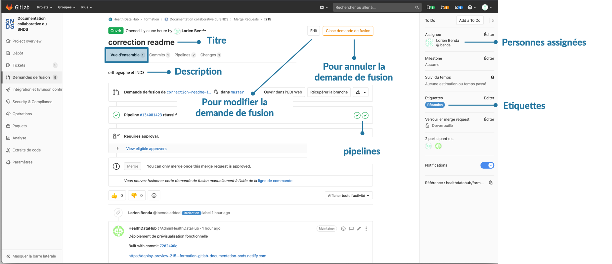
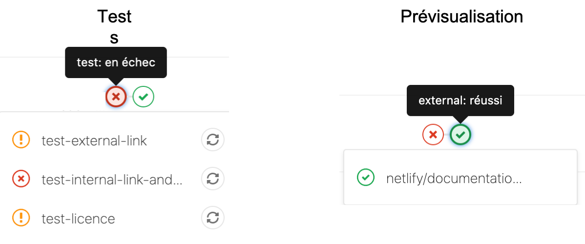
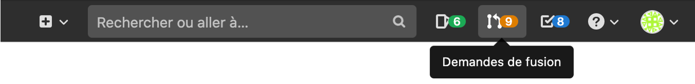

# Demande de fusion
<!-- SPDX-License-Identifier: MPL-2.0 -->

Cette fiche comporte les principales fonctionnalités d'une demande de fusion

## Naviguer dans une demande de fusion (merge-request)

Lorsqu'une demande de fusion est créée, quatre onglets sous le titre de la demande de fusion permettent d'avoir une vue d'ensemble, avoir accès à l'historique des modifications, d'effectuer des tests sur la fiche, d'apporter de nouvelles modifications et comparer deux versions.

* Onglet `Vue d'ensemble`

L'onglet vue d'ensemble permet d'avoir accès à une visualisation générale de la demande de fusion. L'interface est très proche de celle des tickets.
On y retrouve le titre, la description remplie lors de l'ouverture de demande de fusion. Il est possible de rajouter des assignés et des étiquettes dans le panneau de droite. La boite de dialogue peut être utilisée comme dans les tickets pour des discussions autour des modifications apportées. 

En cliquant sur le bouton `Edit` il est possible d'éditer la demande de fusion (changer le titre, la description principale, ajouter/enlever le statut `WIP`)

Des icônes rondes (de couleur verte, orange, rouge, bleue) sont présentes. Ces icônes correspondent à des pipelines (se référer au point pipelines ci-dessous pour plus de détails) .

* Onglet `Commits`

En allant sur l'onglet `Commits`, l’historique des commits et donc des modifications s'affiche. On retrouve également les icônes rondes des pipelines. 

* Onglet `Pipelines`

En allant sur l'onglet `Pipelines`, on retrouve les icônes rondes rencontrées dans les onglets `Vue d'ensemble`et `Commits`. 
Lorsqu'une merge-request est ouverte, un "`pipeline`" est démarré pour effectuer des tests sur les liens hypertextes, la licence et construire une prévisualisation du site de la documentation. Ces 2 étapes sont symbolisées par des icônes rondes (la première icône correspond aux tests et la seconde à la prévisualisation du site de la documentation)

Les tests permettent de vérifier que les liens externes et internes sont valides. Il y a également un test permettant de vérifier que l'identifiant de la licence est bien présent. En cas d’échec, des icônes oranges apparaissent pour les tests des liens externes et de la licence et une icône rouge apparaît pour le test des liens internes. 

La [fiche](erreur_pipelines.md) reprenant les erreurs courantes rencontrées peut être utilisée pour corriger de manière autonome ces erreurs si le contributeur se sent à l'aise. 

Avant d’accepter une demande de fusion, ces tests sont toujours vérifiés par les mainteneurs et les corrections nécessaires sont apportées en cas d’échec.

Lorsque la prévisualisation est construite, la deuxième icône passe au vert. 
Cliquer dessus, permet d'ouvrir la prévisualisation du site. 

À chaque nouveau commit sur la branche, le pipeline est relancé, et la prévisualisation est mise à jour avec la même url.

* Onglet `Changes`

L'onglet `Changes` permet de comparer deux versions de la fiche, d'apporter de nouvelles modification et de suggérer des modifications.

En cliquant sur le bouton `paramètre`, il est possible de comparer les modifications par ligne ou comparer deux versions côte-à-côte. Les lignes supprimées/modifiées sont surlignées en rouge avec un symbole `-`. Les lignes ajoutées/sur lesquels des modifications ont eu lieu, sont surlignées en vert avec un symbole `+`. 

Dans le menu déroulant `compare` il est possible de choisir quelles versions sont à comparer. 

Le bouton Crayon `Edit File` permet d'apporter de nouvelles modifications (voir ci-dessous)

## Retrouver sa demande de fusion
Pour retrouver une demande de fusion dans lequel on s'est assigné, il faut aller dans la barre de navigation de Gitlab et cliquer sur le bouton orange  `Demande de fusion`. Si on ne s'est pas assigné dans la demande de fusion, il faut aller dans l'onglet `Demande de fusion` dans la barre à gauche de l'interface Gitlab et chercher sa demande de fusion parmi la liste.

