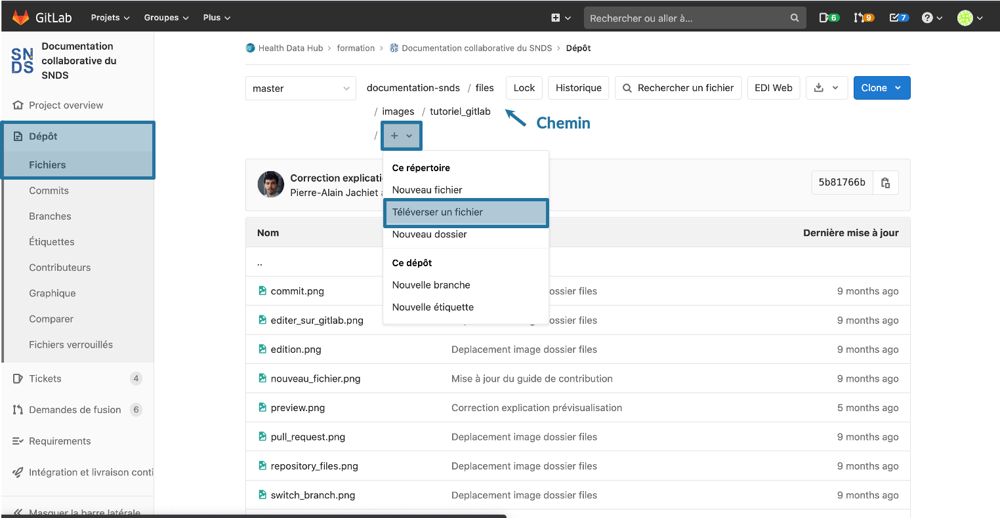
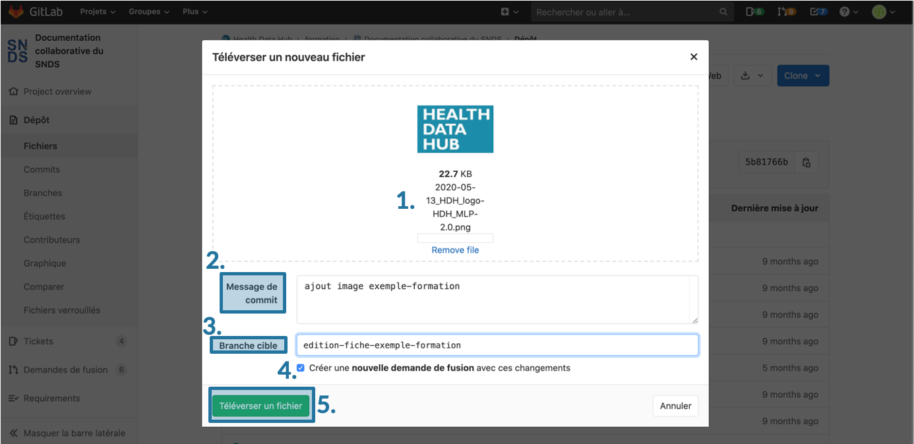
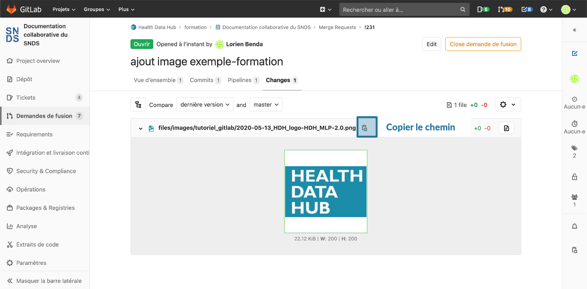
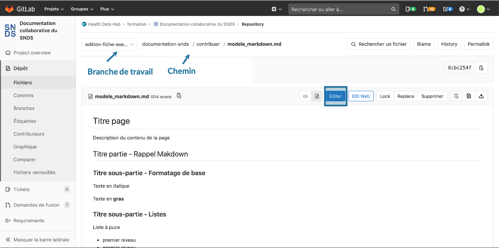

# Ajouter une image dans une fiche
<!-- SPDX-License-Identifier: MPL-2.0 -->

Les images sont un type particulier de fichier. Comme pour tout fichier partagé, vérifiez en amont que vous avez les droits pour la publier. 

## Image provenant d'un lien internet
Ouvrir en [édition la fiche](Modifier_une_fiche.md#ouvrir-et-éditer-le-fichier-en-mode-édition) dans laquelle vous souhaitez ajouter une image. Vous pourrez ensuite intégrer les images dans une page de documentation via un lien hypertexte précédé d'un point d'exclamation `!`.

Vous pouvez également utiliser des balises HTML pour centrer et choisir la taille de l'image.

La visualisation des fichiers pdf n'est pas supportée par le format Markdown. Il faut là aussi utiliser des balises HTML. 

Pour plus d'information, se reporter au [tutoriel Markdown](tutoriel_markdown.md#liens-hypertextes). 

## Image provenant d'un ordinateur en local
Si l'image provient d'un ordinateur en local, il faut d'abord l'ajouter dans le dépôt de Gitlab avant de pouvoir l'inclure dans une fiche. Lors de l'ajout de l'image dans Gitlab, une branche devra être créée. L'ajout de l'image dans la fiche devra ce faire dans la même branche que celle créée pour le versement de l'image dans Gitlab.

Si une image provient d'un document tierce, par exemple une présentation Powerpoint, il faut ajouter ce document tierce pour permettre des évolutions de l'image en repartant du fichier.

### Ajouter l'image dans Gitlab
Renommer sur votre ordinateur l'image à partager à ce format **date_auteur_nom-du-fichier_MPL-2.0.extension**

- `date` : a minima l'année, éventuellement le mois et le jour, au format AAAA-MM-JJ 
- `auteur` : nom court de l'organisation détentrice des droits
- `nom-du-fichier` : remplacer les espaces par des tirets `-`
- `MPL-2.0` : identifiant de licence
- `extension` : par exemple `.csv`, `.pdf`, `.odp`.

::: warning Note
- **Supprimer les espaces** dans les noms de fichiers, car ils compliquent les liens hypertextes (l'espace doit être indiqué par le caractère `%20`). 
- **Ne pas utiliser d'accents ou de caractères spéciaux**
- L'extension d'une image doit être en **minuscule**, sinon l'image n'est pas reconnue.
:::

Aller dans `Dépôt` > `Fichier` puis dans le dossier [files de Gitlab](https://gitlab.com/healthdatahub/documentation-snds/tree/master/files)). Vous pouvez soit ajouter les images dans le dossier de votre institut, soit dans le dossier générique `images`. Ouvrir le dossier où ajouter l'image. 

Cliquer sur le bouton `+` et choisir `téléverser un fichier`.

Ajouter l'image à téléverser, remplir une description de commit explicite, donner un nom de branche explicite (ne pas oublier de remplacer les espaces par des tirets). Laisser la case `Créer une nouvelle demande de fusion avec ces changements` cochée, puis cliquer sur `Téléverser un fichier`.

### Insérer l'image dans la fiche
Pour insérer une image dans une fiche, il faut que l'insertion dans la fiche se fasse dans la même branche que celle créée pour le versement de l'image dans Gitlab. 

Aller dans la [demande de fusion](demande_fusion.md) créée lors de l'ajout de l'image dans Gitlab. Aller dans l'onglet `Changes`, et copier le chemin de l'image. Si cela est nécessaire, vous pouvez vous remémorer le nom de la branche dans l'onglet `Vue d'ensemble`. 

Pour trouver la fiche à modifier, aller dans `Dépôt` > `Fichiers` et sélectionner la branche de travail précédemment utilisée.

Allez dans le dossier qui contient la fiche où l'image doit être incluse et ouvrir la fiche en mode édition. 

Vous pouvez ensuite intégrer l'image dans la page de documentation soit 
- via un lien hypertexte précédé d'un point d'exclamation `!` (cf [tutoriel Markdown](tutoriel_markdown.md#inclure-une-image))
- via des balises HTLM (cf [tutoriel Markdown](tutoriel_markdown.md#inclure-une-image))

Il faudra ensuite remplir le formulaire de bas de page (le commit est à remplir, le nom de la branche ne doit pas être modifié). Le commit ainsi créé apparaitra automatiquement dans la demande de fusion créée lors du versement de l'image. 

Vous pouvez ensuite continuer à apporter des modifications sur la même branche, ajouter de nouvelles images sur la même branche puis faire valider votre contribution par le [processus de relecture/validation](../A_lire/README.md#processus-de-relecture-et-validation). 