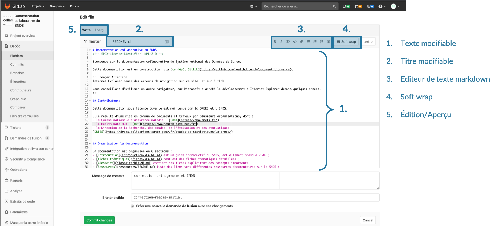
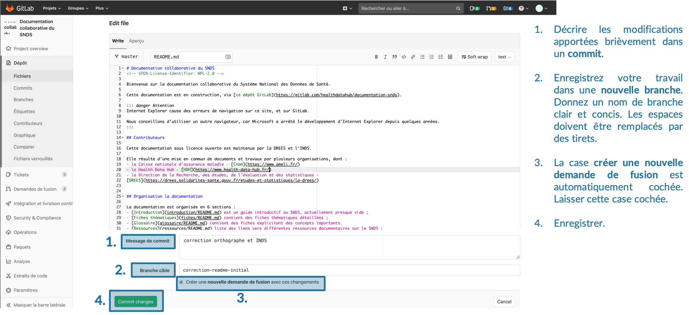
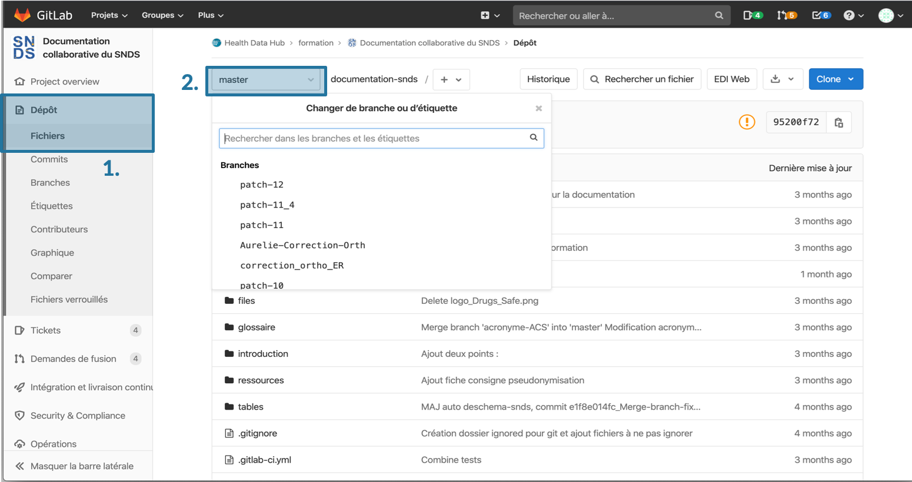
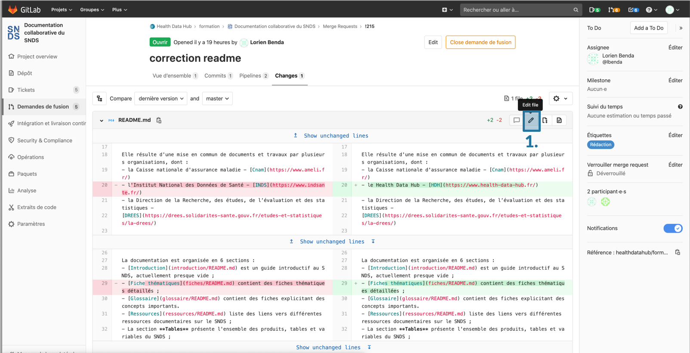

# Modifier une fiche
<!-- SPDX-License-Identifier: MPL-2.0 -->

## Créer un Ticket  
Avant de modifier directement une fiche, il est conseillé de créer avant tout un [ticket](Ticket.md). 

Si les modifications proposées sont jugées mineures (fautes d'orthographes, *etc.*) par le contributeur, l'étape de la création de ticket peut être sautée.

Si la modification est plus importante (ajout de code, d’un paragraphe, mise à jour etc.), il est utile de [créer un ticket](Ticket.md) décrivant les modifications qui vont être apportées. Cela permet d'informer la communauté sur l'évolution du projet de documentation.

## Ouvrir et éditer le fichier en mode édition
Il y a deux manières d'éditer un fichier : en passant par le site de la documentation, ou en accédant à l'interface d'édition par Gitlab.

En [bas de chaque page de la documentation](Utiliser_le_site_de_documentation.md) se trouve un lien, vous invitant à éditer la fiche sur Gitlab. Ce lien redirige directement vers l'interface de Gitlab.

La seconde option pour modifier une fiche est de trouver et afficher la fiche à modifier dans le dépôt sur [Gitlab](https://gitlab.com/healthdatahub/documentation-snds/-/tree/master/fiches) et d'ouvir l'interface d'édition avec le bouton `Editer`.

Dans l'interface d'édition, il est possible de modifier le nom d'une fiche, modifier le texte en utilisant le format markdown. 

::: tip
- le nom d'une fiche doit obligatoirement se terminer par `.md`
- le texte est rédigé au format markdown. Il est possible d'utiliser la barre d'édition de texte pour s'aider pendant la rédaction
- Cliquer sur Soft wrap pour éviter que la longueur des lignes soit supérieure à celle de l’écran.  
- En cliquant sur `Aperçu`, une prévisualisation de la fiche peut être obtenue (certaines images peuvent ne pas s'afficher. Les blocs d'information étant des objets View Press, la prévisualisation ne pourra pas se faire.)
:::

Vous pouvez vous reporter aux fiches [inclure une image](inclure_image.md), [tutoriel Markdown](tutoriel_markdown.md#liens-hypertextes) pour aller plus loin.

## Enregistrer les modifications apportées
Un formulaire en bas de la page éditée permet d'enregistrer vos modifications dans un commit. 
- Écrivez un message décrivant les modifications apportées: une description courte, puis éventuellement une description plus longue séparée par une ligne vide.
- Choisissez le nom d'une nouvelle branche de travail, **avec un nom explicite**. N'oubliez pas de remplacer les espaces par des tirets, sinon un message d'erreur s'affichera.

- En bas de page, la case `créer une nouvelle demande de fusion` est automatiquement cochée. Laissez cette case cochée. Cela permettra une fois une fois les modifications enregistrées dans une branche cible, de demander à incorporer les modifications effectuée dans la branche cible dans la branche master. Cela permettra également de discuter et valider les modifications apportées avant de les inclure dans la documentation.

- Cliquer sur `Commit Changes`

## Ouverture d'une demande de fusion (merge-request)
Une page s'ouvre alors pour configurer la demande de fusion.

- Donner un titre, remplir la description
- Ajouter des assignés pour la [relecture et validation](../Guide_contribution/README.md#processus-de-relecture-et-validation)
- Si le travail n’est pas fini et que des modifications seront apportées ultérieurement, cocher la case `Start the title with WIP`
- Soumettre votre merge-request en bas de page.

::: tip
Enregistrer une demande de fusion ne veut pas dire que la fusion se lancera automatiquement après cette demande. L'incorporation des modifications proposées dans la documentation nécessite une [validation](../Guide_contribution/README.md#processus-de-relecture-et-validation) de certains membres sur Health Data Hub. Des modifications peuvent toujours être apportées sur la même fiche, dans la même demande de fusion (et donc sur la même branche). 

Les demandes de fusions sont validées par [certains membres de HDH](../Guide_contribution/README.md#validation-et-fusion). 
:::

## Naviguer dans une demande de fusion (merge-request)
Pour apprendre à naviguer dans une demande de fusion, se reporter à la fiche [dédiée](demande_fusion.md).

## Apporter des modifications supplémentaires dans la même demande de fusion
Il existe deux méthodes pour apporter des modifications supplémentaires dans la même demande de fusion.

1. La première méthode consiste à ajouter des commits sur une branche de travail existante.
Pour cela aller dans la barre présente à gauche de l'interface Gitlab. Aller dans l'onglet `Dépôt` > `Fichiers`. Aller sur le bouton `master`. En cliquant dessus un menu déroulant contenant les branches de travail encore ouvertes s'affiche. Choisir la branche cible voulue, aller dans le dossier `Fiches` et ouvrir en mode édition la fiche à modifier. Les nouveaux commits ainsi créés apparaîtront alors dans la demande de fusion associée à cette branche.

2. La seconde méthode consiste à ouvrir sa demande de fusion. Dans l'onglet `Changes`, cliquer sur le bouton Crayon `Edit File`. Une fenêtre d'édition identique à celle lors de la première édition s'ouvre. Un nouveau commit décrivant les modifications apportées doit être enregistré. Il apparaitra dans l'historique des modifications dans la demande de fusion.

## Suggérer des modifications
Lors du [processus de relecture](../Guide_contribution/README.md#processus-de-relecture-et-validation), des modifications peuvent être suggérées par le relecteur. 

Se référer à la fiche [processus de relecture](processus_relecture.md) dédiée.

## Incorporation des modifications dans le projet
Lorsque le [processus de relecture](../Guide_contribution/README.md#processus-de-relecture-et-validation) est terminé, les modifications peuvent être incorporées dans la documentation. Aller dans l'onglet `Vue d'ensemble` de la demande de fusion. Enlever l'étiquettes `Etape: en cours` si elle a été mise. Enlever le statut `WIP` en allant dans le bouton `Editer`. Ajouter l'étiquette `Etape : Prêt fusion`. 

Cela permet aux mainteneurs du projet de savoir visuellement quelles demandes de fusion sont prêtes à être incorporées à la documentation.