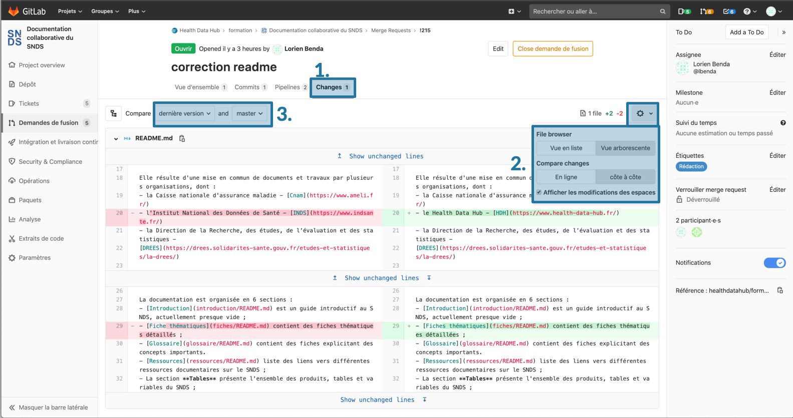
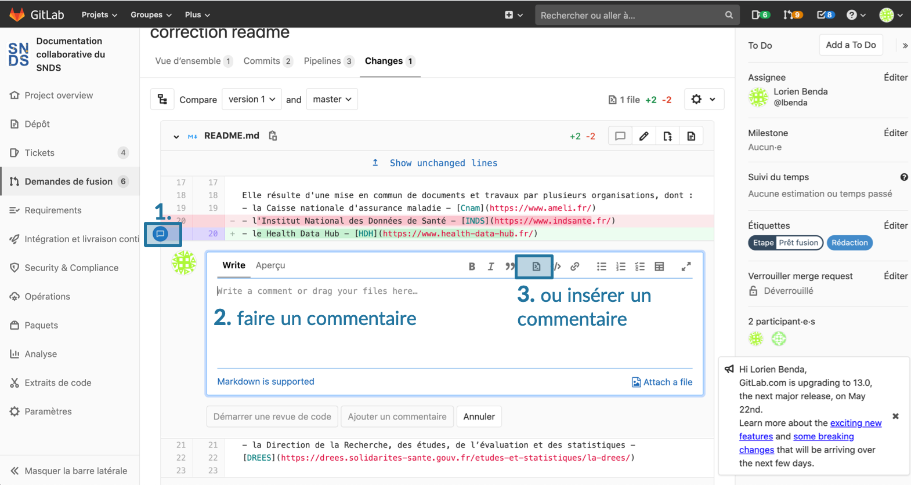

# Modifier une fiche
<!-- SPDX-License-Identifier: MPL-2.0 -->

## Créer un Ticket  
Avant de modifier directement une fiche, il est conseillé de créer avant tout un [ticket](Ticket.md). 

Si les modifications proposées sont jugées mineures (fautes d'orthographes, *etc.*) par le contributeur, l'étape de la création de ticket peut être sautée.

Si la modification est plus importante (ajout de code, d’un paragraphe, mise à jour etc.), il est utile de [créer un ticket](Ticket.md) décrivant les modifications qui vont être apportées. Cela permet d'informer la communauté sur l'évolution du projet de documentation.

## Ouvrir et éditer le fichier en mode édition
Il y a deux manières d'éditer un fichier : en passant par le site de la documentation, ou en accédant à l'interface d'édition par Gitlab.

En [bas de chaque page de la documentation](Utiliser_le_site_de_documentation.md) se trouve un lien, vous invitant à éditer la fiche sur Gitlab. Ce lien redirige directement vers l'interface de Gitlab.

La seconde option pour modifier une fiche est de trouver la fiche à modifier dans le dépôt sur [Gitlab](https://gitlab.com/healthdatahub/documentation-snds/-/tree/master/fiches) et d'ouvir l'interface d'édition avec le bouton `Editer`.

Dans l'interface d'édition, il est possible de modifier le nom d'une fiche, modifier le texte en utilisant le format markdown. 

::: Tips
- le nom d'une fiche doit obligatoirement se terminer par `.md`
- le texte est rédigé au format markdown. Il est possible d'utiliser la barre d'édition de texte pour s'aider pendant la rédaction
- Cliquer sur Soft wrap pour éviter que la longueur des lignes soit supérieure à celle de l’écran.  
- En cliquant sur `Aperçu`, une prévisualisation de la fiche peut être obtenue (certaines images peuvent ne pas s'afficher. Les blocs d'information étant des objets View Press, la prévisualisation ne pourra pas se faire.)
:::

Vous pouvez vous reporter aux fiches [inclure une image](inclure_image.md), [tutoriel Markdown](tutoriel_markdown.md) pour aller plus loin.

## Enregistrer les modifications apportées
Un formulaire en bas de la page éditée permet d'enregistrer vos modifications dans un commit. 
- Ecrivez un message décrivant les modifications apportées : une description courte, puis éventuellement une description plus longue séparée par une ligne vide.
- Choississez le nom d'une nouvelle branche de travail, **avec un nom explicite**. N'oubliez pas de remplacer les espaces par des tirets, sinon un message d'erreur s'affichera.

- En bas de page, la case `créer une nouvelle demande de fusion` est automatiquement cochée. Laissez cette case cochée. Cela permettra une fois une fois les modifications enregistrées dans une branche cible, de demander à incorporer les modification effectuée dans la branche cible dans la branche master. Cela permettra également de discuter et valider les modifications apportées avant de les inclures dans la documentation.

- Cliquer sur `Commit Changes`

## Ouverture d'une demande de fusion (merge-request)
Une page s'ouvre alors pour configurer la demande de fusion.

- Donner un titre, remplir la description
- Ajouter des assignés pour la [relecture et validation](contribuer/Guide_contribution/Contribuer_à_la_documentation.md)
- Si le travail n’est pas fini et que des modifications seront apportées ultérieurement, cocher la case `Start the title with WIP`
- Soumettre votre merge-request en bas de page.

::: Tips
Enregistrer une demande de fusion ne veut pas dire que la fusion se lancera automatiquement après cette demande. L'incorporation des modifications proposées dans la documentation nécessite une [validation](../Guide_contribution/README.md) de certains membres sur Health Data Hub. Des modifications peuvent toujours être apportées sur la même fiche, dans la même demande de fusion (et donc sur la même branche). 

Les demandes de fusions sont validées par certains membres de HDH. 
:::

## Naviguer dans une demande de fusion (merge-request)

Lorsqu'une demande de fusion est créée, quatre onglets sous le titre de la demande de fusion permettent d'avoir une vue d'ensemble, avoir accès à l'historique des modifications, d'effectuer des tests sur la fiche, d'apporter de nouvelles modifications et comparer deux versions.

* Onglet `Vue d'ensemble``

L'onglet vue d'ensemble permet d'avoir accès une visualisation générale de la demande de fusion. L'interface est très proche de celle des tickets.
On y retrouve le titre, la description remplie lors de l'ouverture de demande de fusion. Il est possible de rajouter des assignés et des étiquettes dans le panneau de droite. La boite de dialogue peut être utilisée comme dans les tickets pour des discussions autour des modifications apportées. 

En cliquant sur le bouton `Edit` il est possible d'éditer la demande de fusion (changer le titre, la description principale, ou encore ajouter/enlever le statut `WIP`)

Des icônes rondes (de couleur verte, orange, rouge, bleue) sont présntes. Ces icones correspondent à des pipelines. Se référer au point pipelines ci-dessous pour plus de détails.

* Onglet `Commits`

En allant sur l'onglet `Commits`, l’historique des commits et donc des modifications s'affiche. On retrouve également les icônes rondes des pipelines. 

* Onglet `Pipelines`

En allant sur l'onglet `Pipelines`, on retrouve les icônes rondes rencontrées dans les onglets `Vue d'ensemble`et `Commits`. 
Lorsqu'une merge-request est ouverte, un "`pipeline`" est démarré pour effectuer des tests sur les liens hypertextes, la licence et construire une prévisualisation du site de la documentation. Ces 2 étapes sont symbolisées par des icônes rondes (la première icône correspond aux tests et la seconde à la prévisualisation du site de la documentation)

Les tests permettent de vérifier que les liens externes et internes sont valides. Il y a également un test permettant de vérifier que l'identifiant de la licence est bien présent. En cas d’échec, des icônes oranges apparaissent pour les tests des lien externes et de la licence et une icône rouge apparaît pour le test des liens internes. 

La [fiche](erreur_pipelines.md) reprenant les erreurs courantes rencontrées peut être utilisée pour corriger de manière autonome ces erreurs si le contributeur se sent à l'aise. 

Avant d’accepter une demande de fusion, ces tests sont toujours verifiés par les mainteneurs et les corrections nécessaires sont apportées en cas d’échec.

Lorsque la prévisualisation est construite, la deuxième icône passe au vert. 
Cliquer dessus, permet d'ouvrir la prévisualisation du site. 

À chaque nouveau commit sur la branche, le pipeline est relancé, et la prévisualisation est mise à jour avec la même url.

* Onglet `Changes`

L'onglet `Changes` permet de comparer deux versions de la fiche, d'apporter de nouvelles modification et de suggérer des modifications.

En cliquant sur le bouton `paramètre`, il est possible de comparer les modifications par ligne ou comparer deux versions côte-à-côte. Les lignes supprimées/modifiées sont surlignées en rouge avec un symbole `-`. Les lignes ajoutées/sur lesquels des modifications ont eu lieu, sont surlignées en vert avec un symbole `+`. 

Dans le menu déroulant `compare` il est possible de choisir quelles versions sont à comparer. 

Le bouton Crayon `Edit File` permet d'apporter de nouvelles modifications (voir ci-dessous)

## Retrouver sa demande de fusion
Pour retrouver une demande de fusion dans lequel on s'est assigné, il faut aller dans la barre de navigation de Gitlab et cliquer sur le bouton orange  `Demande de fusion`. Si on ne s'est pas assigné dans la demande de fusion, il faut aller dans l'onglet `Demande de fusion` dans la barre à gauche de l'interface Gitlab et chercher sa demande de fusion parmi la liste.

## Apporter des modifications supplémentaires dans la même demande de fusion
Il existe deux méthodes pour apporter des modifications supplémentaires dans la même demande de fusion.

La première méthode consiste à ajouter des commits sur une branche de travail existante.
Pour cela aller dans la barre présente à gauche de l'interface Gitlab. Aller dans l'onglet `Dépôt` > `Fichiers`. Aller sur le bouton `master`. En cliquant dessus un menu déroulant contenant les branches de travail encore ouverte s'affiche. Choisir la branche cible voulue, aller dans le dossier `Fiches` et ouvrir en mode édition la fiche à modifier. Les nouveaux commits ainsi créés apparaîtront alors dans la demande de fusion associée à cette branche.

La seconde méthode consiste à ouvrir sa demande de fusion. Dans l'onglet `Changes`, cliquer sur le bouton Crayon `Edit File`. Une fenêtre d'édition identique à celle lors de la première édition s'ouvre. Un nouveau commit décrivant les modifications apportées doit être enregistré. Il apparaitra dans l'historique des modifications dans la demande de fusion.

## Suggérer des modifications
Lors du [processus de relecture](../Guide_contribution/README.md), des modifications peuvent être suggérées par le relecteur. 

* Soit en utilisant la boite de dialogue présente dans l'onglet `Vue d'ensemble` de la demande de fusion et en taguant la personne à qui les remarques sont adressées. 
* Soit en faisant un commentaire ou une proposition de modification sur une ligne spécifique. Pour cela, aller dans l'onglet `Changes`  de la demande de fusion, et passer la souris sur la ligne à commenter/modifier. Un bouton bleu contenant une bulle de conversation apparait à gauche. En le sélectionnant il est possible d'écrire un commentaire spécifique à la ligne sélectionnée. Une suggestion de modification peut être insérée à partir de la fenêtre des commentaires en cliquant sur le bouton `Insert Suggestion`. Cela fera apparaitre une suggestion de modification dans l'onglet `Vue d'ensemble` de la demande de fusion. Celle-ci pourra être acceptée ou refusée par l'auteur de la fiche.

::: Tips
Pour taguer une personne il suffit de taper `@` et une liste déroulante des personnes participant au projet de la documentation apparait. En tapant le nom de la personne recherchée dans la barre de recherche on peut donc sélectionner la personne souhaitée.
::: 

## Incorporation des modifications dans le projet
Lorsque le [processus de relecture](../Guide_contribution/README.md) est terminée, les modification peuvent être incorporées dans la documentation. Aller dans l'onglet `Vue d'ensemble` de la demande de fusion. Enlever l'étiquettes 'Etape: en cours' si elle a été mise. Enlever le statut `WIP` en allant dans le bouton `Editer`. Ajouter l'étiquette 'Etape : Prêt fusion'. 

Cela permet aux mainteneurs du projet de savoir visuellement quelles demandes de fusion sont prêtes et de pouvoir incorporer à la documentation les modifications proposées.