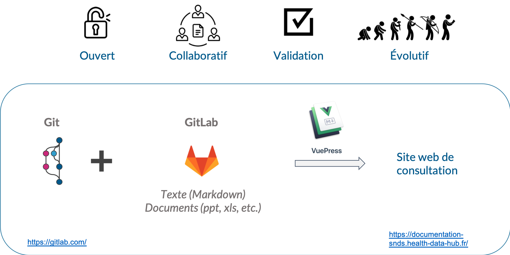

# Guide d'utilisation des outils
<!-- SPDX-License-Identifier: MPL-2.0 -->

## Quels outils?
Différents outils opensource sont mis à disposition par le Health Data Hub et la Dress dans le cadre de la documentation collaborative.

Les fiches et documents sont partagés un dépôt dans [Gitlab](https://gitlab.com/healthdatahub/documentation-snds) par les contributeurs avant d'être compilé par un logiciel Open Source [Vuepress](https://vuepress.vuejs.org/) pour donner le site de la documentation. 

### Gitlab
Les fiches contenues dans ce guide de contribution peuvent être utilisées comme mémo suite à une [formation d'utilisation de Gitlab pour contribuer]() ou pour apprendre de manière autonome.

Vous retrouverez notamment:

- une fiche [Markdown](tutoriel_markdown.md), format dans lequel les fiches sont rédigées
- une fiche [d'introduction et  navigation sur Gitlab](Introduction_Gitlab.md)
- Comment créer un [ticket](Ticket.md)
- Comment [modifier une fiche](Modifier_une_fiche.md)
- Comment [créer une fiche](Créer_une_fiche.md)
- Comment rajouter une [image](inclure_image.md) dans une fiche
- Comment [partager un document](partage_document.md)
- Comment [contribuer aux tables de données synthétiques](contribution_tables.md)
- La formation Gitlab ainsi que des [exercices](exercices_formation.md) pour s'entrainer

### Site de la documentation
Le site de la documentation est obtenu à partir de VuePress et de Gitlab. Une fiche récapitule les [principales fonctionnalités](Utiliser_le_site_de_documentation.md) du site.

### Forum entraide SNDS
Il est fortement recommandé de partager la publication de d'une fiche sur le [forum d'entraide du SNDS](https://entraide.health-data-hub.fr/) pour lui donner plus de visiblité. Une fiche récapitule les [principales fonctionnalités du forum](Forum.md).

## Comment utiliser Gitlab pour contribuer
Toute personne souhaitant contribuer est invitée à le faire. Les contributions peuvent porter sur la correction des erreurs, la mise à jour de certains champs, compléter des pages existantes, et en créer de nouvelles. Toutes améliorations, même d'apparence mineure comme la correction de fautes d'orthographe, améliorent pour tous la qualité du contenu. Un processus de relecture et de validation a été mis en place afin de garantir un contenu de qualité. Merci de s'y [référer](../../contribuer/Guide_contribution/README.md) avant toute contribution. 

Il est possible de contribuer de plusieurs manières : 
- en créant un ticket pour signaler une erreur, proposer une nouvelle idée de fiche par exemple
- en modifiant une à plusieurs fois une [fiche](Modifier_une_fiche.md)
- en créant une [nouvelle fiche](Créer_une_fiche.md)
- en partageant des [programmes](../../contribuer/Guide_contribution/partager_des_sources.md)

