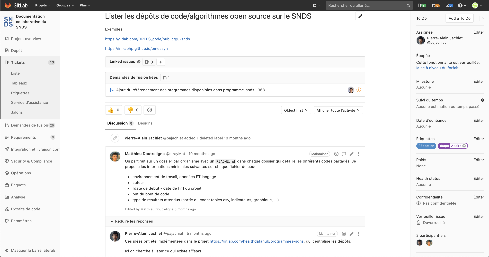
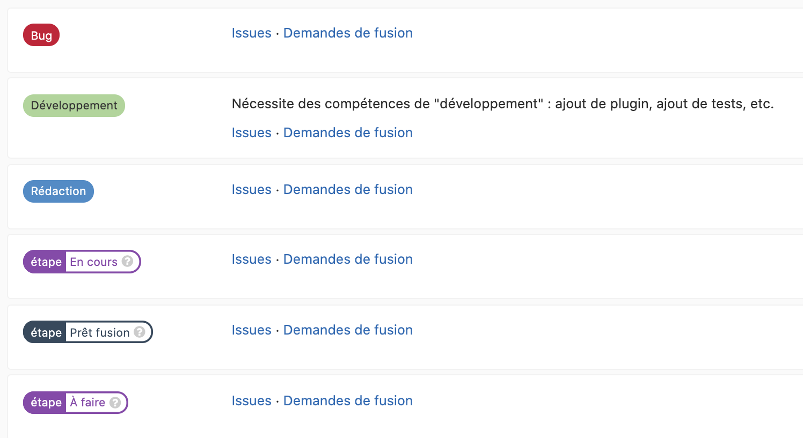
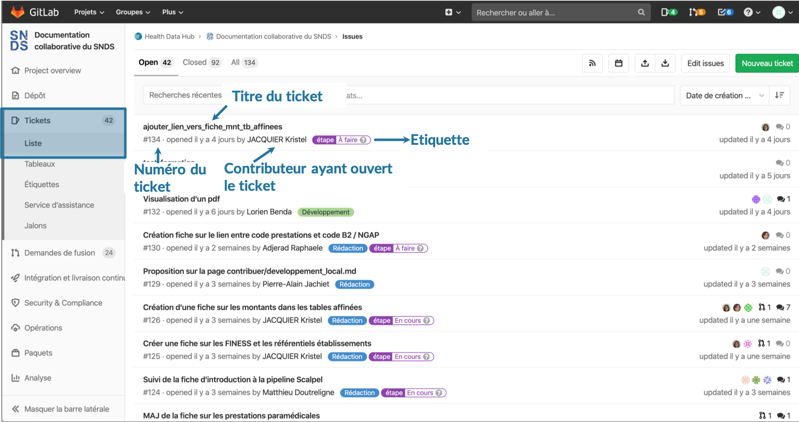
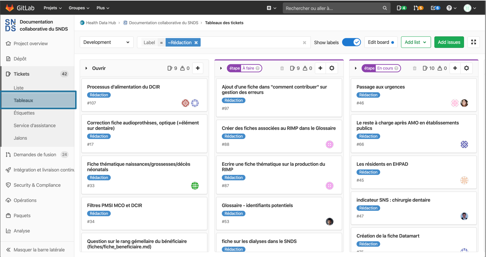
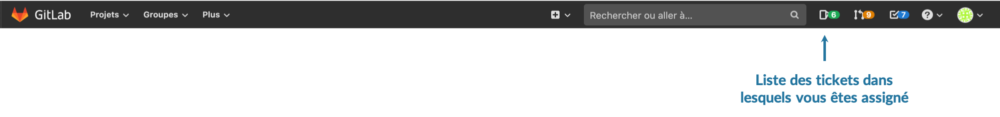
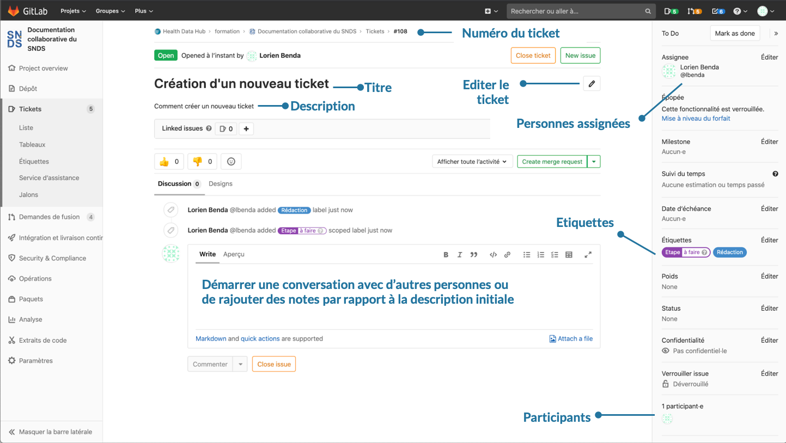

# Tickets
<!-- SPDX-License-Identifier: MPL-2.0 -->

Les tickets sont des outils de communications autour du projet de la documentation. 
Ils peuvent être utilisés pour proposer un nouveau sujet de fiche, proposer des modifications dans une fiche, signaler une erreur, signaler un bug dans les outils.
Ils peuvent être attribués à une ou plusieurs personnes en désignant des assignés. Les tickets comportent une section commentaires, permettant de commencer une discussion avec les différents participants du ticket.

Des étiquettes peuvent être ajoutées pour décrire les tickets. Dans le cadre de la
documentation collaborative, les étiquettes disponibles sont `Rédaction`, `Développement`, `Bug`,
`A faire`, `En cours`, `Prêt fusion

Les tickets peuvent être visualisés sous la forme de [liste](https://gitlab.com/healthdatahub/documentation-snds/-/issues), [tableaux](https://gitlab.com/healthdatahub/documentation-snds/-/boards/1086586?&label_name[]=D%C3%A9veloppement) où il est possible de trier par étiquette.

### Créer un ticket
Pour créer un ticket : aller dans `Tickets` > `Nouveau ticket`. 
Une fenêtre s'ouvre, permettant de décrire le ticket à créer.

1. Donner un titre
2. Faire une courte description
3. Vous assigner pour retrouver facilement votre ticket et assigner les personnes avec qui vous collaborez
4. Ajouter des étiquettes (label)
5. Enregistrer le ticket

## Retrouver un ticket créé
Pour retrouver un ticket dans lequel on s'est assigné, il faut aller dans la barre de navigation de Gitlab et cliquer sur le bouton vert `Tickets` (cet onglet est juste à droite de la barre de recherche)

## Naviguer dans le ticket créé
Une fois, le ticket validé, ce dernier comporte un titre, une description. Une liste des personnes assignées est disponible dans l'onglet à droite et est éditable en cliquant sur `éditer`. Il est également possible d'éditer les étiquettes. Une conversation peut démarrer en utilisant l'outils `commentaire` (le format markdown peut être utilisé lors d'édition de commentaires). 

Chaque ticket comporte un numéro qui lui ait propre et qui permet de l'identifier. Il est possible de faire référence à un ticket dans une demande de fusion en indiquant `#numéro du ticket` en commentaire ou dans la description de la demande de fusion.

