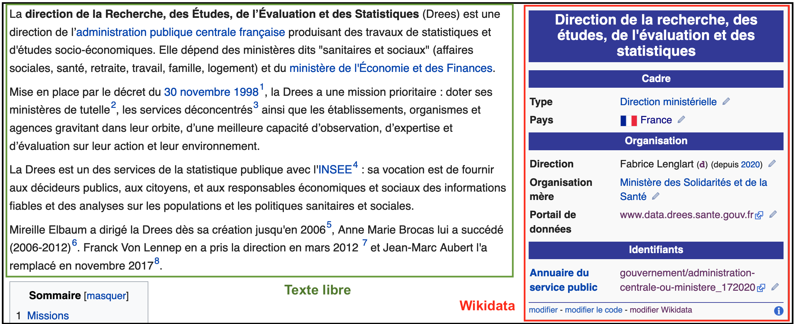
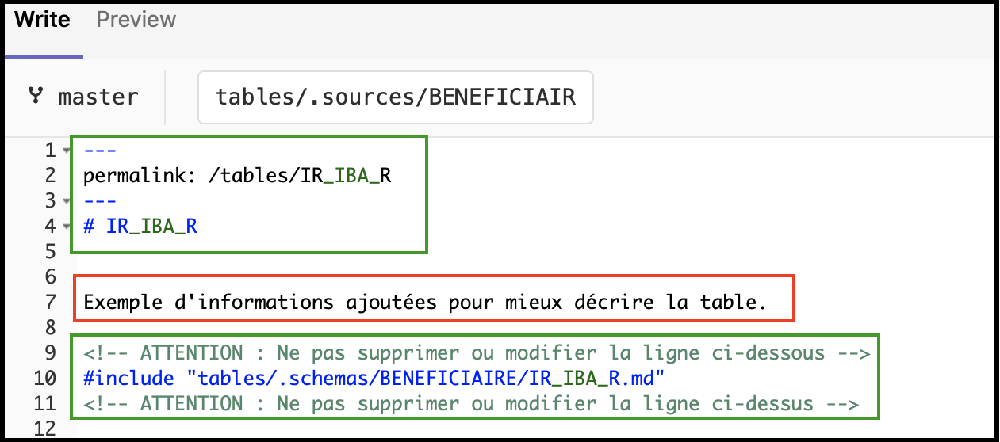
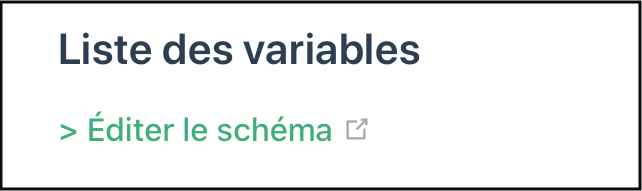
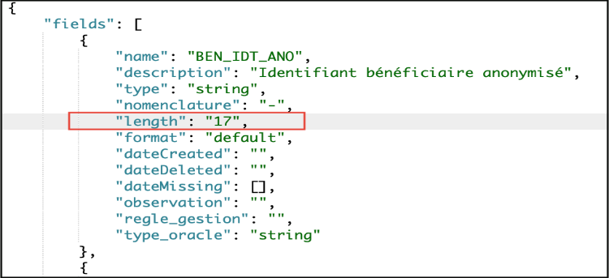

# Modifier la documentation des tables
<!-- SPDX-License-Identifier: MPL-2.0 -->

La section [Tables](../../tables/README.md) de la documentation a un fonctionnement spécifique.

Elle combine des **descriptions textuelles libres**, gérées comme le reste de la documentation, et des **informations structurées** issues du [schéma formel du SNDS](https://gitlab.com/healthdatahub/schema-snds). 

Ce fonctionement est similaire à celui des pages wikipedia, où les informations structurées de wikidata sont gérées séparément du texte principal.  

## Modifier la description textuelle

La description textuelle libre s'édite comme les autres pages de documentation, en suivant le lien `Éditer` en bas de page. 

Le fichier source a 3 parties
 
1. l'en-tête, avec un lien court (permalink) et le titre ;
1. **la description textuelle à éditer**, souvent vide actuellement ; 
1. le code d'inclusion du schéma de la table, entouré de commentaires d'avertissement. 

*Exemple de fichier source de la documentation des tables*

::: tip
Si vous naviguez via le projet sur GitLab, ces fichiers sources sont dans le dossier [tables/.sources](../../tables/.sources). 
:::

## Modifier le schéma de la table

Sur les pages de la section tables, un lien supplémentaire d'édition, situé sous le sous-titre **Liste des variables** permet de modfier le [schéma formel du SNDS](https://gitlab.com/healthdatahub/schema-snds). 

Ce schéma est stocké dans des fichiers json, selon le standard [table-schema](../../glossaire/table-schema.md).

*Exemple de modification du schéma json*

À chaque modification du schéma, les fichiers markdown du dossier [tables/.schemas](../../tables/.schemas) sont mis à jour automatiquement. 
Ils sont ensuite combinés avec les fichiers correspondants du dossier [tables/.sources](../../tables/.sources) pour mettre à jour la section [Tables](../../tables/README.md).

::: tip Note
Les modifications du schéma sont également propagées automatiquement sur le dictionnaire interactif et sur les données synthétiques. 
:::
