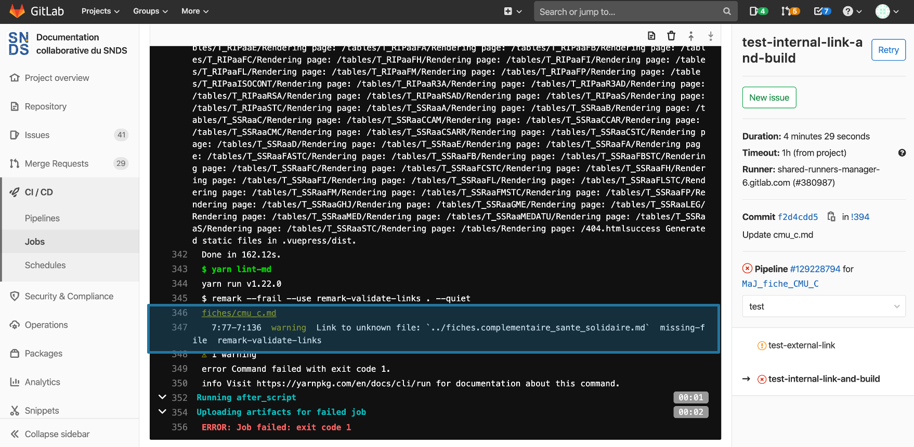

# Erreurs courantes dans les pipelines
<!-- SPDX-License-Identifier: MPL-2.0 -->

En allant sur l'onglet `Pipelines` dans une demande de fusion, on retrouve les icônes rondes rencontrées dans les onglets `Vue d'ensemble`et `Commits`. 
Lorsqu'une merge-request est ouverte, un "`pipeline`" est démarré pour effectuer des tests sur les liens hypertextes, la licence et construire une prévisualisation du site de la documentation. Ces 2 étapes sont symbolisées par des icônes rondes (la première icône correspond aux tests et la seconde à la prévisualisation du site de la documentation)

Les tests permettent de vérifier que les liens externes et internes sont valides. Il y a également un test permettant de vérifier que l'identifiant de la licence est bien présent. En cas d’échec, des icônes oranges apparaissent pour les tests des liens externes et de la licence et une icône rouge apparaît pour le test des liens internes. 

Si une icône orange ou rouge apparaît, il est possible de connaitre la source d'erreur. En cliquant sur l'icone du test, une fenêtre apparait. Les indications utiles se trouvent en bas de cette fenêtre.

<p style="text-align:center;">

</p>

Dans l'exemple ci-dessous, l'erreur est dans un lien interne, dans la fiche cmu_c.md à la ligne 7. 

# Erreur lien interne
Les erreurs les plus courantes pour les liens internes sont les suivantes:
- la fiche/image du lien n'exite pas
- une erreur dans le format markdown 
    - `[texte](lien)` pour les liens
    - ``pour une image
- il y a une erreur dans le nom de la fiche/image 
    - deux fois `.md` 
    - ou aucun `.md`
- il y a une erreur dans le chemin du lien 
    - un `.` au lieu d'un `/`
    - un seul point au lieu de deux pour remonter à la racine dans le dépôt
    - une erreur dans la remontée à la racine
    
::: tip
Pour la remontée à la racine par exemple si dans la fiche `Formation PMSI` du sous-dossier Cnam dans le dossier ressource on souhaite ajouter une image présente dans le dossier files, la remontée se fera selon ce chemin, la fiche étant 2 niveaux en dessous de la racine :

`../../files/Cnam/2020-04-30_CNAM_Enoncés-EXERCICES-TOUS-PMSI-fev-2019_MLP-2.0.pdf`
:::

# Erreur lien externe
Les erreurs les plus courantes pour les liens externes sont:
- lien mort
- une faute de frappe
- une erreur dans le format markdown (`[texte](lien)`)

# Erreur licence
Si tous les fichiers ont une licence, un message disant que tous les fichiers ont une licence apparaît, sinon une liste des fichiers où la licence est absente s'affiche. Il suffit dans ce cas de rajouter cette ligne en seconde position de la fiche :

```
<!-- SPDX-License-Identifier: MPL-2.0 -->
```

