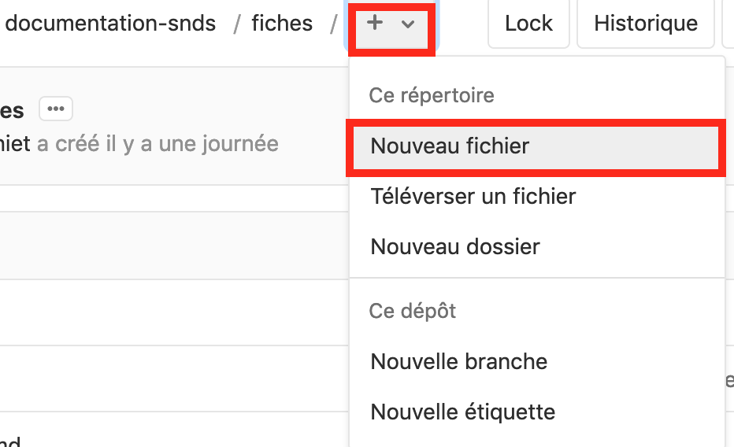
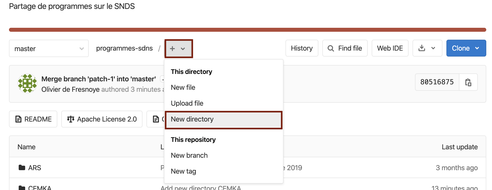

# Créer une nouvelle page du site ou un nouveau dossier
<!-- SPDX-License-Identifier: MPL-2.0 -->  

## Créer une nouvelle page
Les pages du site internet sont des fichiers textuels, stockés dans différents dossiers à la racine, principalement `introduction` pour les tutoriels haut niveau, `fiches` pour les fiches thématiques, et `glossaire`.

Pour créer une nouvelle page de documentation, naviguer dans le dossier de votre choix, et sélectionnez **Nouveau fichier** dans le menu déroulant `+`.

<p align="center">

</p>

Écrivez alors votre fiche, en mettant cette ligne de commentaire après le titre.
```
<!-- SPDX-License-Identifier: MPL-2.0 -->
```

Enregistrez votre fichier, avec un nom 
- en minuscule (sauf sigle), pour standardiser ; 
- sans espace, pour simplifier les liens internes ;
- terminer par l'extention **.md**, pour indiquer qu'il s'agit d'un fichier Markdown.

Pour la suite, enregistrez votre modification dans une branche et ouvrez une merge-request de la même façon que pour modifier un fichier (cf [Introduction GitLab](introduction_gitlab.md)).

## Créer un nouveau dossier
Pour créer un nouveau dossier, naviguer dans le dossier de votre choix, et sélectionnez **Nouveau dossier** dans le menu déroulant `+`. 

<p align="center">

</p>

Nommez votre dossier, ajoutez un commit et enregistrez dans une branche.

