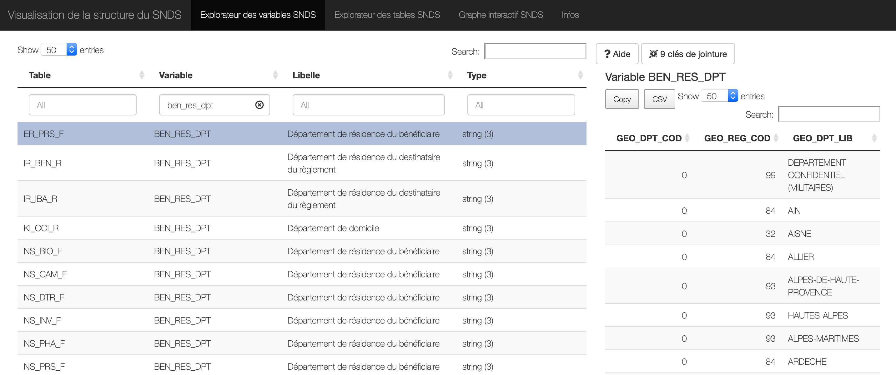

# Titre page
<!-- SPDX-License-Identifier: MPL-2.0 -->

Description du contenu de la page

## Titre partie - Rappel Makdown

### Titre sous-partie - Formatage de base

Texte en *italique*

Texte en **gras**

### Titre sous-partie - Listes

Liste à puce
- premier niveau
- premier niveau
    - second niveau
    - second niveau
- premier niveau

Liste numerotée
1. premier niveau
1. premier niveau
    1. second niveau
    1. second niveau
1. premier niveau

### Titre sous-partie - Liens 

Lien vers url externe
[texte du lien](http://example.com/)

Lien vers document interne

[lien vers images/dico_snds.png](../files/images/dico_snds.png)

Image en lien rendue dans la page avec point d'exclamation devant

Balises html, pour une image centrée et de largeur 600px fixée

## Titre partie

### Titre sous-partie

### Titre sous-partie