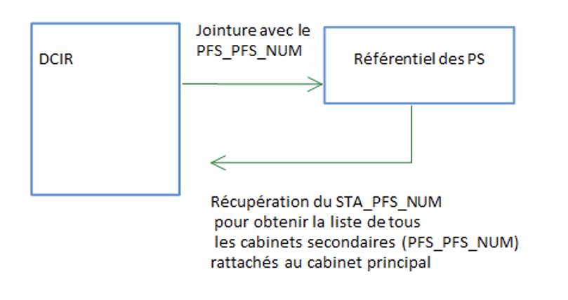
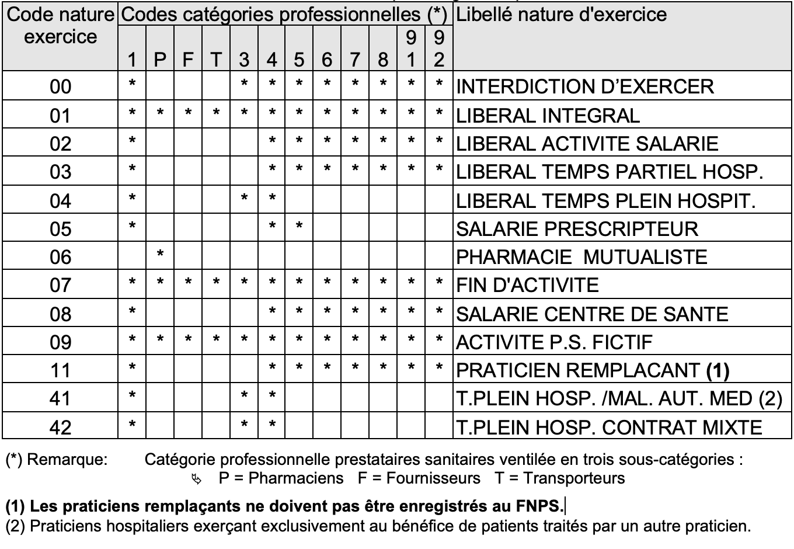
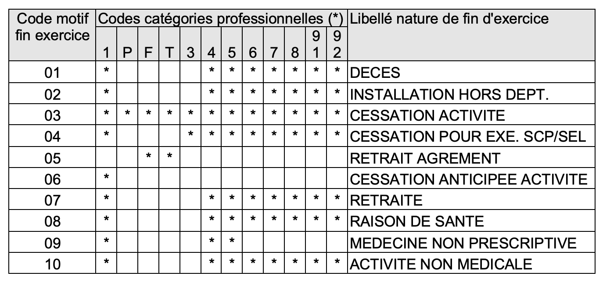
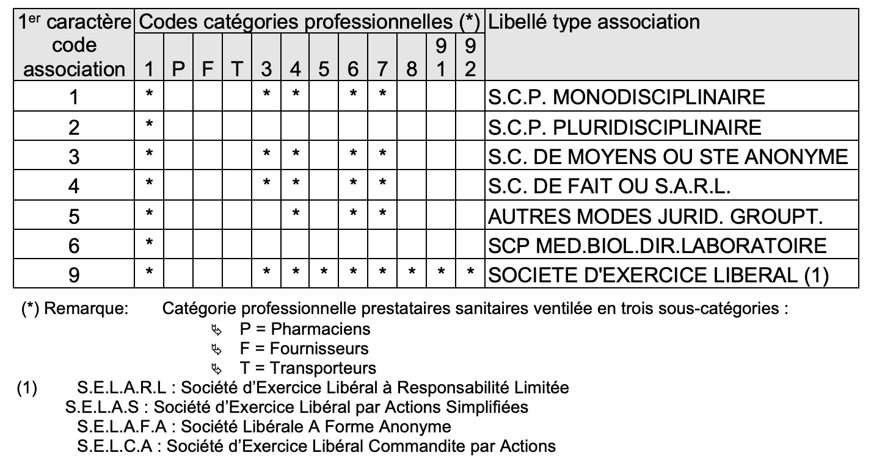

---
tags:
    - Professionnel de Santé
---

# Référentiel des Professionnels de Santé: DA_PRA_R simplifié
<!-- SPDX-License-Identifier: MPL-2.0 -->

<TagLinks />

Un référentiel simplifié des Professionnels de Santé, permettant de regrouper l’activité de tous les cabinets d’un [PS](../glossaire/PS.md) sur son N° PS de chaînage statistique, est mis à disposition des utilisateurs SNDS accédant aux données individuelles bénéficiaires exhaustives dans la bibliothèque ORAVUE. Vous trouverez la liste des variables en fin de communiqué. La vue disponible sur le portail est une extraction de la DA_PRA_R sur son périmètre SNDS.

## Période de chargement du référentiel

Le référentiel DA_PRA_R simplifié des Professionnels de Santé (PS) est partitionné par période d’alimentation (année et mois de traitement).

Les variables année et mois de traitement, `DTE_ANN_TRT` et `DTE_MOI_FIN`, permettent de cibler une période afin de correspondre au mieux à la situation recherchée.

*Exemple* : connaitre le mode d’exercice d’un médecin à un instant précis (temps plein hospitalier ou libéral intégral) pour une date donnée.

En effet, la situation d’un PS est amenée à changer dans le temps :
-	Changement de cabinet principal
-	Changement d’organisme de rattachement
-	Changement de mode d’exercice
-	Etc..

## Cabinet principal et secondaire

Un professionnel peut disposer de plusieurs lieux où il exerce son activité.
**L’identifiant de professionnel de santé est le numéro de cabinet (`PFS_PFS_NUM`) du lieu d’implantation où la prestation est réalisée** et que l’on retrouve dans les différentes bases du SNDS (par exemple `PFS_EXE_NUM` dans le DCIR).
Afin de regrouper l’activité d’un PS sous un même numéro, le numéro de cabinet doit être chainé avec son numéro de cabinet principal (`STA_PFS_NUM`) sous lequel nous pouvons regrouper toute l’activité du professionnel de santé.

*Exemple* : Ici nous avons 2 PS différents disposant de 3 cabinets pour l’un (3 premières lignes) et de deux pour l’autre (2 dernières lignes)

| STA_PFS_NUM  | PFS_PFS_NUM |
|--------------|-------------|
| 12345678     | 87654321    |
| **12345678** | **12345678** |
| 12345678     | 76543210    |
| 23456789     | 98765432    |
| **23456789** | **23456789** |

Les lignes en gras, où le `STA_PFS_NUM` = `PFS_PFS_NUM`, correspondent aux informations sur le cabinet principal.

Dans l’exemple ci-dessus en récupérant le Numéro du cabinet principal `STA_PFS_NUM` dans le référentiel simplifié des professionnels de santé, nous pouvons connaitre l’intégralité de ses cabinets secondaires.
Ce regroupement permet d’obtenir l’ensemble de l’activité pour un professionnel.

::: warning Important
Le `STA_PFS_NUM` peut changer dans le temps, il faut donc être vigilant car le professionnel peut arrêter son activité sur son cabinet principal (nature d’exercice = 07) pour en ouvrir un autre ce qui entrainera un changement de `STA_PFS_NUM`.
Il faudra donc choisir un numéro de cabinet principal en  fonction de la période souhaitée de début et fin de traitement via les colonnes `DTE_ANN_TRT` et `DTE_MOI_FIN`.
:::

## Nature d’exercice et fin d’activité
Le motif de fin d’exercice (`EXC_FIN_MTF`) n’a de sens que pour un cabinet en fin d’activité (`EXC_EXC_NAT` = 07). Le motif n’est renseigné que pour une fin d’activité dans 99.99%

## Liste des variables présentes en restitution

| Libellés | Nom de colonne | Table de valeur  |
|----------|----------------|------------------|
| Mois de traitement | DTE_MOI_FIN | |
| Année de traitement | DTE_ANN_TRT  | |
| Numéro identifiant du PS | PFS_PFS_NUM | |
| Clé PFS | PFS_PFS_CLE | |
| Caisse primaire | CAI_NUM | IR_CAI_V avec ORG_BSE_NUM = ‘01C’ |
| N° PS statistique  | STA_PFS_NUM    | |
| Caisse de chaînage statistique | STA_CAI_NUM | |
| Code spécialité | PFS_PRA_SPE | IR_SPE_V pour les PS de catégorie 1, IR_ACT_V sinon |
| Code spécialité antérieure | PFS_SPE_ANT | IR_SPE_V |
| Code catégorie de PS  | PFS_CAT_COD | IR_CAT_V   |
| Code convention | CNV_CNV_COD | IR_CNV_V  |
| Droit à dépassement  | PRA_IDP_DDP    | Top à « 0 » ou « 1 » |
| Code nature d’exercice  | EXC_EXC_NAT    | Cf. Table *Codes nature d'exercice* ci-dessous      |
| Date d’effet de la nature d’exercice   | EXC_EFF_DSD    |   |
| Motif de fin d’exercice  | EXC_FIN_MTF    | Cf. Table *Mode de fin d'exercice* ci-dessous       |
| Nature d’exercice antérieure du PS   | EXC_ANT_NAT    |               |
| Date d’effet de la nature d’exercice antérieure du PS   | EXC_ANT_DSD    |          |
| Motif de fin d’exercice de la nature d’exercice antérieure du PS | EXC_ANT_MTF    |  |
| Mode d’exercice particulier   | PRA_MEP_COD    | IR_MEP_V      |
| Code association PS | PFS_SCV_COD    | Cf. Table *Code association PS* ci-dessous   |
| Date début de l’activité libérale  | PFS_ACP_DSD    |           |
| Catégorie de laboratoire  | LAB_CAT_COD    | Cf. Table *Catégorie de laboratoire* ci-dessous   |
| Numéro FINESS    | PFS_FIN_NUM    |   |
| Mois de dernière mise à jour   | PFS_MAJ_DAT    |         |

### Table de valeur

#### Codes nature d'exercice
Définition des natures d'exercice et des autorisations par catégorie de professionnel de santé.

#### Motifs de fin d'exercice
Définition des natures d'exercice et des autorisations par catégorie de professionnel de santé.

#### Codes association
Cette table définit la valeur du 1er caractère des codes association et les catégories de professionnels santé autorisées par association.

#### Classification des laboratoires
Définition des codes de classification des laboratoires.

| Code catégorie laboratoire | Libellé catégorie de laboratoire        |
|----------------------------|-----------------------------------------|
| 01                         | PRIVE LIBERAL                           |
| 02                         | MUTUALISTE OU SÉCURITÉ SOCIALE          |
| 03                         | ORGANISME A BUT NON LUCRATIF            |
| 04                         | BIOLOGISTE TEMPS PLEIN                  |
| 05                         | ORGANISME PUBLIC (DÉPARTEMENT, COMMUNE) |
| 07                         | LABORATOIRE FICTIF                      |
| 08                         | ACTES B DES PHARMACIENS D’OFFICINE      |
| 09                         | CENTRE TRANSFUSION SANGUINE (LABO PRIVE)  |

::: tip Auteur et version
Cette fiche a été rédigée à partir d'un document rédigé par la CNAM et disponible en version originale [ici](../files/Cnam/20210708_CNAM_DA_PRA_R-table simplifiee_MPL-2.0.docx).

Version : Juillet 2021
:::
