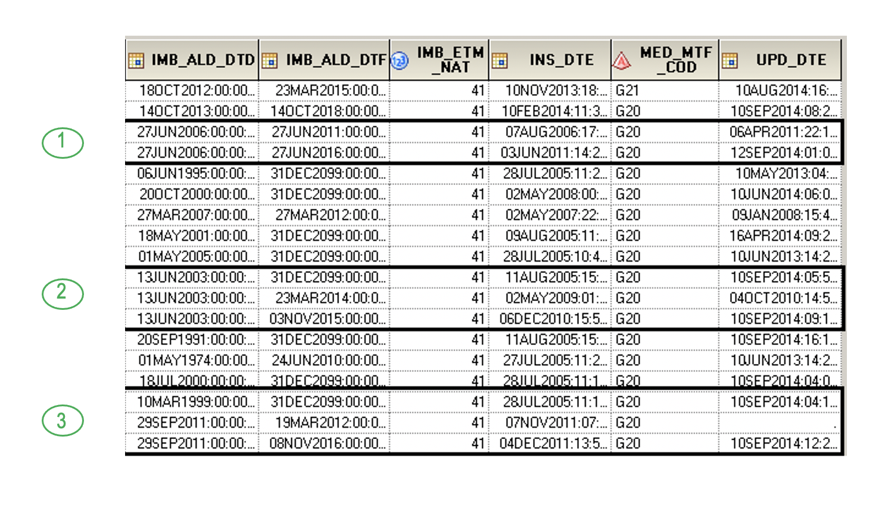

# Requête type de sélection des affections de longue durée
<!-- SPDX-License-Identifier: MPL-2.0 -->

Cette fiche a pour objectif de décrire les informations disponibles dans le SNDS concernant les pathologies exonérantes (avec un focus sur les ALD). Elle propose également une requête type de sélection d’affections de longue durée.

## Introduction 
Le référentiel médicalisé [IR_IMB_R](../tables/DCIR_DCIRS/IR_IMB_R.md) recense les exonérations pour affections de longue durée, maladies professionnelles, accidents du travail, invalidité, grossesse… Ces informations proviennent des Services Médicaux des différents régimes (selon des critères différents et pour des périodes différentes).

Depuis janvier 2017, la CNAM met à disposition la table [IR_ETM_R](../tables/DCIR_DCIRS/IR_ETM_R.md) concernant exclusivement les affiliés au régime général et à ses organismes infogérés. Les informations proviennent non plus directement des Services Médicaux, mais des Bases de Données Opérandes (BDO) des caisses du régime général, et n’y figurent que les individus dont les exonérations sont en cours ou terminées depuis le 1er janvier 2013, selon la même règle que le référentiel des bénéficiaires [IR_BEN_R](../tables/BENEFICIAIRE/IR_BEN_R.md). La table contient le motif d’exonération, les dates de début et de fin d’exonération mais aucune information médicale. Si cela vous suffit, nous vous conseillons de travailler directement à partir de cette table qui a le mérite d’être plus simple à traiter et déjà nettoyée. 

Si vous souhaitez travailler sur plusieurs régimes ou avoir un historique plus profond une extraction à partir du référentiel [IR_IMB_R](../tables/DCIR_DCIRS/IR_IMB_R.md) est préférable.

## Le référentiel médicalisé IR_IMB_R
La table [IR_IMB_R](../tables/DCIR_DCIRS/IR_IMB_R.md) contient les informations médicalisées des bénéficiaires, c’est-à-dire toutes les exonérations pour ALD, maladie professionnelle, invalidité, accident du travail, pension militaire, etc.
Une alimentation différente selon le régime :
-   Régime général (y compris SLM) et régime des militaires: remontée mensuelle de toutes les exonérations rapportées au Service Médical depuis juillet 2005, à l’exception des polypathologies pour le régime général. Cette remontée est indépendante d’un remboursement de prestation.
-   MSA : remontée mensuelle des exonérations pour ALD à partir de janvier 2014. L’historique des exonérations est repris pour les personnes toujours exonérées en 2014. Comme pour le régime général, le référentiel est alimenté indépendamment d’un remboursement de prestations.
-   RSI : seules les exonérations pour ALD sont disponibles. Les données sont exploitables à partir de 2014. Seules les exonérations donnant lieu à un remboursement de prestation sont enregistrées. A compter du 1er janvier 2019, les nouveaux travailleurs indépendants ont été gérés par le RG. Depuis janvier 2020, l’ensemble des indépendants sont intégrés au RG. 
L’information du régime n’est pas présente dans le référentiel médicalisé. Cette information, est à récupérer dans le référentiel des bénéficiaires [IR_BEN_R](../tables/BENEFICIAIRE/IR_BEN_R.md) (attention, il s’agit du dernier régime connu pour le bénéficiaire) ou les tables de consommants **EXTRACTION_PATIENTSxxxxTR**. 

Notez aussi que le référentiel médicalisé recense les exonérations octroyées indépendamment du fait que les bénéficiaires aient mis à profit cette exonération pour des soins ou médicaments. Pour ne considérer que les exonérations « actives » (qui ont eu des prestations remboursées au titre de leur exonération), il faudra faire le lien avec la table des prestations (variable `EXO_MTF` pour le choix du motif d’exonération) ou bien pour les ALD, avec la table de consommants qui dispose d’un TOP pour identifier les ALD « consommantes » mais sans distinction de la pathologie.

Pour quelle raison y aurait-il des exonérations dans le référentiel médicalisé qui ne conduisent pas à des remboursements de soin ? Il peut s’agir d’exonérations délivrées à tort. Il peut s’agir également par exemple d’individus résidant dans des établissements médicalisés (établissements d’hébergement ou établissements hospitaliers) dont les soins sont pris en charge dans cet établissement et n’apparaissent donc pas dans la table des prestations du SNDS. 

### Structure du référentiel
Concernant la thématique ALD, le référentiel contient principalement les variables suivantes :

|     Variable                   |     Description                                  |
|--------------------------------|--------------------------------------------------|
|     BEN_NIR_PSA                |     Identifiant   SNDS crypté du bénéficiaire    |
|     BEN_RNG_GEM                |     Rang   gémellaire                            |
|     IMB_ALD_DTD                |     Date   de mise en ALD                        |
|     IMB_ALD_DTF                |     Date   de fin d’ALD                          |
|     IMB_ETM_NAT                |     Motif   d’exonération                        |
|     MED_MTF_COD                |     Code   CIM-10 de la pathologie               |
|     IMB_ALD_NUM                |     Numéro   d’ALD                               |
|     INS_DTE                    |     Date   d’insertion                           |
|     UPD_DTE                    |     Date   de mise à jour                        |

#### Motifs d'exonération - variable `IMB_ETM_NAT
Les motifs d’exonération pour ALD sont les suivants :
- 41 = BENEFICIAIRE ATTEINT D’UNE MALADIE LISTE AFFECTION
- 43 = PATHOLOGIE HORS LISTE
- 45 = POLYPATHOLOGIE . Remonte seulement pour la MSA à partir de 2014 
- 47 = ARTICLE L324 NON EXONERANT . Ne remonte pas pour la MSA 

La totalité des modalités des motifs d’exonération est disponible dans la table [IR_ETM_V]() de la librairie ORAVAL du DCIR.

#### Code CIM de la pathologie - variable `MED_MTF_COD`
La table [IR_CIM_V]() disponible dans la librairie ORAVAL pour le DCIR, offre une correspondance entre codes CIM-10 et numéro d’ALD 30 affecté selon la dernière réglementation en vigueur.

#### Numéro d’ALD -  variable `IMB_ALD_NUM`
Il est déconseillé de sélectionner les individus par leur numéro d’ALD car la définition de ce numéro a pu évoluer au cours du temps. La sélection se fait par code CIM-10 et motif d’exonération.
Par exemple en 2004 
1.  L’ALD 15 « Lèpre » est devenue « Maladie d’Alzheimer et autres démences ».
2.  L’ALD 29 « Tuberculose active » est devenue « Tuberculose active, lèpre »
3.  L’ALD 23 « Psychose, trouble grave de la personnalité, arriération mentale » est devenue « Affections psychiatriques de longue durée ».

#### Date d’insertion – variable `INS_DTE`
Dans le référentiel médicalisé, un patient peut avoir plusieurs lignes s’il présente plusieurs pathologies ou motifs d’exonération, mais également lorsqu’une exonération est modifiée ou renouvelée. Les informations précédentes ne sont pas écrasées, c’est une nouvelle ligne qui est insérée avec les données actualisées. La date de cette modification est la date d’insertion de cette nouvelle ligne. 
Dans le cas spécifique d’une ALD accordée pour une durée déterminée, l’exonération peut être revue à la fin de cette période, puis renouvelée, occasionnant une nouvelle ligne avec une date de fin d’ALD repoussée. De même, si une erreur telle que la date de début de l’ALD est observée, la première ligne introduite ne sera pas modifiée, mais une nouvelle ligne sera ajoutée avec la date de début valide.

#### Date de début d’exonération - variable `IMB_AMD_DTD`
`IMB_ALD_DTD` correspond à la date de début d’exonération pour tout type d’exonération, pas seulement pour les ALD. Pour les accidents du travail, elle correspond plus précisément à la date de l’accident.
Concernant les ALD, la date de début d’exonération correspond à la date de prise en charge, même si la décision de mise sous ALD est faite après le début de la prise en charge.
A chaque renouvellement d’ALD, la date de début est normalement reprise. Il peut cependant y avoir des exceptions : au lieu de reprendre la date initiale de mise en ALD, la variable `IMB_ALD_DTD` renseigne la date du renouvellement.

#### Date de fin d’exonération - variable `IMB_ALD_DTF`
`IMB_ALD_DTF` correspond à la date de fin d’exonération, cette fois-ci exclusivement pour les ALD.
Le décret n°2011-77 du 19 janvier 2011, fixe maintenant la durée de l’exonération des ALD 30 à 2 ans ou 5 ans selon la pathologie (il est prévu un allongement des durées à 3, 5 ou 10 ans). Ce choix est également préconisé pour les ALD hors-liste. A la fin de cette période, l’exonération est réexaminée et prolongée si nécessaire, occasionnant une nouvelle ligne dans le référentiel.
Avant ce décret, les ALD pouvaient être octroyées à vie. Plusieurs dates de fin sont encore à 2099, autour de 10,5 % à la date du 16/10/2020. La MSA a effectué une correction pour tous ses patients exonérés. Le régime général les corrige au fur et à mesure.

#### Date de mise à jour (attention : faux-ami) – variable `UPD_DTE`
Contrairement à la date d’insertion, la date de mise à jour indique que les informations n’ont pas changé depuis qu’une ligne a été insérée. Tous les mois, le logiciel informatique qui gère les exonérations actualise les informations. 
Lorsqu’une exonération est créée, la date de mise à jour n’est pas renseignée. Elle le sera le mois suivant, lors de la comparaison des dernières informations à celles présentes dans la table. S’il n’y a pas eu de modification la date de mise à jour sera incrémentée. Par contre, s’il y a une modification, une nouvelle ligne sera créée et la date de mise à jour sera manquante.

**Exemple**

* L’individu 1 est en ALD depuis le 27 juin 2006 (information insérée le 7 août). La première période d’exonération s’étendait jusqu’au 27 juin 2011. Elle a été revue le 3 juin puis prolongée jusqu’au 27 juin 2016 (5 ans supplémentaires).
* L’individu 2 est en ALD depuis le 13 juin 2003. C’est une ALD ancienne qui a été intégrée dans le référentiel en 2005 (lors du rapatriement de toutes les exonérations dans le logiciel). La date de fin n’était alors pas fixée, elle a été repoussée au 23 mars 2014 lors de l’insertion du 2 mai 2009. Le 6 décembre 2010, la date de fin a de nouveau été revue et fixée au 3 novembre 2015 (soit 5 ans après l’insertion). 
* L’individu 3 est en ALD depuis le 10 mars 1999 (exonération rapatriée en juillet 2005). Comme pour l’individu 2, l’exonération était accordée à vie puis a été revue en 2011 et ramenée au 19 mars 2012. Remarquons que la date de début d’ALD n’a cette fois-ci pas été reprise. La date de mise à jour est manquante pour cette ligne, car la date de fin d’ALD a été modifiée le mois suivant pour rentrer dans le cadre du décret, soit une durée d’exonération de 5 ans (après le renouvellement du 7 novembre 2011).

## Programme type

La table fournie en fin de programme présente les différentes ALD accordées durant l’année civile d’intérêt pour les codes CIM retenus. Elle contient une ligne par individu/code CIM/motif d'exonération (donc potentiellement plusieurs lignes pour un même individu).

```SAS
/**************************************************************************************************************************/
/****        Paramètres à changer : répertoire, liste des codes CIM, dates définissant la période d’intérêt ******/
/**************************************************************************************************************************/

/*déclaration de la librairie */

%let fichier = %SYSGET (HOME)/sasdata ;  
libname ma_lib "&fichiersasdata1/ /PGM_tmt";   

/ *** Exemple pour l’ALD hypertension artérielle sévère en 2019 ***/
/********************************************************************/
/* LES ARGUMENTS A MODIFIER SONT LES DEUX MACRO –VARIABLES : LIST_CODES et AN */

/*liste  de codes CIM à sélectionner */
%let list_codes = I15 I10 ; /* Codés sur 3 caractères en général*/
/* année à considérer */
%let aaaa = 2019 ; 
/********************************************************************/

/*MACRO- VARIABLES QUI S’INITIALISENT AUTOMATIQUEMENT*/ 
/*date de début de la période considérée */
%let debut_ALD=01JAN&aaaa.;

/*date de fin de la période considérée*/
%let fin_ALD=31DEC&aaaa.;

/*date de point : date maximale d’insertion des exonérations. Permet d’avoir un état des lieux des exonérations à une date précise et de toujours retrouver le même résultat à différentes dates d’exécution du programme 
La quasi totalité des exonérations sont restituées 6 mois après la fin de la période*/

%let anpt = %eval (&aaaa + 1) ;
%let date_point=01JUL&anpt.;

%let nb_codes=%sysfunc(countw(&list_codes));
```


```SAS
/************************************************************************************************************************/
/************            PROGRAMME DE SELECTION DES EXONERATIONS POUR ALD                **********/
/************************************************************************************************************************/

/*Sélection des exonérations pour ALD par codes CIM  dans le référentiel*/

%macro selection_ALD();

/* Sélection des exonérations en SQL code par code (+ rapide) - 1 table par code*/
%do i=1 %to &nb_codes;
%let code=%scan((&list_codes),&i);
%put "&code.%";
proc sql;create table ALD&i as 
SELECT *
FROM oravue.ir_imb_r
WHERE med_mtf_cod like "&code.%"
    and imb_etm_nat in (41,43,45) 
    and ins_dte<"&date_point.:0:0:0"dt;
quit;
%end;

/*regroupement de toutes les tables*/

Data ALD ; set %do i=1 %to &nb_codes ; ALD&I %end; ; run ;
%do i = 1 %to &nb_codes ; proc datasets library = work ;    DELETE ALD&i.; run; %end;

%mend;

%selection_ALD();

/*Tri pour ne garder que les lignes correspondant à la date d'insertion la plus récente pour chaque code et motif*/
/*et tri pour ne garder que la date de mise à jour la plus récente*/
/*Remarque  :lorsque l’on ne s’intéresse qu’à une seule maladie, il n’est pas nécessaire de trier et de supprimer les doublons sur la variable med_mtf_cod */

proc sort data=ALD;by ben_nir_psa ben_rng_gem med_mtf_cod imb_etm_nat descending ins_dte descending upd_dte imb_ald_dtd imb_ald_dtf;run;
    
proc sort data=ALD  nodupkey;by ben_nir_psa ben_rng_gem med_mtf_cod imb_etm_nat;run;

/*Restriction des ALD sur la période d'intérêt*/
data ma_lib.ALD_exo; set ALD; 
where imb_ald_dtd<="&fin_ALD.:0:0:0"dt and (imb_ald_dtf>="&debut_ALD.:0:0:0"dt or imb_ald_dtf=. or imb_ald_dtf='01JAN1600:0:0:0'dt);
run;
```

::: tip Crédit
Cette fiche a été créée par la direction DATA de Santé publique France
:::

::: tip Mise à jour
Cette fiche se base sur une version originale datant du 30/04/2018 et a été mise à jour le 30/10/2020
:::

