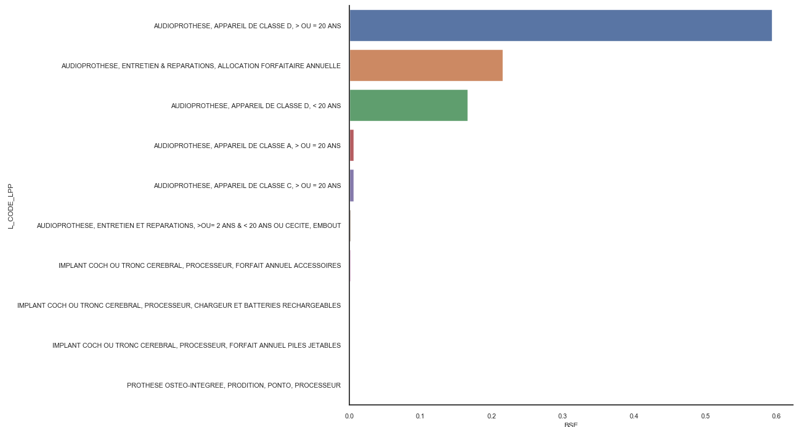
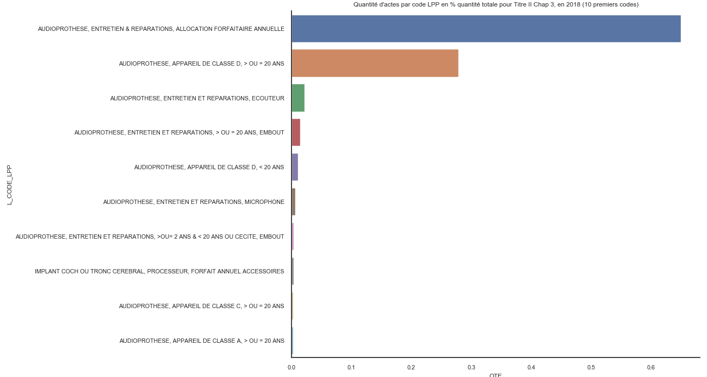

# Les aides auditives
<!-- SPDX-License-Identifier: MPL-2.0 -->


Il existe plusieurs types d'audioprothèses, aussi appelées "aides auditives". On peut en effet les classer en appareils intra-auriculaires, contours à écouteurs
déportés ou contours classiques. Cette fiche aborde principalement les aspects concernant les dépenses et les prix des audioprothèses, ainsi
que tous ces types d'audioprothèses.

Ce domaine du SNDS est en train de subir des **changements**, en particulier en **termes de nomenclature** dans le cadre de la
[réforme du 100% santé](https://solidarites-sante.gouv.fr/systeme-de-sante-et-medico-social/100pourcent-sante/). 
Cette réforme est **progressivement mise en oeuvre** de 2019 à 2021, ce qui implique une montée en charge et un changement
dans les nomenclatures. 
Cette fiche s'attachera à mettre en valeur ces changements suite à la mise en place de la réforme du 100 % santé. 


## Les audioprothèses/aides auditives dans le SNDS

Dans la table centrale des prestations dans le `DCIR` ou dans le `DCIRS`, on peut cibler les dépenses en audioprothèses via les
codes de prestations `PRS_NAT_REF` ([norme PS5](../fiches/prestation.md)) ou les codes prestations de la norme B2 (`PRS_NAT_CB2`) suivants : 

| `PRS_NAT_REF`| `PRS_NAT_LIB` | `PRS_NAT_CB2` |
| ------------ | ------------- | ------------- |
| 3541 | APPAREILS ELECTRONIQUES DE SURDITE  (CHAP 3.) | PAU/AUA |
| 3547 | APPAREILS ELECTRONIQUES DE SURDITE (CONSOMMABLES Y.C. PILES) | AUP |
| 3549 | PROCESSEUR POUR IMPLANT OSTE-INTEGRE | PIO |
| 3550 | PROTHESE AUDITIVE SUIVI | SUI | 
|  **3540**| **PROTHESE AUDITIVE RAC ZERO** | **PAZ**

*Note* : le code prestation correspondant aux prothèses auditives "100 % santé", i.e. de Classe I dans la terminologie
de la réforme, est mis en valeur en gras.


Il est également possible de rechercher les dépenses en audioprothèses à un niveau de détail plus fin 
dans la table affinée `ER_TIP_F` pour le `DCIR` ou `NS_TIP_F` pour le `DCIRS`. En effet, 
les audioprothèses font partie intégrante de la [LPP](../glossaire/LPP.md), plus précisément du Titre II, chapitre 3.
Il est donc également possible d'utiliser la base de données *open data* de la CNAM
 [OPENLPP](http://open-data-assurance-maladie.ameli.fr/LPP/index.php) pour explorer ce champ.

A noter que le code `3550,PROTHESE AUDITIVE SUIVI,SUI` ci-dessus correspond au code LPP de suivi des prothèses auditives. 
Il correspond à une consultation d'un audioprothésiste pour le réglage des aides auditives, qui est transmise par télétransmission.
Cette consultation, facturée 0,01€ auprès de l’AMO, est remboursée à 100 % par l'AMO, et permet un suivi
dans le SNDS des prothèses auditives.


Les dépenses en audioprothèses comprennent:
- **l'achat d'appareil auditif** à proprement parler, 
- l'**entretien** et la **réparation** de l'appareil ainsi que 
- les **processeurs pour les implants**. 

Pour obtenir le détail par le code [LPP](../glossaire/LPP.md) 
des [audioprothèses](http://www.codage.ext.cnamts.fr/codif/tips//chapitre/index_chap.php?p_ref_menu_code=53&amp;p_site=AMELI),
il convient de regarder la variable `TIP_PRS_IDE` dans la table de prestation affinée des dispositifs médicaux : [ER_TIP_F](../tables/DCIR/ER_TIP_F.md). 
Il faut donc effectuer une jointure dans le DCIR entre la table prestations [ER_PRS_F](../tables/DCIR/ER_PRS_F.md) et `ER_TIP_F`, par les neuf
clefs de jointure techniques.

Dans le DCIRS, il faut joindre les tables [NS_PRS_F](../tables/DCIRS/NS_PRS_F.md) et [NS_TIP_F](../tables/DCIRS/NS_TIP_F.md) par la clef de 
jointure unique `CLE_DCI_JNT`. 

La correspondance entre les codes LPP et les codes prestations est donnée dans 
la table de nomenclature `NT_HIS`, où `LPH_PRS_NAT` représente le code prestation en norme B2 (`PRS_NAT_CB2`)
 et `LPH_PRS_IDE` représente le code LPP. 

## Répartition de la base de remboursement par codes LPP





*Note*: Ces graphiques sont donnés à titre indicatif, graphique 1: 10 premiers codes LPP
en parts de la base de remboursement, graphique 2: 10 premiers codes LPP en ce qui concerne la
quantité d'actes. 

*Source*: OPENLPP, 2018


En part d'achats, on trouve 30% d'appareil auditif et 70% de dépenses d'entretien et réparation. 
Les entretiens et réparations coutent moins de 260€ dans 98% des cas.
L'achat d'appareils auditifs représente 89% des dépenses totales 
(seulement 11% pour les dépenses d'entretien et réparations)

Il est possible d'exclure la partie entretien et réparation en appliquant  un filtre
 sur le type de prestations : `TIP_PRS_TYP` NOT IN (2,5). Il convient de se référer à la
 nomenclature `IR_PRF_V` pour cette variable.
 
Dans le titre II, chapitre 3, on trouve les **implants cochléaires**, qui sont  
également des aides auditives. Ce sont des appareils électroniques insérés dans l'oreille interne reliés à 
un microphone posé derrière le pavillon de l'oreille.


## Prix d'un appareil auditif 

::: tip Note
Ces données datent de 2018.
:::

|   | **Fréquence** | **%** | **Fréquence cumulée** | **%** |
| --- | --- | --- | --- | --- |
| **strictement inférieur à 1000€** | 3819 | 9 | 3819 | 9 |
| **entre 1000€ et 1999€** | 32974 | 77,9 | 36793 | 86,9 |
| **entre 2000€ et 2999€** | 3532 | 8,3 | 40325 | 95,3 |
| **plus de 2999€** | 2004 | 4,7 | 42329 | 100 |

*Source*  : DCIR (Base école)

**Prix moyen**

Si l'on considère l'ensemble du poste audioprothèse, on a un prix moyen de 812€.
- Achat d'appareil auditif seulement : 2528,3€
- Entretien et réparation : 124,8€

## Exemple de code pour extraire les dépenses d'audioprothèses

Ce code fonctionne sur les bases école du DCIR

```sql
PROC SQL;
  CREATE TABLE audiop AS
  SELECT  t1.prs_nat_ref,
          t1.prs_pai_mnt,
          t1.pse_spe_cod,
          t1.exe_soi_amd,
          t1.pse_act_nat,
          t2.tip_prs_ide
  FROM (oravue.ere_prs_f t1 
    INNER JOIN oravue.ere_tip_f t2
    ON   (t1.DCT_ORD_NUM = t2.DCT_ORD_NUM AND 
          t1.FLX_DIS_DTD = t2.FLX_DIS_DTD AND 
          t1.FLX_EMT_NUM = t2.FLX_EMT_NUM AND 
          t1.FLX_EMT_ORD = t2.FLX_EMT_ORD AND 
          t1.FLX_EMT_TYP = t2.FLX_EMT_TYP AND 
          t1.FLX_TRT_DTD = t2.FLX_TRT_DTD AND 
          t1.ORG_CLE_NUM = t2.ORG_CLE_NUM AND 
          t1.PRS_ORD_NUM = t2.PRS_ORD_NUM AND 
          t1.REM_TYP_AFF = t2.REM_TYP_AFF)
  )
  WHERE t1.prs_nat_ref in ( **3541** , **3547**, **3549**, **3540** ) 
        AND t1.dpn_qlf <> 71
  ;
QUIT;
```

## Evolutions de nomenclatures audioprothèses

La nomenclature de la LPP est disponible [ici](http://www.codage.ext.cnamts.fr/codif/tips//telecharge/index_tele.php?p_site=AMELI).
Les fichiers sont au format `.dbf` et permettent d'avoir la totalité des codes LPP ainsi que 
leur historique (table `tot` et table `histo_tot` dans le fichier zippé). Cette nomenclature a subi des changements suite à 
la réforme du 100 % santé. 

Le code suivant en python vous permet de comparer les deux tables dbf (après leur téléchargement) et 
d'isoler les nouveaux codes dans le titre II, chapitre 3. 
```python
# modules
import pandas as pd
from dbfread import DBF

path2file = "files/DREES/"

# Import --------------------------------------------------
# Nomenclature LPP
lpp = DBF(path2file + 'lpp_fiche_tot578.dbf', encoding="cp850")
lpp = pd.DataFrame(iter(lpp))
lpp = lpp.rename(columns={"CODE_TIPS": "LPP_PRS_IDE",
                          "NOM_COURT": "LPP_RED_LIB",
                          "AGE_MAX": "LPP_MAX_AGE",
                          "TYPE_PREST": "LPP_PRS_TYP",
                          "DATE_FIN": "LPP_VAL_DTF",
                          "ARBO1": "LPP_ARB_CHA",
                          "ARBO2": "LPP_ARB_SC1"})
lpp = lpp.loc[:, ['LPP_PRS_IDE', 'LPP_RED_LIB', 'LPP_MAX_AGE', 'LPP_PRS_TYP',
                  'LPP_VAL_DTF', 'LPP_ARB_CHA', 'LPP_ARB_SC1']]

# Historique des codes
lpp_histo = DBF(path2file + 'lpp_histo_tot578.dbf', encoding="cp850")
lpp_histo = pd.DataFrame(iter(lpp_histo))
lpp_histo = lpp_histo.rename(columns={"CODE_TIPS": "LPH_PRS_IDE",
                                      "DEBUTVALID": "LPH_HIS_DTD",
                                      "FINHISTO": "LPH_HIS_DTF",
                                      "NAT_PREST": "LPH_PRS_NAT"})
lpp_histo = lpp_histo.loc[:, ['LPH_PRS_IDE', 'LPH_HIS_DTD', 'LPH_HIS_DTF', 'LPH_PRS_NAT']]

# Filtre : année d'entrée en vigueur >= 2019 -------------
lpp_histo = lpp_histo.assign(LPH_HIS_DTD=pd.to_datetime(lpp_histo["LPH_HIS_DTD"]))
lpp_histo = lpp_histo.loc[lpp_histo["LPH_HIS_DTD"].dt.year >= 2019, :]

# Filtre : codes LPP Titre II, chapitre 3
audio = lpp.loc[(lpp["LPP_ARB_CHA"] == 2) & (lpp["LPP_ARB_SC1"] == 3), :]

# Filtre : fin de validité en 2019 ou pas de fin de validité
audio = audio.assign(LPP_VAL_DTF=pd.to_datetime(audio["LPP_VAL_DTF"]))
audio = audio.loc[(audio["LPP_VAL_DTF"].dt.year >= 2019) |
                  (audio["LPP_VAL_DTF"].isna()), :]

# Merge : entre historique et audio
audio_new = pd.merge(audio, lpp_histo, left_on='LPP_PRS_IDE', right_on="LPH_PRS_IDE",
                     how="inner")
# attention, plusieurs lignes par codes s'il y a plusieurs lignes dans lpp_histo pour un code
# dans audio
```

Ces tables dbf sont les dernières versions à jour (à partir des arrêtés dans le Journal Officiel). 
La nomenclature `NT_LPP` est également disponible dans le portail CNAM dans la biliothèque ORAREF tout
comme l'historique `NT_HIS`, mais il y a parfois des décalages entre ces référentiels et les fichiers dbf.
On peut faire le parallèle entre la nomenclature `NT_LPP` et la `lpp_fiche_totVVV.dbf` d'une part
et entre `NT_HIS` et `lpp_histo_totVVV.dbf` d'autre part (où VVV désigne la version).
Dans le code ci-dessus, les noms des variables sont ici transformés pour correspondre aux tables `NT_LPP` et `NT_HIS`.

L'apparition de nouveaux codes dans le titre II chapitre 3, entre autres, est due à l'entrée en vigueur, au 1er 
janvier 2019 et au 1er janvier 2020, de **codes pour les deux classes définies pour le 100 % santé**.
Les codes LPP **reprennent les dichotomies précédentes**: 
- en distinguant les appareils pour
les moins de 20 ans et pour les plus de 20 ans 
- ainsi que l'oreille gauche et droite. 
- A cela s'ajoutent les distinctions Classe I et Classe II,
- ainsi que les distinctions par marque. 

A noter que **certains codes entrés en vigueur au 1er janvier 2019 ont une fin de validité au
 31 décembre 2019**, cela est dû à la **mise en place progressive** de la réforme et à l'évolution des
nomenclatures en conséquence. Par exemple, un code mis en place au 1er janvier 2019 pour un bien d'une certaine classe
 pourra être remplacé par un ensemble de nouveaux codes au 1er janvier 2020 correspondant au même bien
 mais avec le détail des marques. A noter que la **distinction en classe A, B, C et D**,
  qui figure dans les graphiques ci-dessus, **a pris fin** à la fin de l'année 2018.


## Références

- Documentation sur ameli [prise_en_charge_aides_auditives](https://www.ameli.fr/assure/remboursements/rembourse/optique-audition/protheses-auditives)
- Point de repère CNAMTS : 
[le_marche_des_audioprotheses_2015](https://www.ameli.fr/fileadmin/user_upload/documents/Points_de_repere_n_47___Le_marche_de_l_audioprothese_en_2015.pdf)
- Nomenclature LPP sur ameli : [telechargement_lpp](http://www.codage.ext.cnamts.fr/codif/tips//telecharge/index_tele.php?p_site=AMELI)
- Réforme du 100 % santé en audiologie : [site_ministère_santé](https://solidarites-sante.gouv.fr/systeme-de-sante-et-medico-social/100pourcent-sante/espace-professionnels/les-nouvelles-mesures-audiologie/article/la-reforme-100-sante-audiologie)

::: tip Crédits

Le contenu original de cette fiche provient du document
[2019-03-22_DREES_Audioprothèses_MLP-2.0.docx](../files/DREES/2019-03-22_DREES_Audioproth%C3%A8ses_MPL-2.0.docx) rédigé par Kristel JACQUIER.
Il a été complété par Raphaële ADJERAD (DREES).

:::