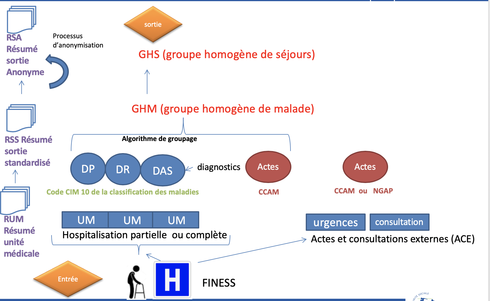
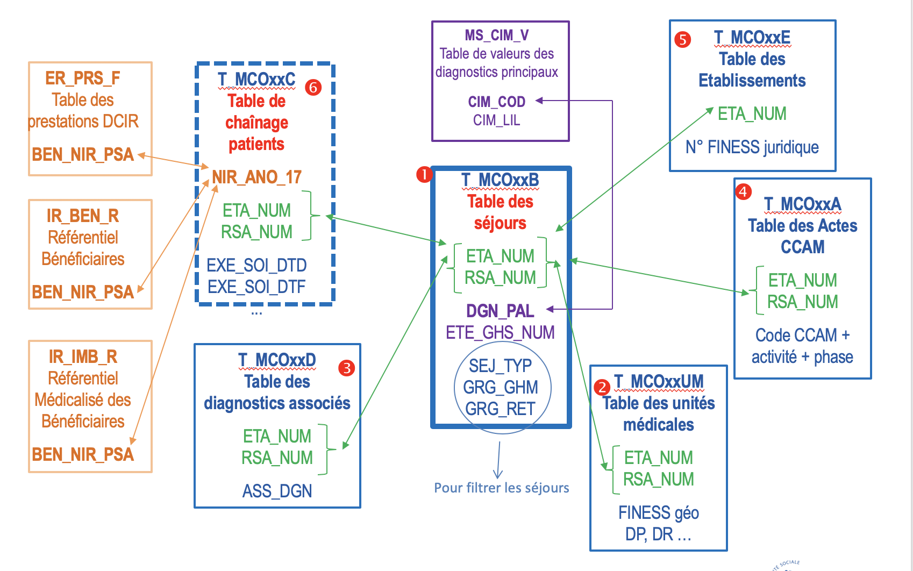
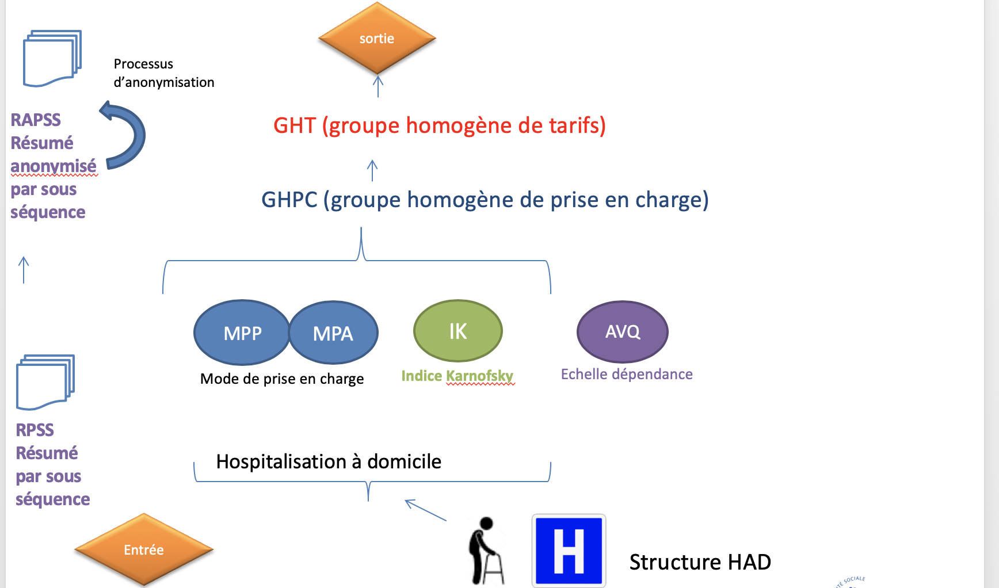
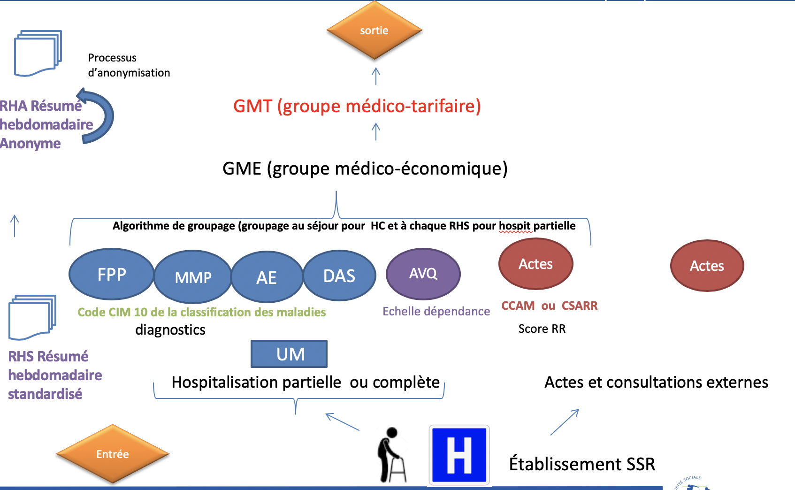
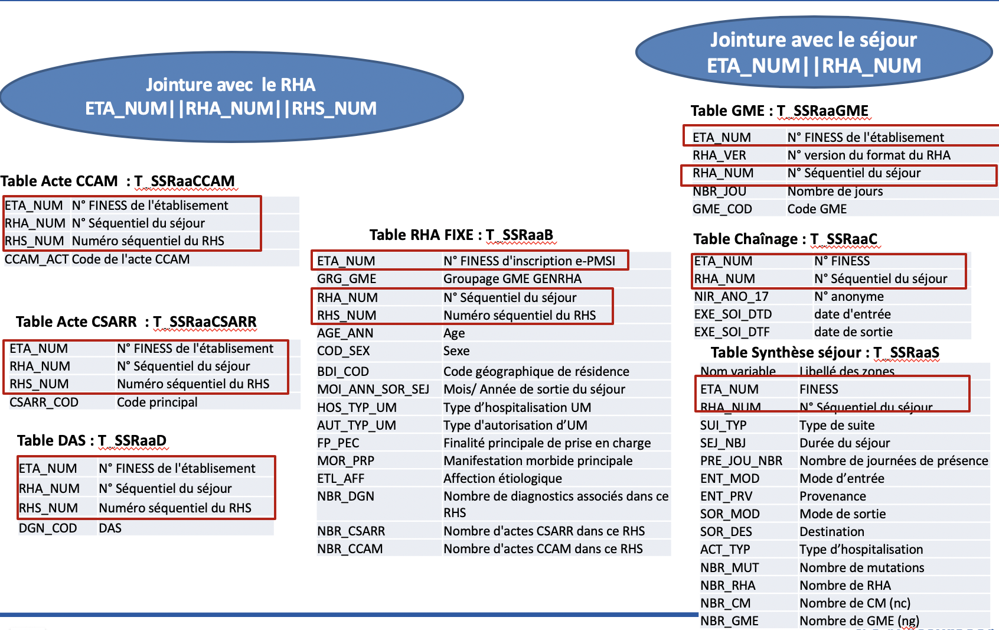
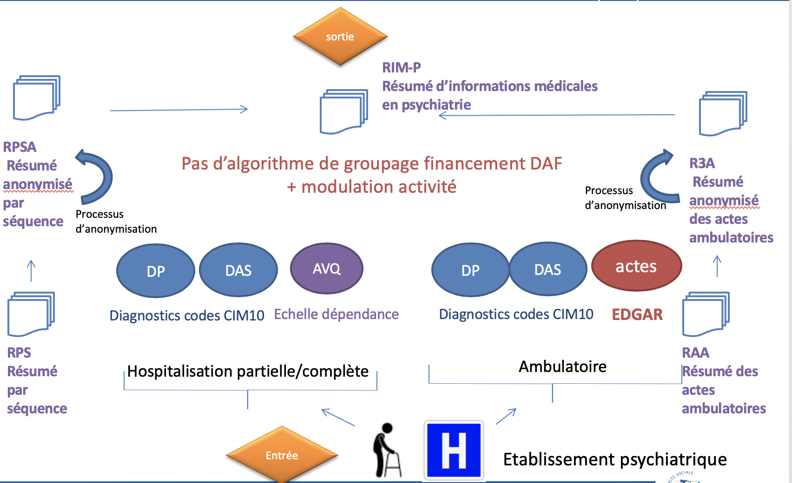
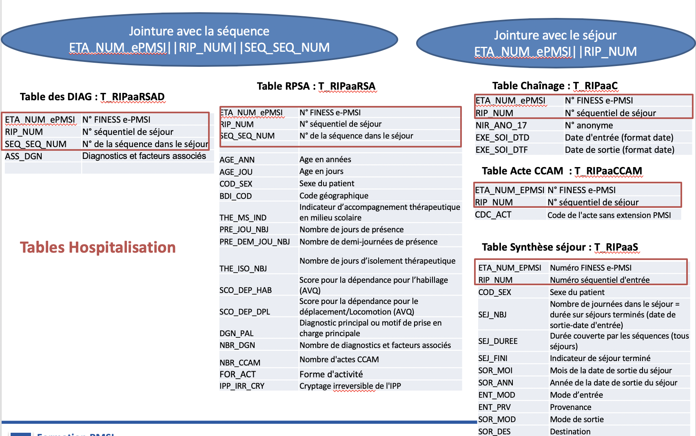

---
tags:
    - Généralité SNDS
    - Initiation au SNDS
    - PMSI
---

# Concepts de fonctionnement des PMSI 
<!-- SPDX-License-Identifier: MPL-2.0 -->

<TagLinks />

Le Programme de Médicalisation des Systèmes d'Information a été créé en 1983 et a été rendu obligatoire pour tous les établissements de santé en 1991.
Initialement, celui-ci avait été créé uniquement pour mesurer l'activité médico-économique hospitalière des établissements MCO (médecine chirurgicale obstétrique).
3 autres PMSI ont ensuite été créés et sont venus s'ajouter à celui-ci:
* Le PMSI SSR (soins de suite et réadaptation)
* Le PSMI HAD (Hospitalisation à domicile)
* Le PMSI RIM-P (Recueil d'information en psychiatrie)

Les différents PMSI ont un historique d'exhaustivité différents dans le SNDS

* MCO : 1997
* SSR : 2008
* HAD : 2005
* RIM-P : 2011

## PMSI MCO

### Schéma des concepts du PMSI MCO

### L'articulation des principales bases du PMSI MCO

### L'identification d'un séjour dans le PMSI MCO
Un séjour hospitalier MCO est identifié par :
- Le numéro juridique de l'établissement : ETA_NUM
- Le numéro du Résumé de Sortie Anonymisé du séjour : RSA_NUM

La table de séjours d'une année AA (T_MCOAAB) correspond aux séjours qui se sont terminés au cours de cette année.

Exemple : T_MCO16B concerne les séjours uniquement terminés en 2016

## PMSI HAD

### Schéma des concepts du PMSI HAD

### L'articulation des principales bases du PMSI HAD

### L'identification d'un séjour dans le PMSI HAD
Un séjour hospitalier en HAD est constitué d'une suite de séquences de soins, elles-mêmes décomposées en sous-séquences.

Un RAPSS (résumé anonymisé par sous séquence) est identifié par les clés de jointure suivantes :
- Le numéro FINESS d'inscription e-PMSI : ETA_NUM_e-PMSI
- Le numéro séquentiel du séjour : RHAD_NUM
- Le numéro de la séquence dans le séjour : SEQ_NUM
- Le numéro de la sous-séquence : SSEQ_NUM

Un séjour est indentifié par les clés de jointure suivantes :
- Le numéro FINESS d'inscription e-PMSI : ETA_NUM_e-PMSI
- Le numéro séquentiel du séjour : RHAD_NUM

## PMSI SSR

### Schéma des concepts du PMSI SSR

### L'articulation des principales bases du PMSI SSR

### L'identification d'un séjour dans le PMSI SSR
Un séjour hospitalier en SSR est couvert par un ou plusieurs résumés hebdomadaires standardisés (RHS)
Les RHS sont restitués dans le PMSI SSR sous forme de RHA (RHS anonymisés) et de suites de RHA (séjours)

Un RHA est identifié par les clés de jointure suivantes :
- Le numéro FINESS d'inscription : ETA_NUM
- Le numéro séquentiel du séjour : RHA_NUM
- Le numéro séquentiel du RHS : RHS_NUM

Un séjour est identifié par les clés de jointure suivantes :
- Le numéro FINESS d'inscription : ETA_NUM
- Le numéro séquentiel du séjour : RHA_NUM

## PMSI RIM-P

### Schéma des concepts du PMSI RIM-P

### L'articulation des principales bases du PMSI RIM-P

### L'identification d'un séjour dans le PMSI RIM-P

Le séjour hospitalier RIM-P est couvert par un ou plusieurs résumés par séquences (RPS)
Les RPS sont restitués dans le PMSI RIM-P sous forme de RPSA (Résumé anonymisé par séquence)

Un RPSA est identifié par les clés de jointure suivantes :
- Le numéro FINESS d'inscription e-PMSI : ETA_NUM_e-PMSI
- Le numéro séquentiel du séjour : RIP_NUM
- Le numéro de séquence : SEQ_SEQ_NUM

Un séjour est identifié par les clés de jointure suivantes :
- Le numéro FINESS d'inscription e-PMSI : ETA_NUM_e-PMSI
- Le numéro séquentiel du séjour : RIP_NUM

## Références

::: tip Crédits
Cette fiche a été rédigé par Emmanuel STRANADICA (Health Data Hub), les graphiques proviennent du support de cours Initiation au PMSI à travers le SNDS et est la propriété de la Cnam
:::

