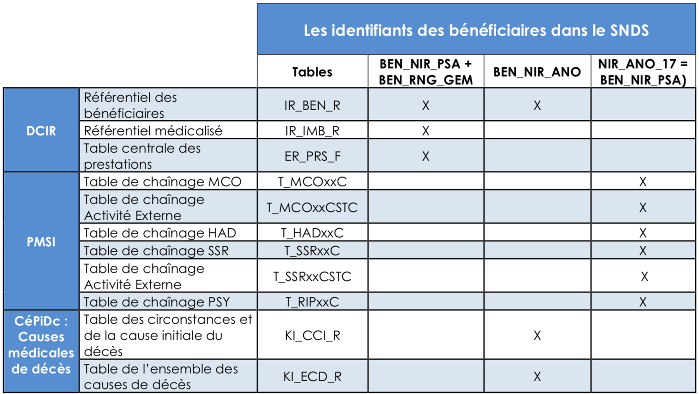
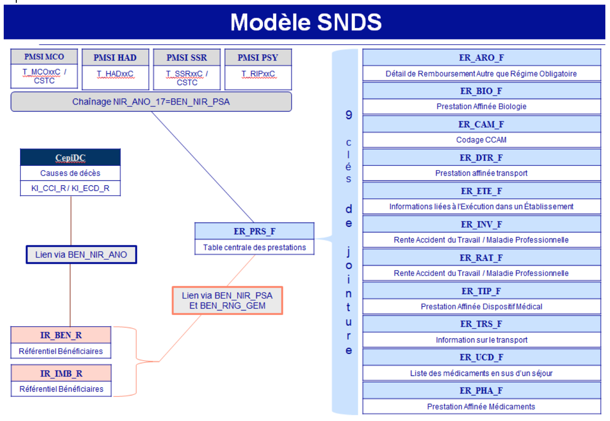

# Identifiants des bénéficiaires
<!-- SPDX-License-Identifier: MPL-2.0 -->

Comprendre les identifiants des bénéficiaires dans le SNDS et les exploiter correctement. 

## Les identifiants bénéficiaires dans le SNDS

**L’identifiant SNDS, appelé pseudo-NIR**, est composé de 3 éléments :
- NIR de l'assuré ouvreur de droit,
- date de naissance du bénéficiaire,
- code sexe du bénéficiaire.

Ce triplet est crypté (pseudonymisé) et est restitué dans les données brutes dans des variables sur 17 caractères : **BEN_NIR_PSA** dans le DCIR et NIR_ANO_17 dans le PMSI.
Dans le cadre des demandes d’extractions des données du SNDS (accès sur projet), cette variable est cryptée et est restituée aux utilisateurs dans la variable NUM_ENQ.

Un individu a plusieurs « pseudo-NIR » durant sa vie, en l’occurrence, autant de « pseudos NIR » que d’assurés :

- Lorsque l’individu est enfant, il peut être assuré par 1 ou 2 parents. L’individu peut donc avoir à ce moment de la vie, 1 ou 2 « pseudos NIR » différents.
- Lorsqu’il devient étudiant, il devient son propre assuré. Il a donc à ce moment de la vie un nouveau « pseudo NIR ».
- Lorsque l’individu est adulte, il est la plupart du temps son propre assuré ; c’est le cas de tout travailleur salarié ou indépendant. Mais il peut également ne plus être son propre assuré (femme, homme au foyer par exemple), et être assuré par son conjoint. L’individu a alors un nouveau « pseudo NIR ».

Au cours de sa vie, un individu a, dans la majorité des cas, au moins 2 « pseudos NIR » différents : 1 lorsqu’il n’est pas son propre assuré et 1 lorsqu’il devient son propre assuré.


**Le rang gémellaire du bénéficiaire (BEN_RNG_GEM)** n’a pas la même signification pour les différents régimes :
- Pour le _régime général_ (y compris SLM) et la MSA, il permet de distinguer les naissances gémellaires de même sexe donc de même BEN_NIR_PSA.
- Pour tous les _autres régimes_, il permet de différencier les bénéficiaires rattachés au même ouvreur de droit.

**Dans le DCIR, le lien entre la table centrale des prestations (ER_PRS_F) et le référentiel des bénéficiaires (IR_BEN_R) ou le référentiel des données médicalisées (IR_IMB_R) se fait à l’aide des clés de jointure BEN_NIR_PSA et BEN_RNG_GEM.
A partir de 2006, le chainage avec les données du PMSI se fait avec le BEN_NIR_PSA = NIR_ANO_17.**

Dans le PMSI, il existe deux variables sur le rang du bénéficiaire :
- Le rang de naissance, obligatoire pour le régime général dans l’attestation de droit du bénéficiaire et associé à la date de naissance,
- et le rang du bénéficiaire, pour les autres régimes. Toutefois, la fiabilité de cette information ne nous permet pas encore de l’utiliser et elle ne peut pas être utilisée comme variable de chainage.

Il est conseillé en revanche, de la ramener comme une variable pour départager après coup les NIR_ANO_17 correspondant à des naissances gémellaires de même sexe.

Par ailleurs, pour établir des statistiques sur les patients et pour chaîner sur les différents PMSI (plusieurs années et/ou entre les différents champs du PMSI), on applique le filtre suivant pour éliminer des clés de chainage incorrectes :
```sql
Where NIR_RET<>'0' and NAI_RET <>'0' and SEX_RET <>'0' and SEJ_RET<>'0' and FHO_RET <>'0' and PMS_RET<>'0' and DAT_RET <>'0' and NIR_ANO_17 not in ('xxxxxxxxxxxxxxxxx','XXXXXXXXXXXXXXXXD')
```
**BEN_NIR_ANO est le numéro d’inscription au répertoire (NIR)**, appelé aussi numéro de sécurité sociale ; il est unique pour un individu durant toute sa vie. BEN_NIR_ANO ne dépend pas de l’ouvreur de droit, mais uniquement de l’individu. BEN_NIR_ANO est également un pseudonyme

## Tableau des identifiants des bénéficiaires



## Schéma des identifiants



## Utilisation des identifiants

Le NIR est certifié lorsque l’identité de la personne a été validée par l’Insee.

Les NIR certifiés sont identifiés avec la variable BEN_CDI_NIR renseignée à 00 : NIR Normal (ni fictif ni provisoire). Cette variable est présente dans la table centrale des prestations ER_PRS_F et dans le référentiel des bénéficiaires IR_BEN_R.

Il existe des NIR provisoires qui sont, par exemple, attribués par un régime d’assurance maladie à un travailleur ou un étudiant étranger en attendant le contrôle des documents permettant la vérification de son identité.
Les NIR provisoires sont identifiés avec la variable BEN_CDI_NIR renseignée à 03 ou 04.

Il existe dans le DCIR des NIR fictifs pour certaines prestations afin de garantir l’anonymat de la personne (ex: IVG). Ils sont identifiés avec la variable BEN_CDI_NIR renseignée à 01, 05, 08, 09.
Dans ER_PRS_F, on peut également repérer les prestations correspondant à un NIR fictif par le code du petit régime d’affiliation (RGM_COD) égal à 888 avec code grand régime de liquidation (RGM_GRG_COD) égal à 01. La variable BEN_CDI_NIR prend alors une des valeurs de NIR fictif.

**Lorsque le NIR est fictif, le BEN_NIR_ANO n’est pas renseigné.**
Les modalités prises par BEN_CDI_NIR sont présentes dans la table référentiel IR_NIR_V :

|BEN_NIR_COD|BEN_NIR_LIB|
|-----------|-----------|
|00|NIR NORMAL (ni fictif ni provisoire)|
|01|NIR FICTIF IVG|
|03|NIR D UN MIGRANT PROVISOIRE PASSAGE (commence par 5 ou 6)|
|04|NIR D UN ASSURE PROVISOIRE (commence par 7 ou 8)|
|05|NIR FICTIF IST|
|06|NIR FICTIF IVG DES MINEURES SANS CONSENTEMENT PARENTAL|
|08|NIR FICTIF AUTRE|
|09|NIR FICTIF DES AIDES A LA TELETRANSMISSION|
|11|NIR FICTIF CONTRACEPTION DES MINEURES|
|12|ALD MINEUR|
|99|valeur inconnue|
|NN|sans objet|
|13|NIR MATERNITE PS|
|14|NIR PATERNITE PS|
|15|NIR ADOPTION PS|

## Fabrication des identifiants pour les demandes d’extractions

L’extraction des données brutes issues des tables SNDS se fait actuellement sur l’identifiant BEN_NIR_PSA qui n’est pas pérenne, un individu pouvant avoir plusieurs BEN_NIR_PSA.

Nous récupérons via le BEN_NIR_ANO, présent dans le référentiel IR_BEN_R, toutes les autres identités en lien avec le BEN_NIR_PSA initialement sélectionné.

Nous construisons ensuite une table de correspondance entre le NUM_ANO (= cryptage de BEN_NIR_ANO) et les NUM_ENQ (= cryptage de BEN_NIR_PSA).

**Dans l’exploitation des données, une nouvelle variable « identifiant unique » du bénéficiaire BEN_ID, doit être fabriquée par l’utilisateur.** Elle est égale :
1. Au NIR pseudonymisé du bénéficiaire BEN_NIR_ANO (NUM_ANO), lorsque ce NIR est renseigné.
2. A la concaténation de l’identifiant SNIIRAM pseudonymisé BEN_NIR_PSA (NUM_ENQ) et du rang de bénéficiaire BEN_RNG_GEM lorsque le NIR du bénéficiaire BEN_NIR_ANO n’est pas renseigné.

L’identifiant BEN_ID vous permet directement de regrouper les informations d’un même bénéficiaire :
- suivant son NIR pseudonymisé BEN_NIR_ANO lorsqu’il est renseigné dans la table IR_BEN_R, 
- suivant son couple (identifiant SNIIRAM pseudonymisé; rang de bénéficiaire) lorsque son NIR ne figure pas dans la table IR_BEN_R.

## Références

::: tip Crédit
Le contenu original de cette fiche provient du document [Fiche bénéficiaires](../files/Cnam/2019-06_CNAM-INDS_SNDS_Fiches_Thematiques_BENEF_MPL-2.0.pdf) rédigé par la [CNAM](https://www.ameli.fr/l-assurance-maladie/statistiques-et-publications/index.php)  
MAJ 11/07/2019
:::
