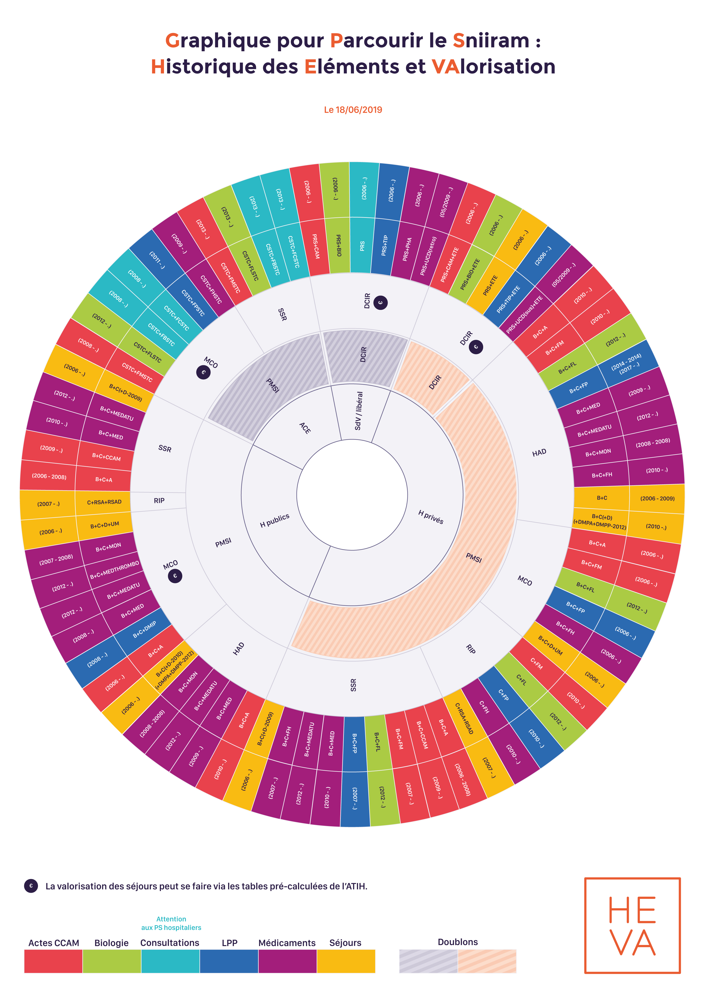

# Graphique pour Parcourir le Sniiram (GPS)
<!-- SPDX-License-Identifier: MPL-2.0 -->

Cette présentation illustre quelles sources (DCIR ou PMSI) et tables utilisées pour rechercher plusieurs types de soins :
- les consultations,
- les actes CCAM,
- les séjours... .

Les années de disponibilités de chaque table sont indiquées. 
La présence de doublons entre le PMSI et le DCIR est visible grâce aux zones hachurées. 

Cet historique permet de voir aussi l'ajout des différents régimes dans les bases.

## Le GPS

## Références

- [Dictionnaire des données - Kwikly](https://documentation-snds.health-data-hub.fr/ressources/kwikly.html)

::: tip Crédits
Le contenu original de cette fiche provient du document [GPS HEVA](../images/2019-06-18_HEVA_graph_parcourir_sniiram_MPL-2.0.jpg) rédigé par HEVA
:::

