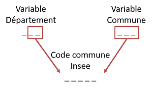

# Localisation géographique des bénéficiaires
<!-- SPDX-License-Identifier: MPL-2.0 -->

La localisation géographique du bénéficiaires dans le SNDS est possible grâce aux variables indiquant le **département et la commune de résidence**. 
Il n’existe pas de niveau plus fin de localisation. 
Ces variables sont mises à disposition dans différentes tables du SNDS, dans des formats différents, avec parfois des informations contradictoires ou à corriger.

L’objet de cette fiche est d’aider à s’y retrouver parmi ces différentes informations pour assurer au mieux la qualité de la localisation du bénéficiaire.  

## Remarques préliminaires

### Le code commune correspond à des information différentes selon les univers

Dans le *SNIIRAM* et les *causes de décès*, il s'agit du **code Insee**
Tandis que dans le *PMSI*, il s’agit du **code géographique**, à savoir le code postal, ou code postal agrégé pour les communes de moins de 1000 habitants. 

Dans le SNIIRAM, le code commune est remonté via la carte vitale au moment du soin; ou via les bases de données des caisses de sécurité sociale. 
Dans le PMSI il est déclaré par le bénéficiaire lors du séjour. 
Dans les causes de décès, il s’agit de l’information sur le certificat de décès.

### Association d'un bénéficiaire à un lieu de résidence

Il existe différents critères de décision pour associer un bénéficiaire à un lieu de résidence.

La CNAM retient souvent le critère du **dernier département de résidence**.
 
Il est possible d’utiliser d’autres critères d'associations, tels que 
- le département associé au plus grand nombre de soins sur la période d’étude ;  
- le département de l’organisme de remboursement du bénéficiaire ;
- le département du professionnel exerçant le soin.

### Qualité de l'information

Au niveau département, la plupart des codes sont bons.
Des problèmes existent pour la Corse, les DOM, et les bénéficiaires de certaines sections locales mutualistes étudiantes (SLM 617).

Au niveau communal, beaucoup de corrections sont à faire, en recourant notamment à des tables de correction *a priori* non exhaustives.

## Où trouver les variables département et commune 

| **UNIVERS**| **TABLE**| **VARIABLE DÉPARTEMENT** (str(3)) | **VARIABLE COMMUNE** (str(3)) | **REMARQUES** |
|------------|----------|----------|----------|----------|
| **SNIIRAM  DCIR** | **Référentiel des bénéficiaires** [IR_BEN_R](../tables/BENEFICIAIRE/IR_BEN_R.md) | BEN_RES_DPT | BEN_RES_COM | Dernière information disponible (table des prestations ou données administratives des caisses de sécurité sociale) |
| | **Table prestations** [ER_PRS_F](../tables/DCIR/ER_PRS_F.md)| BEN_RES_DPT | BEN_RES_COM | Information remontée au moment de la prestation |
| **SNIIRAM DCIRS** | **Référentiel des bénéficiaires** [IR_IBA_R](../tables/BENEFICIAIRE/IR_IBA_R.md) | BEN_RES_DPT | BEN_RES_COM | Dernière information disponible (table des prestations ou données administratives des caisses de sécurité sociale) |
| | **Table prestations** [NS_PRS_F](../tables/DCIRS/NS_PRS_F.md)| BEN_RES_DPT | BEN_RES_COM | Information remontée au moment de la prestation |
| | **Tables affinées** [NS_XXX_F](../tables/DCIRS)| BEN_RES_DPT | BEN_RES_COM | Information remontée au moment de la prestation |
| **PMSI MCO/SSR/HAD** | **Table séjour B** [T_MCOAA_B](../tables/PMSI/PMSI%20MCO/T_MCOaa_nnB.md) | BDI_DEP | BDI_COD (str(5))| |
| **Carto des pathos** | **Table individus** [CT_IND_AAAA_GN](../tables/CARTOGRAPHIE_PATHOLOGIES/CT_IND_AAAA_GN.md)| dpt| Non disponible | Code reconstitué à partir des informations du DCIR et du PMSI et corrigé si besoin |
| **Causes de décès** | **Table cause initiale de décès** [KI_CCI_R](../tables/Causes%20de%20décès/KI_CCI_R.md) | BEN_RES_DPT | BEN_RES_COM | Les codes ont été transformés pour coller aux référentiels du SNIIRAM IR_DPT_V et IR_GEO_V |


## Construction de la localisation dans le SNIIRAM

Si on souhaite travailler *à un niveau départemental*, la variable du département peut généralement s’utiliser seule. 

Dans certains cas, la variable commune est cependant utile pour bien reconstituer le code du département : distinction des DOM entre eux, distinction des deux départements de Corse.

Si on souhaite travailler *au niveau communal* dans le SNIIRAM, il faut combiner l’information des **deux** variables département **et** commune.  

### Construction du code Insee complet à 5 positions

Cette partie détaille comment construire le code commune Insee complet pour un soin, c'est-à-dire pour une ligne du DCIR. 
Elle ne spécifie pas de critère de décision pour savoir quelle information retenir si un bénéficiaire est associé à deux localisations différentes.

La **règle dominante** consiste à extraire *les deux derniers caractères du code département* et *les trois caractères du code commune*.   




Des **exceptions** existent pour : 

*  La Corse (code département `209`)
    * 2 **premiers** caractères du code département    
    * 3 caractères du code commune
*  Les DOM
    * Pour les bénéficiaires du [RG](glossaire.md#rg), le code département est `097` et la règle dominante fonctionne
    * Pour la [MSA](glossaire.md#msa) et le [RSI](glossaire.md#rsi), le code département est entre `971` et `976`, 
        * Pour la MSA, on applique la même règle que pour la Corse
        * Pour le RSI, on conserve les 3 caractères du code département et les 2 derniers caractères du code commune

#### Code SAS pour reconstruire la variable `depcom`

Voici un exemple de code SAS pour reconstruire la variable *depcom* à 5 positions, à partir des variables `BEN_RES_DPT` et `BEN_RES_COM`

```sas
/*Cas général*/
IF ben_res_dpt ne '209' and substr(ben_res_dpt,1,2) ne '97' 
	THEN depcom=compress(substr(ben_res_dpt,2,2)||ben_res_com);
 /*Corse*/
ELSE IF ben_res_dpt = '209' 
	THEN depcom=compress(substr(ben_res_dpt,1,2)||ben_res_com); 
 /*DOM pour MSA*/
ELSE IF (regime='02A' and substr(ben_res_dpt,1,2)='97') 
	THEN depcom=compress(substr(ben_res_dpt,1,2)||ben_res_com); 
/*DOM pour RSI*/
ELSE IF (regime='03A' and substr(ben_res_dpt,1,2)='97') 
	THEN depcom=compress(ben_res_dpt)||substr(ben_res_com,2,2); 
```

#### Corrections supplémentaires

* Un certain nombre de codes communes et de codes départements sont manquants et codés en `000`, `099` ou `999`. 
Pour améliorer l’information, il est possible d’utiliser le département de l’organisme d’affiliation du bénéficiaire `(substr(org_aff_ben,4,3))`.

* Certains codes communes Insee sont erronés pour différentes raisons et peuvent être corrigés, de préférence dans l’ordre qui suit :
    * La nomenclature des codes communes évolue régulièrement et les caisses ne répercutent pas nécessairement toutes les évolutions de codage. 
    Elles utilisent donc parfois des codes Insee qui n’existent plus.  
→ Mise à disposition d’une table de correction pour réattribuer les bons codes (attention, table non exhaustive): RFCOMMUN.CORRECTIONS_COM2012_NEW
    * Codes postaux à la place des codes Insee  
→ Mise à disposition par l’ARS Ile-de-France d’une table de correction pour réattribuer les bons codes: RFCOMMUN.T_FIN_GEO_LOC_FRANCE  
 
* Anomalie pour les bénéficiaires d’une SLM étudiante (code 617) : code département tronqué à deux caractères et compris entre 001 et 009  
→ Correction à effectuer en récupérant via le département de l’organisme (substr(ORG_AFF_BEN,4,3))

* Pour reconstituer le code département de la Corse (Haute-Corse, 201, et Corse-du-Sud, 202) deux méthodes possibles :
    * utiliser le département de l'organisme d'affiliation du bénéficiaire *(substr(org_aff_ben,4,3))* qui distingue les deux départements de la Corse pour le régime général et les SLM
    * reconstituer le code département à partir des codes Insee à 5 positions à l'aide d'un code de passage de la commune au département

### Construction du code département

La méthode la plus rigoureuse pour tenir compte des spécificités du codage de la variable département dans le SNIIRAM (Corse, DOM, etc.) est de repartir de la variable du code commune à 5 positions créée d’après le code ci-dessus, puis d’en extraire le département à l’aide du code suivant :

```sas
IF substr(depcom,1,2) in ("97","20") THEN dept=substr(depcom,1,3);
ELSE dept=substr(depcom,1,2);
```

## Construction de la localisation dans le PMSI

Si on souhaite travailler *à un niveau départemental*, la variable département `BDI_DEP` s’utilise seule.

Si on souhaite travailler *à un niveau communal*, la variable commune `BDI_COD` s’utilise également seule dans le PMSI (5 positions). 
Elle donne le code géographique du lieu de résidence déclaré par le patient, qui correspond au code postal ou à un regroupement pour les communes de moins de 1000 habitants.
 
Différences par rapport au SNIIRAM :
* La Corse : codée 2A ou 2B
* Les DOM : codés 9A, 9B, 9C, 9D et 9F

Une table **PMSI_CORRESP** est mise à disposition par l’[ATIH](glossaire.md#atih) pour passer des codes géographiques aux codes postaux. 
Cette table n’est cependant pas bijective. 
Elle génère des doublons lorsque les codes géographiques sont associés à plusieurs codes postaux.

## Construction du code région

Le programme ci-dessous permet d'associer aux codes départements reconstruits selon les méthodes citées précédemment (SNIIRAM ou PMSI) les codes des nouvelles régions correspondantes :

```sas
IF dept="01" THEN region="84-Auvergne-Rhône Alpes";
IF dept="02" THEN region="32- Hauts de France";
IF dept="03" THEN region="84-Auvergne-Rhône Alpes";
IF dept="04" THEN region="93-Provence Alpes Cote d'Azur";
IF dept="05" THEN region="93-Provence Alpes Cote d'Azur";
IF dept="06" THEN region="93-Provence Alpes Cote d'Azur";
IF dept="07" THEN region="84-Auvergne-Rhône Alpes";
IF dept="08" THEN region="44-Grand Est";
IF dept="09" THEN region="76-Occitanie";
IF dept="10" THEN region="44-Grand Est";
IF dept="11" THEN region="76-Occitanie";
IF dept="12" THEN region="76-Occitanie";
IF dept="13" THEN region="93-Provence Alpes Cote d'Azur";
IF dept="14" THEN region="28- Normandie";
IF dept="15" THEN region="84-Auvergne-Rhône Alpes";
IF dept="16" THEN region="75-Nouvelle Aquitaine";
IF dept="17" THEN region="75-Nouvelle Aquitaine";
IF dept="18" THEN region="24-Centre-Val de Loire";
IF dept="19" THEN region="75-Nouvelle Aquitaine";
IF dept="2A" THEN region="94-Corse";
IF dept="2B" THEN region="94-Corse";
IF dept="201" THEN region="94-Corse";
IF dept="202" THEN region="94-Corse";
IF dept="20" THEN region="94-Corse";
IF dept="21" THEN region="27- Bourgogne Franche Comté";
IF dept="22" THEN region="53-Bretagne";
IF dept="23" THEN region="75-Nouvelle Aquitaine";
IF dept="24" THEN region="75-Nouvelle Aquitaine";
IF dept="25" THEN region="27- Bourgogne Franche Comté";
IF dept="26" THEN region="84-Auvergne-Rhône Alpes";
IF dept="27" THEN region="28- Normandie";
IF dept="28" THEN region="24-Centre-Val de Loire";
IF dept="29" THEN region="53-Bretagne";
IF dept="30" THEN region="76-Occitanie";
IF dept="31" THEN region="76-Occitanie";
IF dept="32" THEN region="76-Occitanie";
IF dept="33" THEN region="75-Nouvelle Aquitaine";
IF dept="34" THEN region="76-Occitanie";
IF dept="35" THEN region="53-Bretagne";
IF dept="36" THEN region="24-Centre-Val de Loire";
IF dept="37" THEN region="24-Centre-Val de Loire";
IF dept="38" THEN region="84-Auvergne-Rhône Alpes";
IF dept="39" THEN region="27- Bourgogne Franche Comté";
IF dept="40" THEN region="75-Nouvelle Aquitaine";
IF dept="41" THEN region="24-Centre-Val de Loire";
IF dept="42" THEN region="84-Auvergne-Rhône Alpes";
IF dept="43" THEN region="84-Auvergne-Rhône Alpes";
IF dept="44" THEN region="52-Pays de Loire";
IF dept="45" THEN region="24-Centre-Val de Loire";
IF dept="46" THEN region="76-Occitanie";
IF dept="47" THEN region="75-Nouvelle Aquitaine";
IF dept="48" THEN region="76-Occitanie";
IF dept="49" THEN region="52-Pays de Loire";
IF dept="50" THEN region="28- Normandie";
IF dept="51" THEN region="44-Grand Est";
IF dept="52" THEN region="44-Grand Est";
IF dept="53" THEN region="52-Pays de Loire";
IF dept="54" THEN region="44-Grand Est";
IF dept="55" THEN region="44-Grand Est";
IF dept="56" THEN region="53-Bretagne";
IF dept="57" THEN region="44-Grand Est";
IF dept="58" THEN region="27- Bourgogne Franche Comté";
IF dept="59" THEN region="32- Hauts de France";
IF dept="60" THEN region="32- Hauts de France";
IF dept="61" THEN region="28- Normandie";
IF dept="62" THEN region="32- Hauts de France";
IF dept="63" THEN region="84-Auvergne-Rhône Alpes";
IF dept="64" THEN region="75-Nouvelle Aquitaine";
IF dept="65" THEN region="76-Occitanie";
IF dept="66" THEN region="76-Occitanie";
IF dept="67" THEN region="44-Grand Est";
IF dept="68" THEN region="44-Grand Est";
IF dept="69" THEN region="84-Auvergne-Rhône Alpes";
IF dept="70" THEN region="27- Bourgogne Franche Comté";
IF dept="71" THEN region="27- Bourgogne Franche Comté";
IF dept="72" THEN region="52-Pays de Loire";
IF dept="73" THEN region="84-Auvergne-Rhône Alpes";
IF dept="74" THEN region="84-Auvergne-Rhône Alpes";
IF dept="75" THEN region="11-Ile de France";
IF dept="76" THEN region="28- Normandie";
IF dept="77" THEN region="11-Ile de France";
IF dept="78" THEN region="11-Ile de France";
IF dept="79" THEN region="75-Nouvelle Aquitaine";
IF dept="80" THEN region="32- Hauts de France";
IF dept="81" THEN region="76-Occitanie";
IF dept="82" THEN region="76-Occitanie";
IF dept="83" THEN region="93-Provence Alpes Cote d'Azur";
IF dept="84" THEN region="93-Provence Alpes Cote d'Azur";
IF dept="85" THEN region="52-Pays de Loire";
IF dept="86" THEN region="75-Nouvelle Aquitaine";
IF dept="87" THEN region="75-Nouvelle Aquitaine";
IF dept="88" THEN region="44-Grand Est";
IF dept="89" THEN region="27- Bourgogne Franche Comté";
IF dept="90" THEN region="27- Bourgogne Franche Comté";
IF dept="91" THEN region="11-Ile de France";
IF dept="92" THEN region="11-Ile de France";
IF dept="93" THEN region="11-Ile de France";
IF dept="94" THEN region="11-Ile de France";
IF dept="95" THEN region="11-Ile de France";
IF dept="9A" THEN region="01-Guadeloupe";
IF dept="9B" THEN region="02-Martiniquee";
IF dept="9C" THEN region="03-Guyane";
IF dept="9D" THEN region="04-La Réunion";
IF dept="9F" THEN region="06-Mayotte";
IF dept="971" THEN region="01-Guadeloupe";
IF dept="972" THEN region="02-Martiniquee";
IF dept="973" THEN region="03-Guyane";
IF dept="974" THEN region="04-La Réunion";
IF dept="976" THEN region="06-Mayotte";
```

## Références

::: tip Crédit
Le contenu de cette fiche est rédigé par Claire-Lise Dubost (DREES) et s'inspire notamment de la note technique rédigée en 2014 par Pierre-Olivier Blotière (CNAM), ainsi que de codes fournis par les ARS.
:::
