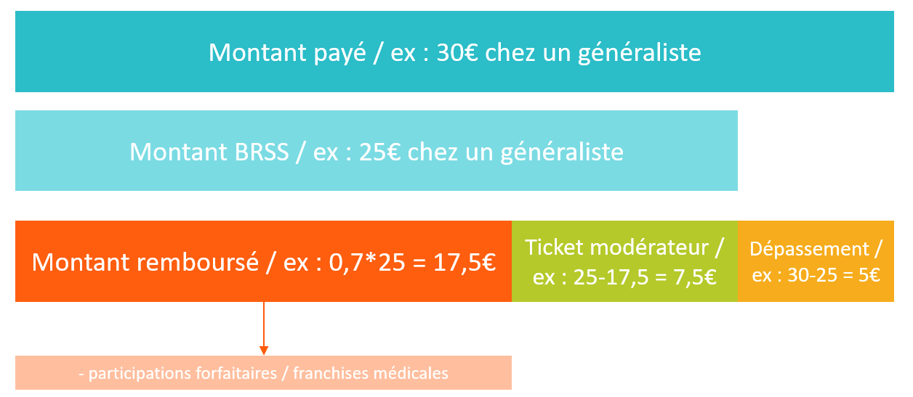
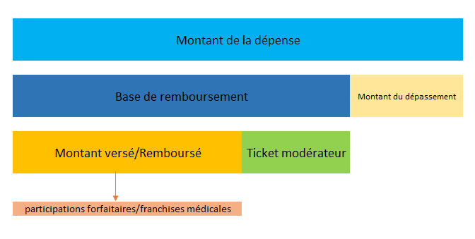

# Dépenses de soins de ville dans le DCIR, le DCIRS et le DAMIR
<!-- SPDX-License-Identifier: MPL-2.0 -->

## DCIR

### Quels indicateurs de dépenses sont disponibles ?

Les soins de ville sont présents dans le DCIR. 
Différentes informations sur les montants sont indiquées : 
- le montant payé par l'assuré 
- le montant de base de remboursement ([BRSS](../glossaire/BRSS.md))
- le montant remboursé
- le [taux de remboursement](https://www.ameli.fr/rhone/assure/remboursements/rembourse/tableau-recapitulatif-taux-remboursement/tableau-recapitulatif-taux-remboursement)
- les [participations forfaitaires](https://www.ameli.fr/rhone/assure/remboursements/reste-charge/participation-forfaitaire-1-euro) et [franchises médicales](https://www.ameli.fr/rhone/assure/remboursements/reste-charge/franchise-medicale)
- les participations supplémentaires prises en charge par le public ([CMU-C](../glossaire/CMUC.md), [AME](../glossaire/AME.md), etc.)

### Exemple schématique des différents montants 

Dans cet exemple, il n'y a pas de parts supplémentaires. 

::: warning Attention
Le reste à charge (RAC) après Assurance Maladie Complémentaire (AMC) n'est pas calculable. 

Le SNDS ne dispose pas encore de l'échantillon représentatif des données de remboursement par bénéficiaire transmis par les organismes d'assurance maladie complémentaires (mutuelles, institutions de prévoyance et sociétés d'assurances) prévu dans la loi de modernisation du système de santé 2016 (cf. [projet ADAM de la DREES](https://drees.solidarites-sante.gouv.fr/IMG/pdf/programme_travail_2017.pdf#page=51)).

On peut toutefois calculer le RAC après Assurance Maladie Obligatoire (AMO) et après prise en compte des participations supplémentaires. 
:::

### Les tables et variables  

Les montants payé, de base et remboursé du régime obligatoire des soins de ville sont disponibles dans la table [ER_PRS_F](../tables/DCIR/ER_PRS_F.md)(`_XXXX` en cas d'extraction):
- montant payé : `PRS_PAI_MNT`
- montant de base de remboursement : `BSE_REM_BSE`
- montant remboursé : `BSE_REM_MNT`
- taux de remboursement : `RGO_REM_TAU`
- montants des compléments et majoration : `CPL_REM_MNT`

Les participations forfaitaires et franchises médicales sont dans la variable `CPL_REM_MNT` dans `ER_PRS_F` (`CPL_MAJ_TOP=2 and CPL_AFF_COD=16`). 

Les participations supplémentaires liés à la couverture étendue de la CMUc et de l'Alsace-Moselle sont dans la
table [ER_ARO_F](../tables/DCIR/ER_ARO_F.md)(`_XXXX`) via la variable `ARO_REM_MNT`. La variable `ARO_REM_TYP` indique
le type de la prise en charge supplémentaire (Alsace Moselle, CMUc, AME, etc.)

::: warning Attention
Dans `ER_ARO_F`, si le patient est Alsace-Moselle et CMUc, il aura pour chaque soin, 
une ligne de remboursement supplémentaire Alsace-Moselle et une pour la CMU-C 
(la variable `ARO_REM_TYP` permet de différencier les 2 types de remboursement).
:::

**Les montants dans les tables affinées**

Pour les médicaments, la LPP, la biologie et la CCAM, seuls les montants totaux sont disponibles dans la table prestation. Le montant payé (`PRS_PAI_MNT`) dans `ER_PRS_F` est le montant total. Le détail des montants de base et remboursé se trouvent dans les tables affinées dédiées (sauf pour la biologie qui est explicitée en dessous). 

Par exemple, dans le cas d'une ordonnance pour 3 médicaments (avec un même taux de remboursement), `PRS_PAI_MNT` correspond au montant payé pour les 3 médicaments. Le montant payé pour chacun des médicaments n'est pas disponible. Idem, les montants de base et remboursé dans ER_PRS_F correspondent aux 3 médicaments. Les montants de base et remboursé de chaque médicament peuvent être calculés à l'aide de la table affinée ER_PHA_F(_XXXX).

Pour calculer les indicateurs d’un acte affiné prendre les indicateurs quantité affinée et prix unitaire de la table affinée et le taux de remboursement de la table prestation.
Puis calculer le montant remboursé affiné et la base de remboursement affinée à l’aide des formules suivantes : 
- Base de remboursement affinée = qté affinée x prix unitaire
- Montant remboursé affiné = qté affinée x prix unitaire x taux de remboursement/100

Pour la biologie, les montants payés et remboursés détaillés pour chaque code NABM sont à recalculer :  
1. récupérer la variable `BTF_TAR_COD` dans la table `IR_BTF_R` dans ORAREF. Cette variable donne le coefficient de l'acte affiné selon les dates d`arrêté au JO (la valeur bouge dans le temps).
2. mettre en face du code de l'acte affiné (variable `BIO_PRS_IDE`) la valeur en vigueur du coef pour cet acte au moment où il a été réalisé
3. calculer le montant remboursé via la formule : coef (`BTF_TAR_COD`) * prix de l'acte (`BSE_REM_PRU`) * quantité affinée de l'acte de bio 
4.  calculer le montant remboursé via la formule : coef (`BTF_TAR_COD`) * prix de l'acte (`BSE_REM_PRU`) * quantité affinée de l'acte de bio * taux de remboursement (dans `ER_PRS_F`)

### Quelques exemples pratiques

Les exemples ci-dessous illustrent différents cas de patients possibles pour comprendre comment les remboursements fonctionnent.

1. **Une consultation chez un médecin généraliste le 03/04/2018 - patient "classique"** 

Le patient a payé 27€, le montant de base de remboursement est 25€. 
Le patient n'a aucune exonération du ticket modérateur, il sera remboursé de 17,5€ (`RGO_REM_TAU`=70%) par le régime obligatoire. Le dépassement d'honoraires est de 2€.  

| Montant           | Table | Variable                  | Valeur |
|-------------------|-------|---------------------------|--------|
| montant payé      | ER_PRS_F  | PRS_PAI_MNT               | 27€    |
| montant de base   | ER_PRS_F  | BSE_REM_BSE               | 25€    |
| montant remboursé | ER_PRS_F  | BSE_REM_MNT               | 17,5€  |
| dépassement       | ER_PRS_F  | PRS_PAI_MNT - BSE_REM_BSE | 2€     |
| RAC après AMO      | ER_PRS_F  | PRS_PAI_MNT - BSE_REM_MNT | 9,5€     |

2. **Une consultation chez un médecin généraliste le 05/05/2019 - patient en ALD30** 

Le patient a payé 25€, le montant de base de remboursement est 25€. 
Le patient a une ALD30, il sera remboursé de 25€ (`RGO_REM_TAU`=100%) par le régime obligatoire. Il n'y a pas de dépassement d'honoraires.

| Montant           | Table | Variable                  | Valeur |
|-------------------|-------|---------------------------|--------|
| montant payé      | ER_PRS_F  | PRS_PAI_MNT               | 25€    |
| montant de base   | ER_PRS_F  | BSE_REM_BSE               | 25€    |
| montant remboursé | ER_PRS_F  | BSE_REM_MNT               | 25€  |
| dépassement       | ER_PRS_F  | PRS_PAI_MNT - BSE_REM_BSE | 0€     |
| RAC après AMO      | ER_PRS_F  | PRS_PAI_MNT - BSE_REM_MNT | 0€     |

3. **Une consultation chez un médecin généraliste le 12/06/2017 - patient CMUc**

Le patient a payé 25€, le montant de base de remboursement est 25€.
Le patient bénéficie de la CMUc. Il sera remboursé de 25€ (100%) par le régime obligatoire.

| Montant           | Table | Variable                  | Valeur |
|-------------------|-------|---------------------------|--------|
| montant payé      | ER_PRS_F  | PRS_PAI_MNT      | 25€    |
| montant de base   | ER_PRS_F  | BSE_REM_BSE    | 25€    |
| montant remboursé | ER_PRS_F  | BSE_REM_MNT       | 17,5€  |
| montant remboursé | ER_ARO_F  | ARO_REM_MNT      | 7,5€  |
| dépassement       | ER_PRS_F  | PRS_PAI_MNT - BSE_REM_BSE | 0€     |
| RAC après AMO      | ER_PRS_F  | PRS_PAI_MNT - BSE_REM_MNT | 0€     |

Le montant total remboursé est donc la somme des montants remboursés dans PRS et ARO.

::: warning 
A noter : les professionnels de santé ne sont pas autorisés à appliquer de dépassement d'honoraires pour les patients CMUc.
:::

4. **Une consultation chez un médecin généraliste le 04/03/2018 - patient Alsace-Moselle**

Le patient a payé 30€, le montant de base de remboursement est 25€.
Il est affilié en Alsace-Moselle, ses taux de remboursement du régime obligatoire sont donc supérieurs à ceux de la population générale. 
Il sera remboursé par le régime obligatoire de 22,50€ (90% au lieu de 70%). Le dépassement d'honoraires est de 5€.

| Montant           | Table | Variable                  | Valeur |
|-------------------|-------|---------------------------|--------|
| montant payé      | ER_PRS_F  | PRS_PAI_MNT      | 30€    |
| montant de base   | ER_PRS_F  | BSE_REM_BSE    | 25€    |
| montant remboursé | ER_PRS_F  | BSE_REM_MNT       | 17,5€  |
| montant remboursé | ER_ARO_F  | ARO_REM_MNT      | 5€  |
| dépassement       | ER_PRS_F  | PRS_PAI_MNT - BSE_REM_BSE | 5€     |
| RAC après AMO      | ER_PRS_F  | PRS_PAI_MNT - BSE_REM_MNT | 7,5€     |

5. **Une consultation chez un médecin généraliste le 03/04/2019 - complément et majoration - patient "classique"** 

La consultation a eu lieu dans la nuit avec une majoration de coordination des généralistes.
Le patient a payé 47,06€. Le montant de base de remboursement de la consultation est 25€ auquel 
il faut ajouter les montants de base de la majoration de coordination et du complément nuit. Le montant de base total est donc 25+19,06+3 soit 47,06€.
Le patient ne bénéficie d'aucune exonération, il est donc remboursé au taux de 70% (soit 32,94€).

Plusieurs lignes vont être présentes dans ER_PRS_F pour ce soin : 

| Montant           | Table | Variable                  | Valeur |
|-------------------|-------|---------------------------|--------|
| montant payé      | ER_PRS_F | PRS_PAI_MNT | 47,06€ |
| montant de base   | ER_PRS_F  | BSE_REM_BSE + CPL_REM_BSE| 25+19,06+3€  |
| montant remboursé | ER_PRS_F  | BSE_REM_MNT + CPL_REM_MNT| 17,5+13,34+2,1€  |
| dépassement       | ER_PRS_F  | PRS_PAI_MNT - (BSE_REM_BSE + CPL_REM_BSE) | 0€ |
| RAC après AMO      | ER_PRS_F  | PRS_PAI_MNT - BSE_REM_MNT -CPL_REM_MNT | 14,12€     |

::: warning À noter 
L'exemple présente un cas de soin avec complément et majoration mais il est possible que seule une majoration (ou un complément) soit associé au soin.
:::

## DCIRS

Dans le DCIRS, on retrouve le montant payé (`PRS_PAI_MNT`) et le taux de remboursement (`RGO_REM_TAU`). 
Cependant, la partie de base et le complément sont sommés au sein de deux indicateurs:

- le montant total remboursé (`TOT_REM_MNT` qui correspond à `BSE_REM_MNT`+`CPL_REM_MNT` dans le DCIR)
- la base de remboursement totale (`TOT_REM_BSE` qui correspond à `BSE_REM_BSE`+`CPL_REM_BSE` dans le DCIR).

On trouve ces variables dans la table prestation `NS_PRS_F`.

::: warning Attention
Si les variables ci-dessus se correspondent conceptuellement, il ne suffit pas de sommer ces variables du DCIR pour obtenir les mêmes valeurs
que dans le DCIRS. En effet, le DCIRS est construit à partir du DCIR selon une procédure qui, entre autres, 
filtre et agrège des observations 
selon une logique orienté individu contrairement à la base DCIR qui est une base essentiellement comptable.

:::

Dans le DCIRS, les participations supplémentaires (Alsace-Moselle, CMUc, etc.) se trouvent dans les variables `AR1_REM_MNT`, `AR2_REM_MNT` et `AR3_REM_MNT`
dans la table centrale des prestations `NS_PRS_F`. La logique n'est pas exactement la même que pour le DCIR. 

En effet, les participations supplémentaires dans le DCIR, comme décrit plus haut, 
sont dans une autre table qui peut comporter plusieurs lignes pour un acte en fonction du type de remboursement. 
Dans le DCIRS, les variables de participations supplémentaires ont été ajoutées à la table centrale 
et pour résoudre ce problème de la relation *one-to-many*, les parts supplémentaires remboursées ont été séparées en trois possibles occurrences. 
Par exemple, si un patient se voit rembourser deux types de parts supplémentaires, alors `AR1_REM_MNT` et `AR2_REM_MNT` seront positives. 
Les variables `AR1_REM_TYP`, `AR2_REM_TYP` et `AR3_REM_TYP` permettent d'associer à chaque occurrence le type de remboursement correspondant.

A noter que la nomenclature de `AR1_REM_TYP`, `AR2_REM_TYP` et `AR3_REM_TYP` est la même que celle de `ARO_REM_TYP` dans le DCIR (table `ER_ARO_F`). 

## DAMIR

Le [DAMIR](../glossaire/DAMIR.md) est un outil pour l'analyse statistique des grands postes de dépenses selon différents axes (Professionnels de santé, Établissements etc.)

Contrairement au DCIR, le DAMIR ne permet pas d'effectuer des analyses individuelles. 
C'est un outil complémentaire au DCIR dans la mesure où il offre des temps de requêtage nettement inférieurs, dans le cas où l'on s'intéresse uniquement à des montants agrégés de dépenses.
 
Sous SAS/Guide, le DAMIR correspond à la table [MA_REM_FT](../tables/DAMIR/MA_REM_FT.md) (bibliothèque `ORAVUE`). 
On trouve également le DAMIR sous certains profils BusinessObjects (profil 22 notamment). 

Toutes les prestations présentées au remboursement sont disponibles dans l’univers DAMIR, à l’exclusion de deux prestations : 4381 (actes hors nomenclature) et 4382 (pharmacie non remboursable). 

### Les indicateurs de dépense disponibles

Il est possible de décomposer la dépense de la même façon que dans le DCIR: 

Cependant, on trouve deux types d’indicateurs pour analyser les dépenses à l'aide du DAMIR : 
- les indicateurs bruts : montant de la dépense, quantité, montant versé/remboursé, base de remboursement et montant du dépassement
- les indicateurs préfiltrés: montant de la dépense de la prestation, quantité de la prestation, montant versé/remboursé (part de base uniquement) et montant du dépassement de la prestation

Les indicateurs bruts correspondent aux variables du DCIR (`PRS_PAI_MNT`, `PRS_ ACT_QTE`, `PRS_REM_MNT` et `BSE_REM_BSE`). 
**Lorsque l'on utilise les indicateurs bruts, il est nécessaire de poser un filtre sur le type de remboursement (la variable `PRS_REM_TYP`).**

| Type de remboursement | Libellé du type de remboursement |
|-----------------------|:--------------------------------:|
| 0                     |      Prestation de référence     |
| 1                     |         Complément d'acte        |
| 2                     |    Ticket modérateur hors CMU    |
| 3                     | Supplément hors Alsace Moselle   |
| 4                     | Supplément Alsace Moselle        |
| 5                     | Ticket modérateur CMU            |
| 6                     | Forfait CMU                      |
| 7                     | AME                              |
| 8                     | Soins urgents                    |
| 99                    | Valeur inconnue                  |

Le type de remboursement permet de distinguer les prestations légales (0, 1) des prises en charge complémentaires (2 à 7) :
-	Part de base = part légale payée par l’Assurance Maladie : acte principal (= nature de prestation) et complément d’acte (= nuit, férié, dimanche, urgence)
-	Parts complémentaires = parts non obligatoires

**Les indicateurs de dépense préfiltrés sont mis à disposition pour faciliter l'utilisation du DAMIR : il s'agit des variables préfixées en FLT_.**

#### Contenu des indicateurs bruts

| Nature de Prestation de Référence | Nature de Prestation | Type de Remboursement | Montant de la Dépense | Base de remboursement | Montant Versé /Remboursé | Montant du dépassement |
|-----------------------------------|:--------------------:|-----------------------|-----------------------|-----------------------|--------------------------|------------------------|
| 1111                              |         1111         | 0                     | 35                    | 23                    | 16,10                    |12                      |
| 1111                              |         1111         | 4                     | 35                    | 0                     | 6,90                     |0                       |
| 1111                              |         1951         | 0                     | 0                     | 0                     | -1                       |0                       |

Nous présentons l'exemple d'une consultation avec 12€ de dépassements d'honoraires. 
Pour cette prestation, deux remboursements sont effectués générant deux lignes de remboursement :
-	Un remboursement part de base (type de remboursement = 0)
-	Un remboursement part complémentaire : type de remboursement à 4 

Une participation forfaitaire de 1€ est associée à cet acte (code 1951: participation forfaitaire hors tiers payant)

Sans filtre sur le type de remboursement, l’indicateur « Montant de la Dépense » calcule une dépense totale de 70€ pour cet acte. 
Avec le filtre `PRS_REM_TYP` IN (0,1) on a une dépense de 35€ et un remboursement de l'assurance maladie obligatoire de 16,1-1€ soit 15,1€.

#### Contenu des indicateurs préfiltrés

| Nature de Prestation de Référence | Nature de Prestation | Type de Remboursement | Montant de la Dépense de la Prestation | Montant Versé /Remboursé (Part de Base uniquement) |Montant du dépassement de la prestation|
|-----------------------------------|:--------------------:|-----------------------|----------------------------------------| ---------------------------------------------------|---------------------------------------|
| 1111                              |         1111         | 0                     | 35                                     | 16,10                                              |12                                     |
| 1111                              |         1111         | 4                     | 0                                      | 0                                                  |0                                      |
| 1111                              |         1951         | 0                     | 0                                      | -1                                                 |0                                      |

-	L’indicateur de dépense « Montant de la Dépense de la Prestation » (`FLT_PAI_MNT`) correspond à `PRS_PAI_MNT` avec `PRS_REM_TYP`=0 (acte de base uniquement)
-	L’indicateur de dépense « Montant Versé/Remboursé » (`FLT_REM_MNT`) correspond à `PRS_REM_MNT` avec `PRS_REM_TYP` IN (0,1) (acte de base et complément d’acte)
-	L’indicateur de dépense « Quantité de la Prestation » (`FLT_ACT_QTE`) correspond à `PRS_ACT_QTE` avec `PRS_REM_TYP`=0 (acte de base uniquement)

La somme de l'indicateur préfiltré « Montant de la Dépense de la Prestation » permet de retrouver le montant de 35€ de dépense pour l'acte dont la nature de prestation de référence est 1111.
La somme de l'indicateur « Montant Versé/Remboursé » indique quant à elle un montant remboursé par l'assurance maladie de 15,1€ (70% de la base de remboursement moins la participation forfaitaire de 1€). 

L’indicateur « base de remboursement » existe uniquement dans la classe « Indicateurs bruts » (`PRS_REM_BSE`). De ce fait, lorsqu’on demande la base de remboursement, il faut absolument mettre les conditions : 	
-	Type de remboursement ≤ 1 (`PRS_REM_TYP` IN (0,1))
-	Complément d’actes ≠ 0 quand nature de prestation différente de 2251 (forfait journalier) (`CPL_COD` ≠ 0 et `PRS_NAT` ≠ 2251)

## Références

::: tip Crédit
Le contenu de cette fiche s'appuie fortement sur les présentations faites par la CNAM lors des formations au DCIR-DCIRS. 
Elle a été rédigée par [HEVA](https://hevaweb.com/fr/#!/).

La partie sur le DAMIR s'appuie sur le support de formation DAMIR. Elle a été rédigée par Kristel JACQUIER (DSS).
:::
