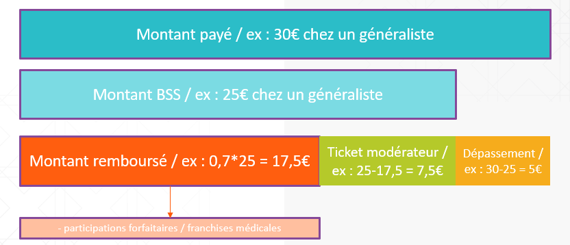

# Les montants des soins de ville dans le DCIR
<!-- SPDX-License-Identifier: MPL-2.0 -->

## Quels montants sont disponibles ?

Les soins de ville sont présents dans le DCIR. 
Différentes informations sur les montants sont indiquées : 
- le montant payé par l'assuré 
- le montant de base de remboursement 
- le montant remboursé
- le [taux de remboursement](https://www.ameli.fr/rhone/assure/remboursements/rembourse/tableau-recapitulatif-taux-remboursement/tableau-recapitulatif-taux-remboursement)
- les [participations forfaitaires](https://www.ameli.fr/rhone/assure/remboursements/reste-charge/participation-forfaitaire-1-euro) et [franchises médicales](https://www.ameli.fr/rhone/assure/remboursements/reste-charge/franchise-medicale)

Ci-dessous un exemple schématique des différents montants : 

::: warning 
Attention
Le reste à charge après Assurance Maladie Complémentaire (AMC) n'est pas calculable. Le SNDS ne dispose pas encore de l'échantillon représentatif des données de remboursement par bénéficiaire transmis par les organismes d'assurance maladie complémentaires (mutuelles, institutions de prévoyance et sociétés d'assurances) prévu dans la loi de modernisation du système de santé 2016 (cf. projet ADAM de la DREES).
On peut toutefois calculer le reste à charge après Assurance Maladie Obligatoire (AMO).
:::

## Quelques exemples 
Les exemples ci-dessous illustrent différents cas de patients possibles pour comprendre comment les remboursements fonctionnent.

1. **Une consultation chez un médecin généraliste le 03/04/2018 - patient "classique"** 

Le patient a payé 27€, le montant de base de remboursement est 25€. 
Le patient n'a aucune exonération du ticket modérateur, il sera remboursé de 17,5€ (70%) par le régime obligatoire. Le dépassement d'honoraires est de 2€.

2. **Une consultation chez un médecin généraliste le 05/05/2019 - patient en ALD30** 

Le patient a payé 25€, le montant de base de remboursement est 25€. 
Le patient a une ALD30, il sera remboursé de 25€ (100%) par le régime obligatoire. Il n'y a pas de dépassement d'honoraires.

3. **Une consultation chez un médecin généraliste le 12/06/2017 - patient CMUc**

Le patient a payé 25€, le montant de base de remboursement est 25€.
Le patient bénéficie de la CMUc. Il sera remboursé de 25€ (100%) par le régime obligatoire.

4. **Une consultation chez un médecin généraliste le 04/03/2018 - patient Alsace-Moselle**

Le patient a payé 30€, le montant de base de remboursement est 25€.
Il est affilié en Alsace-Moselle, ses taux de remboursement du régime obligatoire sont donc supérieurs à ceux de la population générale. 
Il sera remboursé par le régime obligatoire de 22,50€ (90% au lieu de 70%). Le dépassement d'honoraires est de 5€.

5. **Une consultation chez un médecin généraliste le 03/04/2019 - complément et majoration - patient CMUc** 

La consultation a eu lieu dans la nuit avec une majoration de coordination des généralistes.
Le patient a payé 47,06€. Le montant de base de remboursement de la consultation est 25€ auquel il faut ajouter les montants de base de la majoration de coordination et du complément nuit. Le montant de base total est donc 25+19,06+3 soit 47,06€.
Le patient bénéficie de la CMUc, il est donc remboursé de 47,06€.

## Quelles tables et quelles variables pour les récupérer ?

Les montants payés, de base et remboursé du régime obligatoire des soins de ville sont disponibles dans la table [ER_PRS_F](../tables/DCIR/ER_PRS_F.md)(_XXXX en cas d'extraction). 
Les montants liés à la couverture étendue de la CMUc et de l'Alsace-Moselle sont dans la table [ER_ARO_F](../tables/DCIR/ER_ARO_F.md)(_XXXX). 

En reprenant les mêmes exemples que précédemment :

1. **Une consultation chez un médecin généraliste le 03/04/2018 - patient "classique"**

| Montant           | Table | Variable                  | Valeur |
|-------------------|-------|---------------------------|--------|
| montant payé      | ER_PRS_F  | PRS_PAI_MNT               | 27€    |
| montant de base   | ER_PRS_F  | BSE_REM_BSE               | 25€    |
| montant remboursé | ER_PRS_F  | BSE_REM_MNT               | 17,5€  |
| dépassement       | ER_PRS_F  | PRS_PAI_MNT - BSE_REM_BSE | 2€     |

2. **Une consultation chez un médecin généraliste le 05/05/2019 - patient en ALD30**

| Montant           | Table | Variable                  | Valeur |
|-------------------|-------|---------------------------|--------|
| montant payé      | ER_PRS_F  | PRS_PAI_MNT               | 25€    |
| montant de base   | ER_PRS_F  | BSE_REM_BSE               | 25€    |
| montant remboursé | ER_PRS_F  | BSE_REM_MNT               | 25€  |
| dépassement       | ER_PRS_F  | PRS_PAI_MNT - BSE_REM_BSE | 0€     |

3. **Une consultation chez un médecin généraliste le 12/06/2017 - patient CMUc**

| Montant           | Table | Variable                  | Valeur |
|-------------------|-------|---------------------------|--------|
| montant payé      | ER_PRS_F  | PRS_PAI_MNT      | 25€    |
| montant de base   | ER_PRS_F  | BSE_REM_BSE    | 25€    |
| montant remboursé | ER_PRS_F  | BSE_REM_MNT       | 17,5€  |
| montant remboursé | ER_ARO_F  | ARO_REM_MNT      | 7,5€  |
| dépassement       | ER_PRS_F  | PRS_PAI_MNT - BSE_REM_BSE | 0€     |

Le montant total rembousé est donc la somme des montants remboursés dans PRS et ARO.

::: warning 
A noter : le professionel de santé n'est pas autorisé à faire de dépassement d'honoraires pour les patients CMUc.
:::

4. **Une consultation chez un médecin généraliste le 04/03/2018 - patient Alsace-Moselle**

| Montant           | Table | Variable                  | Valeur |
|-------------------|-------|---------------------------|--------|
| montant payé      | ER_PRS_F  | PRS_PAI_MNT      | 30€    |
| montant de base   | ER_PRS_F  | BSE_REM_BSE    | 25€    |
| montant remboursé | ER_PRS_F  | BSE_REM_MNT       | 17,5€  |
| montant remboursé | ER_ARO_F  | ARO_REM_MNT      | 5€  |
| dépassement       | ER_PRS_F  | PRS_PAI_MNT - BSE_REM_BSE | 5€     |

5. **Une consultation chez un médecin généraliste le 03/04/2019 - complément et majoration - patient CMUc** 

Plusieurs lignes vont être présentes dans ER_PRS_F pour ce soin : 

| Montant           | Table | Variable                  | Valeur |
|-------------------|-------|---------------------------|--------|
| montant payé      | ER_PRS_F | PRS_PAI_MNT | 47,06€ |
| montant de base   | ER_PRS_F  | BSE_REM_BSE + CPL_REM_BSE| 25+19,06+3€  |
| montant remboursé | ER_PRS_F  | BSE_REM_MNT + CPL_REM_MNT| 17,5+13,42+2,1€  |
| montant remboursé | ER_ARO_F  | ARO_REM_MNT | 7,5+5,64+0,9€  |
| dépassement       | ER_PRS_F  | PRS_PAI_MNT - (BSE_REM_BSE + CPL_REM_BSE) | 0€ |

CPL_REM_MNT contient les montants des compléments et majoration.

Les participations forfaitaires et franchises médicales sont dans la variable CPL_REM_MNT dans ER_PRS_F (`CPL_MAJ_TOP=2 and CPL_AFF_COD=16`). 

::: warning 
Attention : pour les médicaments, LPP, biologie et CCAM, seuls les montants totaux sont calculés ici. Le détail des montants de base et remboursé sont dans les tables affinées dédiées. Le montant payé des ER_PRS_F est le montant total. Par exemple, dans le cas d'une prise de sang avec 3 dosages, PRS_PAI_MNT correspond au montant payé pour les 3. Le montant payé pour chacun des dosages n'est pas disponible. Idem, les montants de base et remboursé dans ER_PRS_F correspondent aux 3 dosages. Le montant remboursé et de base de chaque dosage est dans ER_BIO_F(_XXXX).
:::

::: warning 
Attention, dans ER_ARO_F, si le patient est Alsace-Moselle et CMUc, il aura pour chaque soin, une ligne de remboursement supplémentaire Alsace-Moselle et une pour la CMUc (la variable ARO_REM_TYP permet de différencier les 2 types de remboursement).
:::

## Références
::: tip Crédit
Le contenu de cette fiche s'appuie fortement sur les présentations faites par la CNAM lors des formations au DCIR-DCIRS. Elle a été rédigée par [HEVA](https://hevaweb.com/fr/#!/).
:::