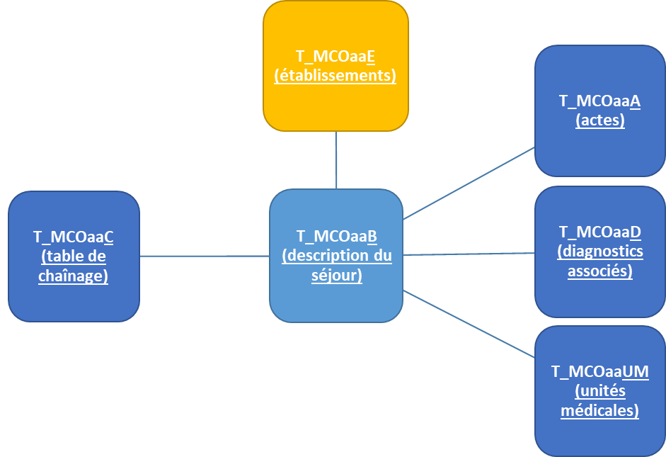

---
tags:
    - Généralité SNDS
    - Diagnostics
    - PMSI
    - Fiche-programme
---

# Requête type dans le PMSI-MCO
<!-- SPDX-License-Identifier: MPL-2.0 -->

<TagLinks />

La fiche décrit une requête type de sélection de séjours hospitaliers dans les tables du PMSI-MCO à partir des diagnostics principaux (DP), des diagnostics reliés (DR) et/ou des diagnostics associés significatifs (DAS).  
Des variables relatives au patient, au séjour et à l'établissement sont restituées en sortie.  

## 1. Identification des tables et des variables de la requête    
Les tables du PMSI, disponibles à partir de 2005, se trouvent dans la bibliothèque ORAVUE.  
Le nom des tables est de la forme **T_MCOaaZ** avec aa = année sur 2 caractères et Z = caractère(s) identifiant de la table.  
Les six tables utilisées dans le programme type sont présentées ci-dessous :

#### Liste des variables sélectionnées :
* **T_MCOaaB** : table de description du séjour, une ligne par séjour

| variable | description |
| ------ | ------ |
| `ETA_NUM` | numéro Finess e-PMSI de l'établissement _(variable de jointure)_ |
| `RSA_NUM` | numéro séquentiel dans le PMSI _(variable de jointure)_ |
| `DGN_PAL` | diagnostic principal |
| `DGN_REL` | diagnostic relié |
| `GRG_GHM` | GHM = Groupe Homogène de Malades |
| `AGE_ANN` | âge en années |
| `AGE_JOU` | âge en jours (pour les enfants âgés de moins de 1 an) |
| `COD_SEX` | sexe |
| `BDI_COD` | commune de résidence |
| `BDI_DEP` | département de résidence |
| `SOR_ANN` | année de sortie |
| `SOR_MOI` | mois de sortie |
| `ENT_MOD` | mode d'entrée |
| `ENT_PRV` | provenance |
| `SOR_MOD` | mode de sortie |
| `SOR_DES` | destination |
| `SEJ_NBJ` | durée totale du séjour dans le champ PMSI |
| `NBR_DGN` | nombre de diagnostics associés dans ce RSA |
| `NBR_RUM` | nombre de RUM composant le RSS d'origine |
| `NBR_ACT` | nombre de zones d'actes dans ce RSA |

 
* **T_MCOaaC** : table de chainage, une ligne par séjour

| variable | description |
| ------ | ------ |
| `ETA_NUM` | numéro Finess e-PMSI de l'établissement _(variable de jointure)_ |
| `RSA_NUM` | numéro séquentiel dans le PMSI _(variable de jointure)_ |
| `NIR_ANO_17` | identifiant du patient |
| `SEJ_NUM` | numéro de séjour |
| `EXE_SOI_DTD` | date d'entrée |
| `EXE_SOI_DTF` | date de sortie |
| `NIR_RET` | code retour contrôle « numéro de sécurité sociale » |
| `NAI_RET` | code retour contrôle « date de naissance » |
| `SEX_RET` | code retour contrôle « sexe » |
| `SEJ_RET` | code retour contrôle « n° d'identification administratif de séjour » |
| `FHO_RET` | code retour contrôle « fusion ANO HOSP et HOSP PMSI » |
| `PMS_RET` | code retour contrôle « fusion ANO PMSI et fichier PMSI » |
| `DAT_RET` | code retour contrôle « date de référence » (date d'entrée) (à partir de 2006) |
| `COH_NAI_RET` | code retour contrôle « cohérence date de naissance » (à partir de 2013) |
| `COH_SEX_RET` | code retour contrôle « cohérence sexe » (à partir de 2013) |

* **T_MCOaaA** : table des actes, une ligne par acte

| variable | description |
| ------ | ------ |
| `ETA_NUM` | numéro Finess e-PMSI de l'établissement _(variable de jointure)_ |
| `RSA_NUM` | numéro séquentiel dans le PMSI _(variable de jointure)_ |
| `CDC_ACT` | code CCAM |

* **T_MCOaaD** : table des DAS, une ligne par diagnostic associé

| variable | description |
| ------ | ------ |
| `ETA_NUM` | numéro Finess e-PMSI de l'établissement _(variable de jointure)_ |
| `RSA_NUM` | numéro séquentiel dans le PMSI _(variable de jointure)_ |
| `ASS_DGN` | diagnostic associé significatif |

* **T_MCOaaUM** : table des unités médicales, existe depuis 2006, une ligne par diagnostic principal d'UM

| variable | description |
| ------ | ------ |
| `ETA_NUM` | numéro Finess e-PMSI de l'établissement _(variable de jointure)_ |
| `RSA_NUM` | numéro séquentiel dans le PMSI _(variable de jointure)_ |
| `UM_TYP` (2006-2009) / `AUT_TYP1_UM` (2010+) | type d'unité médicale |
| `ETA_NUM_GEO1` (2012) / `ETA_NUM_GEO` (2013+) | premier numéro Finess géographique |
| `DGN_PAL` | diagnostic principal de l'unité médicale (à partir de 2008) |
| `DGN_REL` | diagnostic relié de l'unité médicale (à partir de 2008) |

* **T_MCOaaE** : table des établissements

| variable | description |
| ------ | ------ |
| `ETA_NUM` | numéro Finess e-PMSI de l'établissement _(variable de jointure)_ |
| `SOC_RAI` | raison sociale |
| `STA_ETA` | statut |

Si vous souhaitez ajouter d'autres variables dans votre requête, vous pouvez consulter le [dictionnaire interactif](https://health-data-hub.shinyapps.io/dico-snds/) de la documentation collaborative du SNDS.  

La jointure des tables se fait à l'aide des variables `ETA_NUM` et `RSA_NUM`, sauf pour la table établissements **T_MCOaaE** pour laquelle seule la variable `ETA_NUM` est nécessaire.  

## 2. La requête

### 2.1	Les filtres appliqués

* Suppression des séjours en doublons pour les établissements APHP, APHM et HCL jusqu'en 2017 inclus.
* Suppression des séjours dont les GHM commencent par 90 « Erreurs et autres séjours inclassables »
* Génération de la variable `CR_OK` pour vérification de la validité du chaînage intra-séjour:
    * `1` si tous les codes retours sont égaux à zéro : chainage valide
    * `0` sinon

:::warning Attention
Les séjours avec codes retour erronés sont présents dans la table finale et doivent ensuite être supprimés.
:::

### 2.2	Les diagnostics

En début de programme, l'utilisateur renseigne les codes diagnostics d'intérêt et le mode de sélection des séjours qui peut se faire par :
* Diagnostic principal (DP)  
* Diagnostic principal (DP) ou relié (DR)  
* Diagnostic principal (DP) ou relié (DR) ou associés (DAS) 
 
Note d'attention sur le changement de définition du DP :
* Avant 2009, le DP est le diagnostic qui a demandé l'essentiel de l'effort de soin  
* A partir de 2009, le DP est le diagnostic qui a motivé l'hospitalisation    

Les diagnostics principaux ainsi que les diagnostics reliés des Unité médicales sont conservés (disponibles à partir de 2008). L'un des diagnostics principaux (souvent `DP_UM1`) et l'un des diagnsotics reliés (souvent `DR_UM1`) sont aussi les DP et DR du séjour. Les autres diagnostics peuvent ne pas être listés dans la table des diagnostics associés. C'est pourquoi le programme sélectionne les DAS à partir des tables **T_MCOaaD** et **T_MCOaaUM**.

Lorsqu'un même code est identifié en DP et en DAS, le programme le supprime de la liste des DAS. On conserve uniquement la position en DP.

### 2.3	Inclusion des actes, DAS et UM  

L'utilisateur choisit en début de programme le nombre d'actes, de DAS et d'UM qu'il souhaite inclure dans le fichier créé en sortie.  
Par défaut, on inclut les 20 premiers actes et DAS, et les 10 premiers UM.  
Les DAS, les actes et les informations des UM (type d'UM, numéro géographique de l'établissement de l'UM) sont transposés en colonnes pour constituer une seule ligne pour un séjour donné.

## 3. Recommandations pour les requêtes

* Il faut programmer en SQL lorsque vous requêtez sur des tables se trouvant sous Oracle. Une fois les données sélectionnées, vous pouvez les traiter en langage SAS.
Les tables Oracle se trouvent dans les dossiers commençant par ORAxxx.  
* Il est recommandé de ne garder que les variables nécessaires, même si ces tables sont beaucoup moins volumineuses que les tables du DCIR.  
* Pour ajouter d'autre(s) variable(s) provenant de la table **T_MCOaaUM** ou **T_MCOaaA** il faut penser à les transposer avant de chainer avec la table principale **T_MCOaaB**.  
* Attention à la suppression, à la modification de nom ou de format, ou à l'ajout de variables selon les années.  

Par exemple :  
* Dans la table **T_MCOaaUM**, la variable s'intitule `UM_TYP` en 2006-2009, et `AUT_TYP1_UM` à partir de 2010  
* L'information IGS2 se trouve dans la table **T_MCOaaB** en 2005-2009 sous le nom de la variable `COD_IGS`, et ensuite, dans la table **T_MCOaaUM** à partir de 2010 sous le nom `IGS2_COD`.  

## Programme type

Le programme SAS est accessible dans le dépôt **programme-snds**, dossier [**Sante_publique_France**](https://gitlab.com/healthdatahub/programmes-snds/-/tree/master/Sante_publique_France)
* pmsi_mco_select_sejours_par_diag.sas

## Références

:::tip Crédits
Cette fiche a été créée par la direction DATA de Santé publique France
:::

:::tip Mise à jour
Cette fiche se base sur une version originale datant du 29/04/2019 et a été mise à jour le 08/06/2020.
:::
