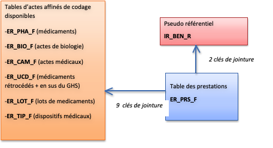
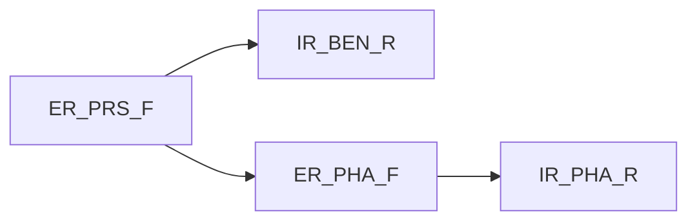

# Requête type dans la table prestations du DCIR
<!-- SPDX-License-Identifier: MPL-2.0 -->

Cette fiche décrit une requête type de sélection de prestations impliquant une table d'actes affinés de codage avec sélection de données concernant les bénéficiaires.

Les programmes sont accessibles dans le dossier
[Santé publique France des programmes-snds](https://gitlab.com/healthdatahub/programmes-sdns/-/tree/master/Sante_publique_France).

**Avertissement**
Le programme de sélection des prestations sélectionne  des remboursements de médicaments et devra être adapté en fonction des prestations d’intérêt.

## Identification des tables et des variables

- La table des prestations (`ER_PRS_F`) est centrale dans le DCIR. Les variables généralement sélectionnées dans cette table sont :
  - Nature de la prestation (`PRS_NAT_REF`)
  - Dates (par exemple dates de début (`EXE_SOI_DTD`) et de fin de prestation (`EXE_SOI_DTF`))
  - variables concernant le PS exécutant ou prescripteur (par exemple spécialité médicale : `PSE_SPE_COD` (PS exécutant) et `PSP_SPE_COD` (PS prescripteur))
  - CMUC (Couverture Maladie Universelle Complémentaire) au moment de la prestation (`BEN_CMU_TOP`)
  - Régime d'affiliation à l'Assurance Maladie au moment de la prestation (généré à partir de`ORG_AFF_BEN`)
  - Département ou commune de résidence au moment de la prestation (`BEN_RES_DPT` et `BEN_RES_COM`)

NB : la sélection des prestations peut se faire sur une valeur particulière de `PRS_NAT_REF` (nature de la prestation) comme par exemple 'visite chez un médecin généraliste' et dans ce cas la jointure s'effectue sur les seules tables  (`ER_PRS_F` et `IR_BEN_R`, `IR_BEN_R_ARC`).

- Des pseudo-référentiels des bénéficiaires (`IR_BEN_R`/`IR_BEN_R_ARC`), on retient généralement les variables socio-démographiques (la table contient les informations les plus récentes) et l'identifiant unique `BEN_NIR_ANO` en plus des 2 clés de jointure (`BEN_NIR_PSA` et `BEN_RNG_GEM`).

Cependant, on peut garder uniquement les variables de jointure (`BEN_NIR_PSA` et `BEN_RNG_GEM`) et conserver les variables socio-démographiques associées à des prestations déjà sélectionnées (cf programme type joint) ou récupérer les variables socio-démographiques de l'année 20aa  dans la table **EXTRACTION_PATIENTS20aaTR** du répertoire CONSOPAT.

- La table d'actes affinés de codage précise la nature des remboursements liés à la prestation, comme par exemple la liste des médicaments liée à la prestation(`ER_PHA_F`) ou les actes médicaux (`ER_CAM_F`). 

Le document « [SNDS ce qu'il faut savoir ](../files/Sante_publique_France/2019_01_SpF_SNDS-ce-quil-faut-savoir-MPL-2.0.docx)» décrit ces tables en détail.

De la table des prestations affinées, on ne retient généralement que le code affiné et la quantité correspondante

| Nom de la table | Code affiné | Quantité | Remarque | Référentiel associé |
|--------------------------------------------------------------------------------------------------|-------------|-------------|-----------------------------------------------------------------------------------------------------|---------------------|
| ER_PHA_F | PHA_PRS_C13 | PHA_ACT_QSN | | IR_PHA_R |
| ER_BIO_F | BIO_PRS_IDE | BIO_ACT_QSN | | IR_BIO_R |
| ER_CAM_F | CAM_PRS_IDE | | Il n’y a pas de variable quantité dans la table `ER_CAM_F`. Prendre `PRS_ACT_QTE` de la table `ER_PRS_F`.    Pensez à prendre en compte `CAM_ACT_COD` (code activité) + `CAM_TRT_PHA` (code phase de traitement).| - |
| ER_UCD_F | UCD_UCD_COD | UCD_DLV_NBR | | - |
| ER_TIP_F | TIP_PRS_IDE | TIP_ACT_QSN | | NT_LPP |

La sélection des codes affinés peut se faire directement dans la requête en listant le ou les codes souhaités ou en fusionnant la table de prestations affinées avec un référentiel pour effectuer une sélection sur un groupe plus important de codes.

Par exemple : fusionner la table de prestations affinées de pharmacie : ER_PHA_R avec le référentiel pharmacie IR_PHA_R afin de faire une sélection sur un code ATC particulier regroupant plusieurs codes.

## Recommandations pour les requêtes

- La fusion des tables se fait par une procédure SQL.

- Il est recommandé de ne garder que les variables nécessaires.

    - Ne pas sélectionner systématiquement les 9 variables constituant les clés de jointure entre la table `ER_PRS_F` et les tables affinées,

    - Ne pas systématiquement sélectionner en double les variables en fonction de leur provenance. (par exemple : variable `BEN_SEX_COD` dans `IR_BEN_R` et `ER_PRS_F`)   

- Lorsque l'on veut sélectionner des visites ou des consultations dans `ER_PRS_F`, il faut supprimer les enregistrements correspondant à des majorations et des compléments en utilisant le filtre `CPL_MAJ_TOP` < 2.

- Pour le moment, l'information sur les soins externes réalisés en établissements publics n'est pas exhaustive, et sauf cas particulier, il convient d'appliquer un filtre pour les exclure (`DPN_QLF` <> 71 AND `PRS_DPN_QLP` <> 71)

- Les tables du DCIR sont des tables volumineuses. Les prestations alimentent le DCIR par mois de flux et non en fonction de la date d'exécution de la prestation de soins. Pour ces deux raisons, la requête peut être exécutée par mois de flux et, si l'on veut les prestations sur une année complète, la requête doit être répétée 18 fois (année entière plus les 6 mois suivants). En procédant ainsi, on connait par exemple plus de 98% des délivrances de médicaments  de l'année portées au remboursement.

- Prise en compte des régularisations.

Dans les tables de prestations ou d'actes affinés de codage il existe des lignes de régularisation. Elles correspondent à des annulations de prestations avec ou non enregistrement d'une nouvelle ligne en remplacement de la ligne annulée. La ligne de régularisation est en tout point identique à la ligne initiale mais avec une quantité d'actes négative. En pratique, il faut donc sommer les quantités des lignes identiques de prestations et ne garder que les lignes dont la somme est strictement positive.

## Références

::: tip Crédits
Le contenu original de cette fiche provient du document [Requêtes types dans la table prestations du DCIR](../files/Sante_publique_France/2018_04_SpF_requetes-types-prestations-DCIR_MPL-2.0.docx) rédigé par [Santé publique France](../glossaire/SpF.md) en avril 2018
:::