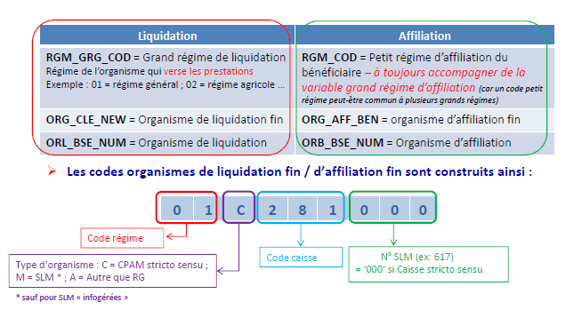

# Sections Locales Mutualistes
<!-- SPDX-License-Identifier: MPL-2.0 -->

## Notions préalables sur les organismes de liquidation / d’affiliation 

On note SLM la Section Locale Mutualiste, c’est-à-dire une mutuelle complémentaire qui propose à ses adhérents affiliés au régime général, un service de gestion de la part obligatoire remboursée par la sécurité sociale. 
Elle est l’unique interlocuteur et rembourse à son adhérent la part obligatoire sécurité sociale et la part mutuelle complémentaire. 

Les variables ORG_CLE_NEW (Code de l'organisme de liquidation) et ORG_AFF_BEN (Code de l'organisme d'affiliation) sont décomposées en 4 parties :

*  Grand régime de liquidation / d’affiliation : 2 premiers caractères
*  Type d’organisme : C si géré par CPAM, M si géré par SLM
*  Caisse de liquidation / d’affiliation : caractères 4 à 6
*  Code de la SLM d’affiliation : N° de la SLM ou 000 si CPAM stricto sensu

### Organisme de liquidation du bénéficiaire 

**Organisme qui  saisit les remboursements** des bénéficiaires qui lui sont affiliés, mais aussi éventuellement des bénéficiaires affiliés dans d’autres organismes (c’est la subsistance).

Exemple de cas de subsistance : 
* pour les caisses des DOM (hors Guadeloupe) qui liquident les remboursements des bénéficiaires salariés de la MSA, 
* pour les prestations de cures thermales liquidées sur le lieu d’implantation de l’établissement pour n’importe quelle affiliation du bénéficiaire,
* et pour les SLM infogérées pour lesquelles des caisses avec un numéro de liquidation « fictif » liquident pour les bénéficiaires de ces SLM, en France entière.

Cette notion de liquidation à un moment donné n’est pas exhaustive par rapport aux dépenses de l’organisme. 

*Par exemple la CPAM des Pyrénées Orientales (661) saisit les remboursements du bénéficiaire affilié chez elle car résidant dans le département 66.* 
*Elle saisit également dans le cas de la  subsistance les remboursements du bénéficiaire résidant à Paris, affilié à la CPAM de Paris, venu faire une cure thermale dans les Pyrénées.* 
*Mais ces dépenses doivent être imputées à la CPAM de Paris.*

### Organisme d’affiliation du bénéficiaire
**Organisme du lieu de résidence du bénéficiaire**, il s’agit des remboursements qui incomberont à cet organisme, même si pour des raisons de subsistance la liquidation a été faite ailleurs.

Cette notion est exhaustive en termes de dépense de l’organisme in fine.

*Par exemple, le bénéficiaire résidant à Paris venu faire une échographie à Marseille durant ses congés est affilié à la CPAM de Paris et remboursé par la CPAM de Paris.* 
*Dans le cadre d’une subsistance, le bénéficiaire affilié à la CPAM 751 sera remboursé par la CPAM 661 où il réalise sa cure thermale, mais cette dernière se fera rembourser son paiement in fine par la CPAM de Paris dont relève le bénéficiaire.*

## Notions de SLM

### SLM "Classiques"

Mutuelle qui gère la part obligatoire du Régime Général, financière et administrative, à la place de la CPAM d’affiliation xxx du bénéficiaire [organisme de liquidation et d’affiliation en 01M] ; en général elle assure aussi la gestion de la part mutuelle complémentaire du bénéficiaire. 

    *Remarque : cette SLM classique adresse au SNDS des données en norme NOEMIE 303.*

Par exemple, la MGEN - mutuelle générale de l’éducation nationale NUM 501 et 506 - propose au personnel de l’Education nationale de gérer la part administrative et financière de leurs remboursements de soins pour la part obligatoire de la sécurité sociale, en même temps que le remboursement de la mutuelle complémentaire MGEN qu’ils ont souscrite.

|SLM Classique | Cas général | Exemple MGEN d'un bénéficiaire affilié à Paris|
|---|---|---|
|Organisme de liquidation|**01M**xxxNUM|01M751501|
|Organisme d'affiliation|**01M**xxxNUM|01M751501|

### SLM "infogérées" ou en infogérance

SLM qui rend la gestion financière de la part obligatoire du Régime Général, assurée alors par une caisse centralisatrice zzz, mais qui conserve la gestion administrative de ses adhérents [organisme de liquidation avec un 01C « fictif » pour les dépenses, organisme d’affiliation en 01M pour les bénéficiaires].

L’activité de cette caisse centralisatrice « fictive » est réalisée dans une CPAM mais le numéro de la CPAM est fictif (= N° CPAM créé pour cette infogérance).

*Remarque : la SLM infogérée utilise notre système informationnel et adresse donc au SNDS des données en norme NEC.*

Par exemple, la Mutuelle des étudiants LMDE - NUM 601 – a rendu en 2015 la gestion financière des remboursements de la part obligatoire  qui a été réalisée par la CPAM centralisatrice « fictive » 909, mais la LMDE assurait toujours la gestion administrative des bénéficiaires pour le compte de leur CPAM de résidence xxx.

|SLM infogérée | Cas général | Exemple LMDE d'un bénéficiaire affilié à Paris|
|---|---|---|
|Organisme de liquidation|**01C**zzz000|01C909000|
|Organisme d'affiliation|**01M**xxxNUM|01M751601|

### SLM réintégrée au Régime Général

Ce sont des SLM infogérées qui, en rendant à la fois la gestion financière et administrative de la part obligatoire, deviennent intégrées aux caisses du RG [organisme de liquidation et d’affiliation en  01C « réel »]. 

Lorsque la SLM intègre le RG elle n’est plus comptabilisée comme une SLM et les bénéficiaires sont pris en charge par les CPAM selon leur lieu de résidence.

*Par exemple, en septembre 2019, la LMDE - NUM 601 - a restitué aux caisses du régime général la gestion administrative et financière de la part obligatoire de la sécurité sociale et les bénéficiaires sont à présent gérés par leur CPAM d’affiliation.*

|SLM rendant l'infogérance | Cas général | Exemple LMDE d'un bénéficiaire affilié à Paris|
|---|---|---|
|Organisme de liquidation|**01C**xxx000|01C751000|
|Organisme d'affiliation|**01C**xxxUGE* |01C751000|

::: warning Attention
Il n’y a pas de code organisme d’affiliation en `01CXXX000` ; les 3 dernières composantes sont les centres de gestion UGE des CPAM.
:::

:::tip 
Un tableau de suivi des codifications des SLM est disponible
- dans le portail SNDS, au chemin: `Dossiers Publics/Documentation SNIIRAM-SNDS/Offre de service/Suivi des chargements_SLM dans SNIIRAM.xls`
- en [téléchargement ici](../files/Cnam/2019-10-14_Codification-SLM-SNIIRAM_MPL-2.0.xls), éventuellement moins à jour 
:::

## Références
::: tip Ressources
Ce document a été initialement publié sur le portail SNDS de la Cnam en décembre 2019. 

Il a été rédigé par la Cnam et a été converti en Markdown pour être publié ici, et servir plus facilement de ressources pour d'autres fiches.
Il est [téléchargeable ici](../files/Cnam/SNDS_Fiches_Thematiques_SLM-Mutuelles_MLP_2.0.docx) dans sa version d'origine.
:::
