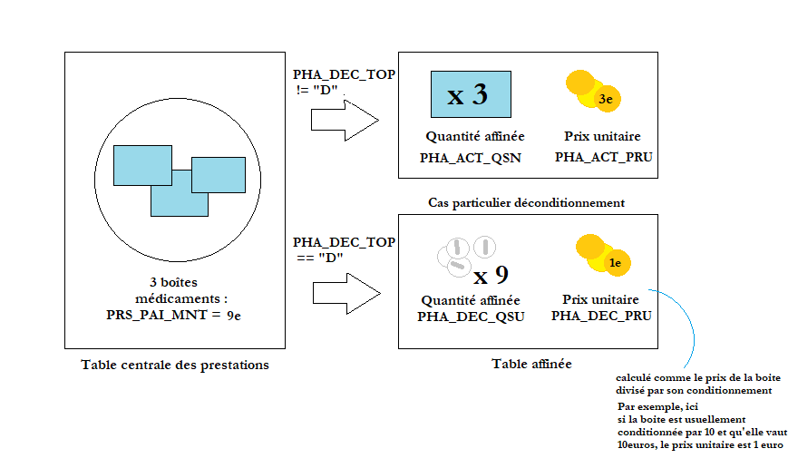
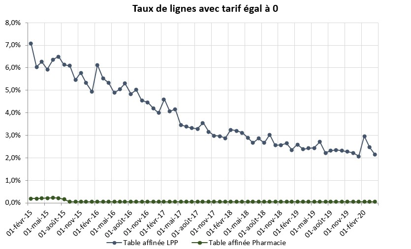
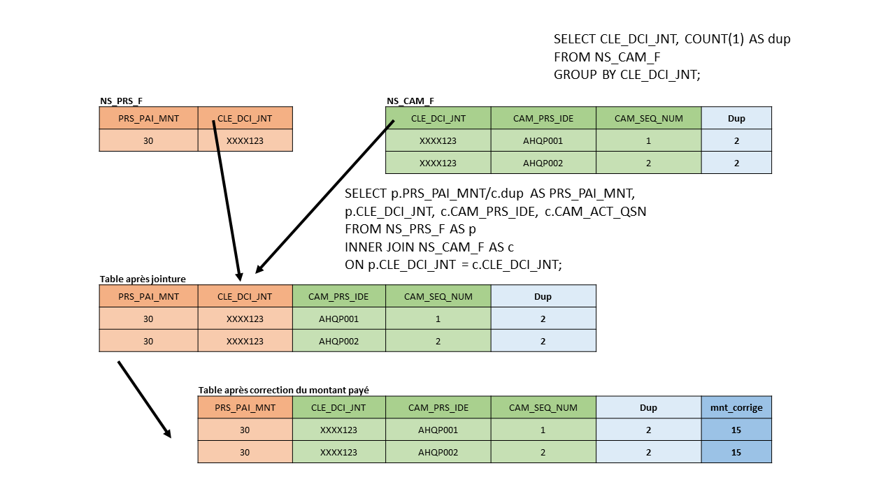

---
tags:
    - Dépenses
    - Prestations
    - DCIR/DCIRS
---

# Dépenses dans les tables affinées du DCIR et du DCIRS
<!-- SPDX-License-Identifier: MPL-2.0 -->

<TagLinks />

Certains actes de la table centrale des prestations (`ER_PRS_F` dans le DCIR et `NS_PRS_F` dans le DCIRS) donnent lieu
à un acte affiné. On appelle **acte affiné**, toute prestation à un niveau plus fin que le code prestation (`PRS_NAT`). 
Il peut s'agir par exemple d'un code CIP ou d'un code CCAM.

L'objectif de la fiche est de décrire comment calculer correctement les quantités, montants remboursés et montants payés 
lorsqu'on s'intéresse à un niveau de prestation plus fin que le code prestation.


## Les tables affinées

### Dans le DCIR

Les tables affinées peuvent se joindre avec la table centrale des prestations `ER_PRS_F` via 9 clés de jonture:
- `FLX_DIS_DTD`
- `FLX_TRT_DTD`
- `FLX_EMT_TYP`
- `FLX_EMT_NUM`
- `FLX_EMT_ORD`
- `ORG_CLE_NUM`
- `DCT_ORD_NUM`
- `PRS_ORD_NUM`
- `REM_TYP_AFF`

Il existe 14 tables affinées dans le DCIR:
- `ER_BIO_F`: Prestations affinées en biologie
- `ER_CAM_F`: Codage CCAM
- `ER_PHA_F`: Prestations affinées en pharmacie
- `ER_UCD_F`: Médicaments rétrocédés et de la liste en sus
- `ER_TIP_F`: Prestation affinée Dispositif médical
- `ER_DTR_F`: Information Transport Détail 
- `ER_TRS_F`: Prestation affinées transport
- `ER_RAT_F`: Accidents du travail/Maladies professionnelles (ATMP)
- `ER_INV_F`: Pensions d'invalidité
- `ER_ARO_F`: Détail de remboursement autre que régime obligatoire (CMU-C, Alsace Moselle, etc.)
- `ER_ETE_F`: Informations liées à l'exécution dans un établissement
- `ER_DCT_F`: Table de décompte
- `ER_CPT_F`: Ventilation comptable
- `ER_ANO_F`: Anomalies (signalement ou rejet)

*Note: la jointure avec la table de décompte `ER_DCT_F` se fait sur 7 clés de jointure seulement. 
Les variables `PRS_ORD_NUM` et `REM_TYP_AFF` ne sont pas présentes dans cette table.*
 

### Dans le DCIRS

Les tables affinées du DCIRS diffèrent quelque peu des tables affinées du DCIR. 
Elles sont préfixées par `NS` au lieu de `ER`, et au lieu de se joindre à la table centrale des prestations `NS_PRS_F` par neuf clés
 de jointure comme pour la majorité des tables affinées du DCIR, elles se joignent par la clé unique `CLE_DCI_JNT`. 

La clé de jointure unique `CLE_DCI_JNT` est constituée à partir de 10 variables, qui ont été ajoutées aux différentes tables affinées.
Ainsi dans le DCIRS, les tables affinées disposent des variables qui constituent la clé unique : `BEN_IDT_ANO`, `EXE_SOI_DTD`, 
`EXE_SOI_DTF`, etc. contrairement aux tables affinées du DCIR.  

Le DCIRS ne comprend que 9 tables affinées. 
Les tables de ventilation comptable, de décompte et d'anomalies ne sont plus présentes
tandis que les tables de remboursement complémentaire `ARO_F` et de données des établissements 
`ETE` ont été intégrées à la table principale (`NS_PRS_F`). 
Le DCIRS permet donc d'effectuer moins de jointure et lorsque celle-ci est nécessaire, 
la jointure est facilitée par l'existence de cette clé de jointure unique. 

On trouve donc les 9 tables ci-dessous:
- `NS_BIO_F`: Prestations affinées en biologie
- `NS_CAM_F`: Codage CCAM
- `NS_PHA_F`: Prestations affinées en pharmacie
- `NS_UCD_F`: Médicaments rétrocédés et de la liste en sus
- `NS_TIP_F`: Prestation affinée Dispositif médical
- `NS_DTR_F`: Information Transport Détail 
- `NS_TRS_F`: Prestation affinées transport
- `NS_RAT_F`: Accidents du travail/Maladies professionnelles (ATMP)
- `NS_INV_F`: Pensions d'invalidité

## La relation entre la table centrale et les tables affinées

La relation de l'acte dans la table centrale à l'acte dans la table affinée peut être *one-to-one* (1-1) ou *one-to-many* (1-n). 
Cela signifie qu'à une ligne de la table centrale des prestations peut correspondre une ligne dans la table affinée ou 
*n* lignes (avec n>1) suivant la table et la prestation considérée.  
La prise en compte des relations *one-to-many* est particulièrement importante lorsque l'on s'intéresse au dénombrement, aux quantités ou aux montants.

Dans le DCIRS, dans le cadre d'une relation *one-to-many* entre la table centrale des prestations
`NS_PRS_F` et une table affinée, on a plusieurs fois la même valeur de la clé de jointure
unique `CLE_DCI_JNT` pour des valeurs distinctes de la prestation affinée. Par exemple, des codes LPP différents (variable `TIP_PRS_IDE`) 
pour une même valeur de `CLE_DCI_JNT`, qui correspond entre autres à un même code prestation `PRS_NAT`.   
Dans ce cas, un **numéro séquentiel** est introduit dans les tables affinées pour 
numéroter les actes affinés de ces différents identifiants qui correspondent à une même valeur de la 
clé de jointure unique `CLE_DCI_JNT`. 
Ce numéro séquentiel dispose du suffixe `_SEQ_NUM`. 

Dans le DCIR, on trouve également un numéro séquentiel suffixé `_ORD_NUM`. 
La variable `*_ORD_NUM` donne le nombre de lignes de la table affinée correspondant à une ligne dans la table prestation.
Lorsque `*_ORD_NUM` est égale à n>1, cela signifie que pour une ligne de la table prestation, on a n lignes dans la table affinée.


## Calculer des quantités et montants remboursés affinés

::: warning Attention
Pour réaliser ces calculs il faut joindre les différentes tables affinées à la table prestation dans le DCIR. 
En revanche, dans le DCIRS toutes les variables nécessaires sont présentes dans les tables affinées et les calculs peuvent donc être effectués directement. 
:::


### Quantité affinée 
 
Dans le DCIRS, les quantités d'actes apparaissent avec le suffixe `_ACT_QSN`. 
La **quantité d'acte** de la table centrale correspond à la somme de la quantité d'acte 
pour chaque valeur de `CLE_DCI_JNT` X chaque prestation affinée (`BIO_PRS_IDE` dans la table biologie, 
etc.). Toutes les tables affinées du DCIRS contiennent la **quantité affinée**,
le **prix unitaire de l'acte** et la **prestation de référence**.   

Les tables du DCIR disposent également de variables appelées quantité d'acte (par exemple `TIP_ACT_QSN` dans `ER_TIP_F`, table affinée de la LPP) 
mais elles ne sont pas nécessairement égales à celles du DCIRS. En effet, le DCIRS est construit à partir du DCIR selon une procédure qui 
filtre et agrège des observations pour un même individu, ce qui crée, à la marge, des écarts entre les deux bases.  
On note également que l'on ne trouve pas de variable de quantité affinée dans la table du DCIR `ER_CAM_F`. 

### Montants remboursés affinés

Les indicateurs de dépense dans la table prestation (table `ER_PRS_F` dans le DCIR ou `NS_PRS_F` dans le DCIRS) sont:
- montant payé `PRS_PAI_MNT`,
- montant du dépassement `PRS_DEP_MNT`,
- montant remboursé pour l'acte de base `BSE_REM_MNT`,
- montant remboursé pour un éventuel acte complémentaire `CPL_REM_MNT`

Ils correspondent au montant total pour un code prestation donné (`PRS_NAT_REF`). 
Le détail à un niveau plus fin que le code prestation se trouve dans les tables affinées dédiées. 
Les informations des tables affinées permettent de connaître la quantités affinées et de calculer 
les montants de base et remboursés associés à un acte affiné. 

Pour calculer ces indicateurs affinés dans le DCIR, il est nécessaire de joindre la table affinée à la table centrale des prestations 
afin d'accéder à la variable taux de remboursement `RGO_REM_TAU`. En revanche, toutes les tables affinées du DCIRS contiennent la variable `RGO_REM_TAU`. Cela permet, dans le DCIRS, de calculer le montant remboursé affiné sans avoir besoin de joindre la table des prestations à la table affinée.  

Nous présentons ci-dessous le calcul de ces indicateurs pour les principales tables affinées.  


#### Les actes CCAM


Dans le DCIR, la table affinée <PreviewPage text="CCAM" link="../glossaire/CCAM.html" /> `ER_CAM_F` fournit des données détaillés sur les actes CCAM, notamment le code CCAM (variable `CAM_PRS_IDE`, nomenclature `IR_CCAM_VXX`, avec `XX` désignant la version
de la nomenclature CCAM).  Les actes CCAM regroupent des champs divers comme le système nerveux,
 le dentaire ou encore les actes sur le tube digestif, les voies biliaires, etc. 

Le code descriptif détaillé d’un acte CCAM est constitué des trois variables:

- `CAM_PRS_IDE` (identifiant du code acte CCAM),

- `CAM_ACT_COD` (code activité)

- `CAM_TRT_PHA` (code phase de traitement). 

Pour compter les actes, il faut prendre en compte le **code activité** (nomenclature `XC_ATE_V`) et le **code phase de traitement** (nomenclature `XC_PHA_V`).
En effet, un même acte peut apparaitre plusieurs fois au titre de l'activité considérée ou de la phase de traitement. 
 
Pour obtenir les bases de remboursement par acte affiné 
de la CCAM, on peut se référer aux variables `CAM_REM_BSE` présentes dans `ER_CAM_F`
et `NS_CAM_F`.  
 
Pour calculer le montant remboursé avec `ER_CAM_F`, on peut utiliser :

```
Montant remboursé affiné = Base de remboursement CCAM (`CAM_REM_BSE`)* tx de remboursement (`RGO_REM_TAU`)/100
```
Pour ce faire, il faut d'abord joindre la table affinée `ER_CAM_F` avec la table centrale
`ER_PRS_F` pour obtenir la variable `RGO_REM_TAU`. 
Attention, si on essaie de calculer la base de remboursement de l'acte à partir du prix 
unitaire de l'acte ccam, les montants peuvent différer de la variable `CAM_REM_BSE`, notamment
à cause des modificateurs qui induisent des minorations et majorations sur les actes.
Les modificateurs sont contenus dans la variable `CAM_MOD_COD`. Un modificateur est une lettre ou un chiffre indiquant des majorations/minorations à appliquer.
Les modificateurs peuvent se cumuler et la variable `CAM_MOD_COD` peut contenir jusque 4 modificateurs.
La table `ER_CAM_F` contient le détail des montants associés à chaque modificateur. Ce n'est pas le cas dans `NS_CAM_F`.
Toutefois, ces variables ne sont pas toujours remplies.
Le prix unitaire de l'acte CCAM et la base de remboursement `CAM_REM_BSE` peuvent aussi différer
en fonction du code association de l'acte (`CAM_ASS_COD`). En effet, pour les 
actes ccam réalisés à la même date, par le même professionnel de santé pour un patient, on a une
association d'actes. La facturation des actes est ainsi affectée par cette association.
Par exemple, `CAM_REM_BSE` et `CAM_ACT_PRU` diffèrent quand `CAM_ASS_COD` est égal à 2 ou 3 (acte
facturé respectivement à 50% et 75% de sa valeur).

#### Exemple 1 :  Scanographie de la face avec modificateur indiquant une majoration du tarif pour acte de radiographie en 2016

On fait une jointure (*left join*) entre `ER_CAM_F` et `ER_PRS_F` à l'aide des 9 clefs pour comparer avec les variables
`PRS_PAI_MNT` et `BSE_REM_BSE`. 

| CAM_PRS_IDE | CAM_ACT_PRU | CAM_REM_BSE | CAM_MOD_COD | CAM_ASS_COD | PRS_PAI_MNT | BSE_REM_BSE | CAM_ORD_NUM |
| ----------- | ----------- | ------------| ----------- | ----------| --------------| -----------| ----------- |
| LAQK013 | 25.27 | 30.78 | Z | NA | 30.78 | 30.78 | 1 |

Ici, on remarque qu'on a bien `CAM_REM_BSE` = `CAM_ACT_PRU`*1,218 car en 2016, le modificateur Z (radio) induisait une 
majoration de +21,8%.
L'année est précisée car les valeurs de majorations et minorations peuvent évoluer en fonction
des versions de la CCAM. 

#### Exemple 2 : Détartrage associé à un autre acte (en tant que 2ème acte) en 2016

| CAM_PRS_IDE | CAM_ACT_PRU | CAM_REM_BSE | CAM_MOD_COD | CAM_ASS_COD | PRS_PAI_MNT | BSE_REM_BSE | CAM_ORD_NUM |
| ----------- | ----------- | ------------| ----------- | ----------| --------------| -----------| ----------- |
| HBJD001 | 28.92 | 14.46 |NA | 2 | 14.46 | 14.46 | 1 |

Ici, on a  `CAM_REM_BSE` = 0,5*`CAM_ACT_PRU` car on a le code association 2 qui signifie que cet acte
est facturé à 50% de sa valeur. 


On remarquera que dans `ER_CAM_F`, contrairement au `NS_CAM_F`, il n'y a pas de variable de quantité pour les actes CCAM.  

Attention, pour compter le nombre d'actes, dans la table affinée `NS_CAM_F` du DCIRS, bien que les lignes aient été regroupées par rapport
à `ER_CAM_F` pour faire apparaître cette quantité d'acte notamment, il n'y a pas  nécessairement une ligne unique pour chaque quadruplet
[`CLE_DCI_JNT`, `CAM_PRS_IDE`, `CAM_ACT_COD`, `CAM_TRT_PHA`]. En effet, un certain nombre
de variables peuvent différer pour une même valeur de ce quadruplet, par exemple pour le dentaire en fonction de la 
localisation de la dent (`CAM_QUA_DEN`) ou encore en fonction du code modificateur (`CAM_MOD_COD`).

Il est possible de calculer le montant remboursé affiné dans le DCIRS à l'aide de `NS_CAM_F`
```
Montant remboursé affiné =  Base de remboursement affinée (`CAM_REM_BSE`)* tx de remboursement (`RGO_REM_TAU`)/100
```

De même, si on essaie de calculer la base de remboursement de l'acte à partir du prix 
unitaire de l'acte ccam et de la quantité d'acte, les montants peuvent différer de la variable `CAM_REM_BSE`, notamment
à cause des modificateurs et du code association.


#### Les médicaments hors rétrocédés et liste en sus

Dans le cas d'une ordonnance pour 3 médicaments, la variable `PRS_PAI_MNT` dans `ER_PRS_F` correspond au montant payé pour les 3 médicaments. 
Les montants de base (`BSE_REM_BSE`) et remboursés (`BSE_REM_MNT`)  correspondent également aux 3 médicaments. 

Les variables présentes dans la table affinée médicament `ER_PHA_F` permettent de calculer 
le montant remboursé affiné et la base de remboursement affinée par boîte. Toutefois, il convient de prendre en compte
quelques cas particuliers.

Dans certains cas, le pharmacien est amené à déconditionner certains médicaments, selon la réglementation. 
Ces cas-ci sont identifiables à l'aide de la variable `PHA_DEC_TOP` lorsqu'elle est égale à `D`. 
Calculer la base de remboursement affiné et le montant remboursé affiné dépend donc de ce top. 

Dans le cas où les médicaments vendus ne sont pas déconditionnés (`PHA_DEC_TOP`!= 'D'), on peut calculer
la base de remboursement affinée et le montant remboursé affiné à l’aide de la variable  
`PHA_ACT_QSN`, qui correspond au nombre de conditionnements facturés et `PHA_ACT_PRU` qui correspond
au prix unitaire par conditionnement. On utilise alors 
les formules suivantes :  
```
Base de remboursement affinée = qté affinée (`PHA_ACT_QSN`) x prix unitaire (`PHA_ACT_PRU`)  
```
```
Montant remboursé affiné = qté affinée (`PHA_ACT_QSN`) x prix unitaire (`PHA_ACT_PRU`) x tx de rbmt(`RGO_REM_TAU`)/100 
```
Dans le cas où le pharmacien est amené à déconditionner les médicaments vendus, la variable `PHA_ACT_PRU` n'est pas renseignée.
Le prix unitaire de l'unité déconditionnée délivrée se trouve dans la variable `PHA_DEC_PRU`.
La quantité à considérer dans ce cas est `PHA_DEC_QSU`, le nombre d'unités fractionnées de médicaments délivrés
(par exemple le nombre de comprimés).  Dans ce cas particulier, on calcule les quantités affinées comme:

```
Base de remboursement affinée = qté affinée (`PHA_DEC_QSU`) x prix unitaire (`PHA_DEC_PRU`)  
```
```
Montant remboursé affiné = qté affinée (`PHA_DEC_QSU`) x prix unitaire (`PHA_DEC_PRU`) x tx de rbmt(`RGO_REM_TAU`)/100 
```

 

Le référentiel pharmacie se trouve sous le répertoire oravue (table `IR_PHA_R`). 
A partir du code CIP à 13 chiffres de la table affinée (`PHA_PRS_C13`), on peut joindre cette table affinée au référentiel (qui contient également la variable `PHA_CIP_C13`), 
ce qui nous donne notamment le libellé des différents médicaments. 


Dans le DCIRS, il faut considérer la table `NS_PHA_F`. On retrouve la même distinction de cas selon que le médicament est vendu
conditionné ou non (à l'aide du top `PHA_DEC_TOP`). 
La quantité affinée pour les **médicaments conditionnés** dans `NS_PHA_F` est `PHA_ACT_QSC`, elle correspond au 
prix par unité conditionnée (`PHA_ACT_PRU`).  La variable `RGO_REM_TAU` est déjà dans la table `NS_PHA_F`.
Dans le cas de médicaments conditionnés, on a donc : 
```
Base de remboursement affinée = qté affinée (`PHA_ACT_QSC`) x prix unitaire (`PHA_ACT_PRU`)  
```
```
Montant remboursé affiné = qté affinée (`PHA_ACT_QSC`) x prix unitaire (`PHA_ACT_PRU`) x tx de rbmt(`RGO_REM_TAU`)/100 
```
Dans le cas de médicaments vendus déconditionnés, on a : 
```
Base de remboursement affinée = qté affinée (`PHA_DEC_QSD`) x prix unitaire (`PHA_DEC_PRU`)  
```
```
Montant remboursé affiné = qté affinée (`PHA_DEC_QSD`) x prix unitaire (`PHA_DEC_PRU`) x tx de rbmt(`RGO_REM_TAU`)/100 
```

#### Les médicaments rétrocédés et de la liste en sus

Les médicaments <PreviewPage text="rétrocédés" link="../glossaire/retrocession.html" /> et de la [liste en sus](../fiches/medicaments_de_la_liste_en_sus.md) sont disponibles dans la table affinées `ER_UCD_F`. 
Le sigle UCD correspond à **unités communes de dispensation**, le code UCD est contenu dans la variable `UCD_UCD_COD` et correspond au plus petit conditionnement pharmaceutique.

::: tip Attention
Le code UCD est un numéro à 7 chiffres commençant par 9. 
Il sera par la suite de 13 caractères. 
Ainsi, `UCD_UCD_COD` dispose déjà de 13 positions mais les 6 premières positions sont des zéros.
Le code UCD à 7 chiffres se situe sur les 7 dernières positions. 
 :::

On peut distinguer la rétrocession hospitalière des médicaments de la liste en sus via le top `UCD_TOP_UCD` (égal à 0 pour
les médicaments rétrocédés et 1 pour les médicaments en sus). 

Le montant total facturé TTC est donné par la variable `UCD_TTF_MNT`. 

Pour la **rétrocession**, le montant de la dépense TTC est calculé comme:
```
montant total facturé TTC (`UCD_TTF_MNT`) = (prix unitaire `UCD_FAC_PRU` * coefficient de
majoration CTOM) * (coefficient de fractionnement `UCD_FRC_COE` + nombre d’UCD dispensées `UCD_DLV_NBR`) + coût de
reconstitution `UCD_RCT_COU` + montant de la marge `UCD_MAR_MNT`
``` 
où la majoration CTOM correspond à la majoration applicable sur le prix unitaire par un
établissement de Guadeloupe, Martinique, Guyane, Réunion. Le coefficient de fractionnement 
correspond à la délivrance d'une unité UCD fractionnée (par exemple, s'il s'agit d'1/4 de flacon, alors :`UCD_FRC_COE` = 0.25). 
Le coût de reconstitution correspond au coût supplémentaire que représente la reconstitution de certains
médicaments à partir de plusieurs composants.
Attention, dans le cadre de la rétrocession, le montant
total facturé intègre une **marge forfaitaire** par ligne de prescription (correspond à une ligne de prescription sur une ordonnance
indépendamment de la quantité). 
Cette marge correspond aux frais inhérents de gestion et de dispensation des médicaments rétrocédés.
Il est donc difficile de calculer une base de remboursement et un
montant remboursé AMO par unité délivrée.
Le taux de remboursement du médicament rétrocédé délivré s’applique au calcul de la part AMO
sauf si le patient bénéficie d’un taux de remboursement plus favorable (exonération du ticket
modérateur, régime particulier, etc.). 
Ainsi, le taux de remboursement théorique du médicament est associé à son code nature de prestation, 
(3 possibilités, correspondant aux taux de 100%, 65% ou 35%). 
Le montant remboursé par l'AMO se calcule comme:
```
Base de remboursement affinée = Montant TTC de la dépense totale (`UCD_TTF_MNT`)
```
```
Montant remboursé affiné = Montant TTC de la dépense totale (`UCD_TTF_MNT`) x tx de rbmt (`RGO_REM_TAU`)/100
```
Pour plus de précisions sur la facturation des médicaments rétrocédés, se référer au [guide de 
facturation des médicaments rétrocédés](https://www.ameli.fr/sites/default/files/Documents/5229/document/facturation-medicaments-retrocedes_assurance-maladie.pdf).

Le taux de remboursement des médicaments facturables **en sus** est
identique au taux de prise en charge par l’AMO du séjour au cours duquel ils sont délivrés. 
La part patient dépendra donc de son taux de remboursement pour son séjour.
Dans tous les cas, la part restante à l’établissement sur le
montant AMO, qui dépend de son taux de financement global, ne peut être facturée au patient (L. 162-22-7 CSS).
Pour plus de précisions sur la façon dont est calculée le montant total facturé des médicaments de la liste en 
sus, se référer au [guide de facturation des médicaments de la liste en sus](https://www.ameli.fr/sites/default/files/Documents/5230/document/produits-prestations-facturables-en-sus_assurance-maladie.pdf).


Dans le DCIRS, il faut considérer la table `NS_UCD_F`. Les médicaments sont identifiés par le code UCD `UCD_UCD_COD`.
On retrouve les variables `UCD_TTF_MNT` (le montant TTC facturé),
`UCD_DLV_NBR` (le nombre d'unités délivrées), `UCD_FRC_COE` (le coefficient de fractionnement), `UCD_MAR_MNT`
(le montant TTC de la marge de rétrocession), etc.


#### La LPP


La  <PreviewPage text="LPP" link="../glossaire/LPP.html" /> est décomposée en titres et les titres sont décomposés en chapitres. Dans le titre II par exemple, on peut trouver 
les aides auditives ([audioprothèses](audioprotheses.md)) et l'optique médicale ([optique](optique.md)).  
En outre, une partie de la LPP correspond à des dépenses en sus de prestations hospitalières ([voir la liste donnée sur le 
site ameli](https://www.ameli.fr/etablissement/exercice-professionnel/nomenclatures-codage/lpp#text_24524)).  
La [fiche dispositifs médicaux implantables en sus du GHS](../fiches/dispositifs_medicaux_implantables_en_sus.md) est consacrée à cette question. 

Le code LPP est donné par `TIP_PRS_IDE` dans les tables `ER_TIP_F` (DCIR) et `NS_TIP_F` (DCIRS). On trouve sous le répertoire ORAREF le référentiel `NT_LPP` 
qui donne le libellé des différents codes LPP. 
Plus de précisions sur la nomenclature de la LPP se trouvent dans la fiche [audioprothèses](audioprotheses.md).

Dans la table affinée du DCIR (`ER_TIP_F`) on peut
calculer la base de remboursement affinée à l’aide de la formule : 
```
Base de remboursement affinée = qté affinée (`TIP_ACT_QSN`) x prix unitaire (`TIP_ACT_PRU`)
```
```
Montant remboursé affiné = qté affinée (`TIP_ACT_QSN`) x prix unitaire (`TIP_ACT_PRU`) x tx de rbmt (`RGO_REM_TAU`)/100 
```


Cependant, contrairement à la table pharmacie où `PHA_ACT_PRU` est très bien renseignée, la variable `TIP_ACT_PRU` a eu 
jusqu’à 7% de valeurs manquantes.  


  
**Source** : SNIIRAM-DCIR. Extraction des tables affinées `ER_PHA_F` et `ER_TIP_F` au 28 avril 2020.

Pour pallier ce manque, le plus simple est de calculer la base de remboursement avec la formule ci-dessus,
`TIP_ACT_QSN`*`TIP_ACT_PRU` quand `TIP_ACT_PRU` est renseignée 
et d’utiliser la variable `BSE_REM_BSE` (base de remboursement) de la table prestation divisée par le nombre de lignes correspondant
à la prestation dans la table affinée quand `TIP_ACT_PRU` est manquant (approximation dans ce cas).
On procède de même pour le montant remboursé   
Pour connaître la précision du calcul il est possible de comparer le montant global remboursé de la table centrale des prestations 
(`BSE_REM_MNT`+ `CPL_REM_MNT`) 
au montant global remboursé recalculé à partir de la table affinée.

Dans le DCIRS, dans la table `NS_TIP_F`, on peut calculer les montants en considérant
les variables `TIP_ACT_PRU` (prix unitaire du produit ou de la prestation) et 
`TIP_ACT_QSN` (quantité d'actes). `RGO_REM_TAU` fait déjà partie
de la table affinée pour calculer le montant remboursé.

#### La biologie

La table affinée biologie DCIR se nomme `ER_BIO_F`.

Pour la biologie, les montants payés et remboursés détaillés pour chaque code <PreviewPage text="NABM" link="../glossaire/NABM.html" /> sont à recalculer :
1.	récupérer la variable `BTF_TAR_COF` dans la table `IR_BTF_R` dans ORAREF. 
Cette variable donne le coefficient de l'acte affiné selon les dates d'arrêté au JO (la valeur bouge dans le temps). 
Si l'on souhaite la dernière valeur de chaque coefficient, il faut donc ne conserver que les lignes de `BTF_PRS_IDE`
pour lesquels la date de fin, `BTF_HIS_DTF` est égale à "31DEC9999". Si l'on souhaite la valeur du coefficient correspond à la date de la
prestation, suivre le point 2.

2.	mettre en face du code de l'acte affiné (variable `BIO_PRS_IDE` dans `ER_BIO_F`) la valeur en vigueur du coefficient pour cet acte 
au moment où il a été réalisé. Pour ce faire, on peut joindre `ER_BIO_F` avec `ER_PRS_F` sur les neuf clés de jointure 
pour obtenir la date d'exécution de l'acte dans la table centrale des prestations. 
Puis, on peut joindre `ER_BIO_F` avec `IR_BTF_R` par `BIO_PRS_IDE` pour ne conserver que les lignes où la période de 
validité du coefficient (donnée par `BTF_HIS_DTD` et `BTF_HIS_DTF`) correspond à la date d'exécution de la prestation. 

3.	calculer la base de remboursement via la formule : 
```
coef (`BTF_TAR_COF`) x prix de l'acte (`BSE_REM_PRU`) x quantité affinée de l'acte de bio (`BIO_ACT_QSN`)
```

4.	calculer le montant remboursé via la formule : 
```
coef (`BTF_TAR_COF`) x prix de l'acte (`BSE_REM_PRU`) x quantité affinée de l'acte de bio (`BIO_ACT_QSN`)  
            x taux de remboursement(`RGO_REM_TAU`)/100
```
La variable `BSE_REM_PRU` se trouve dans `ER_PRS_F`.

On trouve sous le répertoire `ORAREF` le référentiel `IR_BIO_R` 
contenant le libellé des différents actes de biologie. 

#### Les transports

Les dépenses de transport de la table prestation peuvent être jointes avec les tables affinées `ER_DTR_F`et `ER_TRS_F`.

Dans `ER_TRS_F` se trouvent des informations détaillées qui permettent notamment d'identifier un trajet particulier:
- `TRS_TRP_HRD` : heure de départ
- `TRS_TRP_HRA` : heure d’arrivée
- `TRS_DEP_CDP` : Code postal du lieu de départ du transport
- `TRS_ARR_CDP` : Code postal du lieu d’arrivée du transport
- `TRS_VEH_NUM` : Numéro minéralogique du véhicule

En revanche, la table ne comporte pas d'informations sur la dépense engagée. 

La table `ER_DTR_F` contient le code prestation affiné (`TRS_PRS_IDE`) qui renseigne sur les majorations et suppléments appliqués. En effet, le cout de transport comprend trois composantes: Le nombre de KM facturés, et/ou les forfaits et/ou les suppléments. 

Les modalités de la variable `TRS_PRS_IDE` sont données par la nomenclature `IR_DTR_V`. ci-dessous les principaux codes: 
|TRS_PRS_IDE|TRS_IDE_LIB|
|---|---|
|11|FORFAIT DEPARTEMENTAL OU MINIMUM DE PERCEPTION, MAJORE OU NON|
|12|FORFAIT AGGLOMERATION, MAJORE OU NON|
|13|FORFAIT REGION PARISIENNE, MAJORE OU NON|
|14|MAJORATION FORFAIT DEPARTEMENTAL OU MINIMUM DE PERCEPTION, MAJORE NUIT (75% DU TARIF AMBULANCE, 50% DU TARIF VSL)|
|15|MAJORATION FORFAIT AGGLOMERATION, MAJORE NUIT (75% AMBULANCE, 50% VSL)|
|16|MAJORATION FORFAIT REGION PARISIENNE, MAJORE NUIT (75% AMBULANCE, 50% VSL)|
|17|MAJORATION FORFAIT DEPARTEMENTAL OU MINIMUM DE PERCEPTION, MAJORE DIMANCHE OU FERIE (50% AMBULANCE, 25% VSL)|
|18|MAJORATION FORFAIT AGGLOMERATION, MAJORE DIMANCHE OU FERIE (50% AMBULANCE, 25% VSL)|
|19|MAJORATION FORFAIT REGION PARISIENNE, DIMANCHE OU FERIE (50% AMBULANCE, 25% VSL)|
|21|KILOMETRES A TARIF NORMAL (<= 150KM) MAJORES OU NON|
|22|KILOMETRES A TARIF REDUIT (> 150KM) MAJORES OU NON|
|43|SUPPLEMENT APPEL D URGENCE|
|47|MAJORATION POUR ABA-TRAJET < OU = A 5KM PARCOURUS|
|48|MAJORATION POUR ABA-TRAJET < OU = A 5KM PARCOURUS, MAJORE NUIT|
|49|MAJORATION POUR ABA-TRAJET < OU = A 5KM PARCOURUS, MAJORE FERIE|
|51|PEAGE OU VOIE D EAU|
|52|MAJORATION POUR ABA-TRAJET>A 5KM et < OU = 10KM PARCOURUS|
|53|MAJORATION POUR ABA-TRAJET>A 5KM et < OU = 10KM PARCOURUS, MAJORE NUIT|
|54|MAJORATION POUR ABA-TRAJET>A 5KM et < OU = 10KM PARCOURUS, MAJORE FERIE|
|55|MAJORATION POUR ABA-TRAJET>A 10KM et < OU = 15KM PARCOURUS|
|56|MAJORATION POUR ABA-TRAJET>A 10KM et < OU = 15KM PARCOURUS, MAJORE NUIT|
|57|MAJORATION POUR ABA-TRAJET>A 10KM et < OU = 15KM PARCOURUS, MAJORE FERIE|
|58|MAJORATION POUR ABA-TRAJET>A 15KM et < OU = 19KM PARCOURUS|
|59|MAJORATION POUR ABA-TRAJET>A 15KM et < OU = 19KM PARCOURUS, MAJORE NUIT|
|60|MAJORATION POUR ABA-TRAJET>A 15KM et < OU = 19KM PARCOURUS, MAJORE FERIE|

La variable de quantité `TRS_ACT_QSN` correspond à la quantité correspondante de nombre de KM facturés, et/ou les forfaits et/ou les suppléments. 
Enfin `TRS_ACT_PRU` donne le prix unitaire. 


## Calculer le montant payé par acte affiné

Nous avons vu dans le chapitre précédent comment calculer le montant remboursé par actes affinés ainsi que la quantité affinée. Lorsqu'on s'intéresse à la dépense totale ou au reste à charge du patient, on peut avoir besoin de calculer le montant payé par acte affiné. Par exemple dans le cadre d'une étude sur le prix d'un équipement optique composé d'un type de verre spécifique. Un code prestation peut correspondre à deux types des verres différents dans la table affinées (code LPP `TIP_PRS_IDE` dans la table `ER_TIP_F` du DCIR ou `NS_TIP_F` du DCIRS). Or, dans la table prestation, le montant payé `PRS_PAI_MNT` donne le montant total pour un code prestation `PRS_NAT_REF`.
Lorsque l'on joint la table centrale avec les tables affinées dans le DCIR/S, il convient de prendre en compte l'introduction possible de doublons. En effet, au moment de la jointure, sur les lignes pour lesquels le numéro séquentiel est supérieur à 1, les informations de la table prestation sont dupliquées, notamment le montant payé `PRS_PAI_MNT`. C'est pourquoi nous proposons ci-après deux méthodes permettant de ré-affecter le montant payé aux différents codes affinés. Cette méthode peut également s'appliquer pour calculer le montant du dépassement par acte affiné. 


### Correction simple des montants

Dans les conditions suivantes:

- vous voulez connaître la quantité et les différents codes dans les tables affinées
associés à chaque clé unique,

- vous être surtout intéressés par les montants agrégés de la table centrale (`PRS_PAI_MNT`) et non 
par la décomposition des montants par code affiné 

Alors la solution la plus simple consiste à compter le nombre de
lignes par `CLE_DCI_JNT` dans la table affinée, à la joindre avec la table centrale des prestations
et à diviser les montants agrégés d'intérêt par ce nombre. 

Le schéma ci-dessous donne l'exemple avec la table affinée de la CCAM:  



Code pour le DCIRS
```sql
# Pour produire dup
SELECT CLE_DCI_JNT, COUNT(1) AS dup
FROM NS_CAM_F
GROUP BY CLE_DCI_JNT;


# pour faire la jointure
SELECT p.PRS_PAI_MNT/c.dup AS PRS_PAI_MNT, p.CLE_DCI_JNT, c.CAM_PRS_IDE, c.CAM_ACT_QSN
FROM NS_PRS_F AS p
INNER JOIN NS_CAM_F AS c
ON p.CLE_DCI_JNT = c.CLE_DCI_JNT;
```

::: tip Attention
Avec cette solution, les sommes de montants dans votre table
jointes restent identiques aux montants de la table prestation avant jointure et ne sont pas dédoublonnés. 
**Toutefois**, le montant de dépense associé sur une même ligne à un code affiné ne correspond pas exactement au montant
de ce code affiné, puisque l'on a donné le même poids dans la dépense à l'ensemble
des codes affinés associé à une valeur de `CLE_DCI_JNT`.
:::

### Correction des montants au prorata de la base de remboursement

::: tip Attention
Cette méthode n'engage que les auteurs et constitue seulement une proposition de méthodologie pour conserver des 
montants payés cohérents en face de chaque indicateur affiné. 
:::

La solution suivante consiste comme la précédente à faire la jointure entre la table centrale des prestations
et la table affinée. Toutefois, au lieu de diviser le montant global payé par le nombre de lignes associées dans la table
affinée, on va diviser le montant global payé par un poids correspondant à chaque indicateur affiné. 
Comme dit plus haut cela ne permettra pas d'avoir un réel montant payé par indicateur affiné
mais au moins le montant global payé sera divisé entre chaque indicateur affiné proportionnellement 
à sa base de remboursement. 

Dans la première partie de cette fiche, figure le détail du calcul des bases de remboursement affinées pour un 
certain nombre de tables affinées. On peut donc calculer le poids de chaque indicateur affiné de la manière
suivante, pour un indicateur affiné `k`:
`
w_k = BASE REMBOURSEMENT_k /Somme BASE REMBOURSEMENT_n
`
où:
- `BASE REMBOURSEMENT_k` est la base de remboursement calculée de l'indicateur affiné `k`
- `Somme BASE REMBOURSEMENT_n` est la somme des bases de remboursement calculées de l'ensemble des indicateurs affinées
associées à une même valeur de la clé de jointure unique `CLE_DCI_JNT` dans le DCIRS 

La somme des poids est bien égale à 1. 
Après jointure, au lieu de diviser `PRS_PAI_MNT` par le nombre de lignes, on peut diviser ce montant 
par `w_k`. Ainsi, les sommes des montants au niveau global correspond à la somme des montants de la table prestation avant la jointure comme dans la première méthode
mais cette fois le montant payé associé à un code affiné est proportionnel à la base de remboursement. 


## Références

- Guide de facturation des médicaments rétrocédés : https://www.ameli.fr/sites/default/files/Documents/5229/document/facturation-medicaments-retrocedes_assurance-maladie.pdf
- Guide de facturation des médicaments, produits et prestations de la liste en sus : https://www.ameli.fr/sites/default/files/Documents/5230/document/produits-prestations-facturables-en-sus_assurance-maladie.pdf
- Outils KWIKLY - Le Katalogue SNIIRAM-SNDS V3 des Données individuelles bénéficiaires.xlsxm : CNAM
- Formation DCIR DCIRS CNAM


::: tip Crédits
Le contenu de cette fiche s'appuie fortement sur les présentations faites par la CNAM lors des formations au DCIR-DCIRS. 
Elle a été rédigée par Kristel Jacquier (DSS) et Raphaële Adjerad (DREES).

:::

