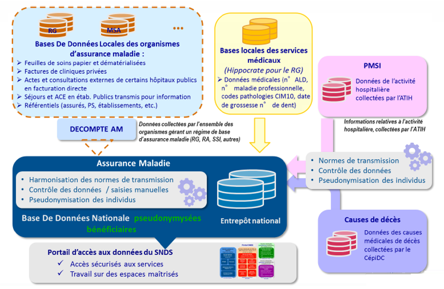
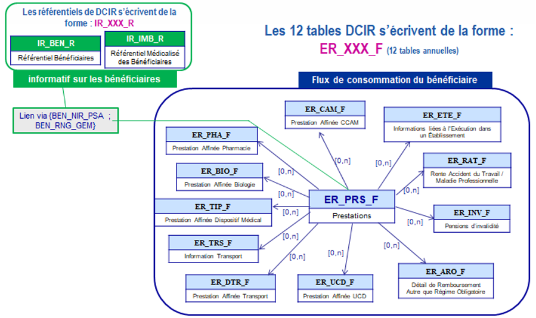
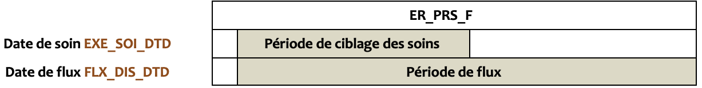
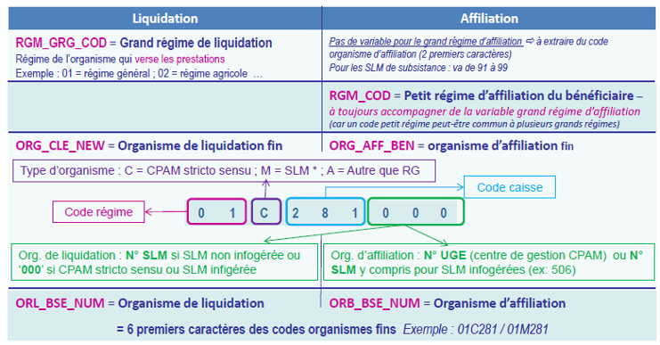
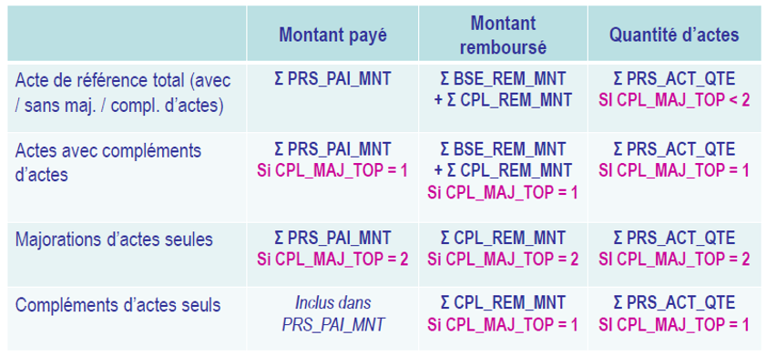
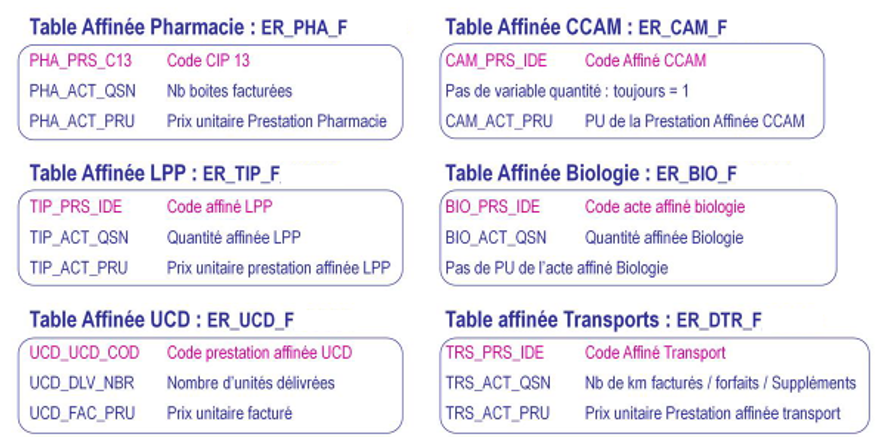
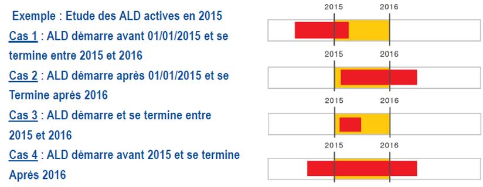
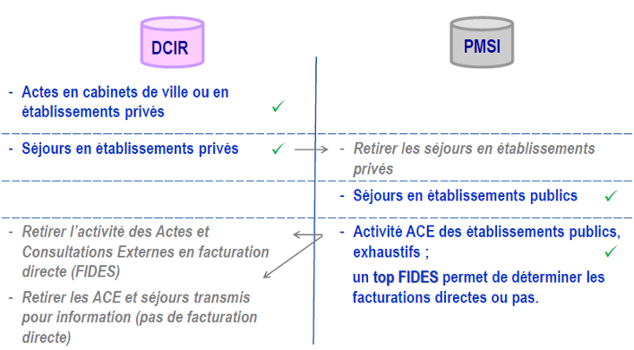

# L'Essentiel du SNDS
<!-- SPDX-License-Identifier: MPL-2.0 -->

L’objectif de ce document est de fournir aux utilisateurs un résumé de l’alimentation du SNDS, du référentiel sécurité, ainsi que des notions ou règles élémentaires sur les données du DCIR et de ses référentiels, du PMSI MCO et des causes de décès.

Ce document a été rédigé par la [CNAM](../../glossaire/Cnam.md) et est téléchargeable en bas de page.

## Le Circuit d’Alimentation du SNDS
<p style="text-align:center;">

</p>

## Le Référentiel Sécurité du SNDS
1.	La pseudonymisation des identifiants patients
2.	L’authentification forte de l’utilisateur et la conformité du poste de travail
3.	La traçabilité de toutes les actions et l’information des utilisateurs
4.	Le contrôle des traitements
5.	La sensibilisation et la formation des utilisateurs
6.	L’interdiction de sortir du SNDS des données non anonymes

## Identifiants potentiels
1. Commune de résidence
2. Année et mois de naissance
3. Date de soins
4. Date de décès
4. Commune de décès

## Notions d’identifiants des patients (pseudonymisées dans le SNDS)
* **L’assuré ou ouvreur de droit** : personne qui est assurée, sous le nom duquel le remboursement de soins est effectué (variable DCIR NIR assuré `ASS_NIR_ANO`).
* **L’ayant-droit** : personne qui n’a pas de droits ouverts à son nom, mais sous le compte d’un assuré (identifiable avec la variable DCIR qualité du bénéficiaire `BEN_QAF_COD`).
* **Le pseudo NIR du bénéficiaire** : concaténation du Numéro de l’assuré, de la date de naissance et du sexe du bénéficiaire (variable DCIR `BEN_NIR_PSA`) : 
    * ce pseudo NIR du bénéficiaire ne permet pas de distinguer les jumeaux de même sexe (il faut ajouter le rang de naissance du bénéficiaire (Variable DCIR `BEN_RNG_GEM`) ; 
    * un même bénéficiaire peut également avoir plusieurs pseudo NIR différents. Par ex : enfants présents sur la carte Vitale de ses 2 parents, bénéficiaire qui change de statut (enfant ayant droit de son parent => assuré ouvreur de droit) ou étranger passant d’un NIR provisoire à un NIR définitif.
* **Le bénéficiaire des soins** : personne bénéficiaire du soin, qu’elle soit assuré ou ayant droit, selon l’identification unique donnée par l’INSEE à chaque personne à la naissance, identique tout au long de la vie (variable DCIR NIR bénéficiaire `BEN_NIR_ANO`).

## Variables d’identifiants des patients
* **Le NIR du bénéficiaire** : `BEN_NIR_ANO`
* **Le pseudo NIR du bénéficiaire** (= NIR Assuré + date naissance du bénéficiaire + sexe du bénéficiaire) associé au rang gémellaire du bénéficiaire : `BEN_NIR_PSA`||`BEN_RNG_GEM`
* L’information `BEN_IDT_ANO` avec son top `BEN_IDT_TOP`. 
    * Il est égal au NIR unique du bénéficiaire : `BEN_NIR_ANO` s’il existe, topé avec `BEN_IDT_TOP = 1` ; 
    * sinon au Pseudo NIR et rang du bénéficiaire : `BEN_NIR_PSA`||`BEN_RNG_GEM`, topé avec `BEN_IDT_TOP = 0` (car les SLM et certains petits régimes ne renseignent pas encore le `BEN_NIR_ANO`)
    * Cette information est unique si `BEN_IDT_TOP = 1` ; en revanche, un bénéficiaire peut avoir plusieurs pseudo `NIR BEN_NIR_PSA` (dans ce cas, utiliser le rang gémellaire).

Cas particulier des extractions de données ‘demex’ : 
* La variable `BEN_NIR_PSA` (ou `NIR_ANO_17` pour le PMSI) est équivalente à `NUM_ENQ`, 
* la variable `BEN_NIR_ANO` à NUM_ENQ_ANO et la variable `BEN_IDT_ANO` à `NUM_ENQ_IDT`.

## Présentation de IR\_BEN\_R
Cette table contient des informations sur le bénéficiaire ayant eu de la consommation de soins en ville ou en clinique privée (aucune information si le bénéficiaire a recours à l’hôpital public uniquement car informations présentes dans le PMSI). Les informations sont les caractéristiques administratives les plus récentes, correspondant à la dernière mise à jour de la base.
La table contient également des informations sur les non-consommants.

[Lien](../../tables/BENEFICIAIRE/IR_BEN_R.md) vers la description de la table.

### Variables du référentiel bénéficiaires IR\_BEN\_R
* **Pour voir si l’information concerne un consommant ou un non consommant** : Variable « TOP consommant / non consommant » `BEN_TOP_CSN` ou variable « date maximale de traitement » `MAX_TRT_DTD` (date la plus récente des prestations perçues par un bénéficiaire), renseignée à ‘01/01/1600’ pour les non-consommants (aucune prestation perçue).
* **Pour distinguer la qualité du bénéficiaire des soins** (assuré, conjoint ayant droit, enfant, fictif…) : variables `BEN_QAF_COD` (qualité du bénéficiaire) ou `BEN_CDI_NIR` (NIR fictif, modalités dans le référentiel **IR_NIR_V**).
* **Les variables dates** :
    * L’année de naissance `BEN_NAI_ANN` est forcée à 1600 lorsqu’elle est inconnue. 
    * De même, les dates manquantes sont forcées au 1er janvier 1600 au lieu du 1er janvier de l’an 1. 
    * Lorsque vous extrayez des dates manquantes dans vos tables SAS, elles sont renseignées et égales au 1er janvier 1600. 
    * La date de décès `BEN_DCD_DTE` est alimentée au 01/01/1600 lorsque le bénéficiaire est vivant, la date d’insertion dans le référentiel BEN_DTE_INS est alimentée à 01/01/1600 si le bénéficiaire est inséré avant 2012.
* **La commune de résidence du bénéficiaire** : `BEN_RES_COM`, elle remonte des bases «adresses» locales des organismes et contient la commune / le département de la dernière situation connue du destinataire de règlement (adresse de l’ouvreur de droit ou du bénéficiaire si connue). La commune est un code INSEE et doit toujours être associée au code département.

## Présentation du DCIR
Une table centrale autour de laquelle gravitent les autres tables de prestations affinées. Plusieurs lignes pour 1 bénéficiaire et pour une prestation dans la table [**ER_PRS_F**](../../tables/DCIR/ER_PRS_F.md). 9 clés de jointure répliquées dans toutes les tables de consommation de soins.
 
<p style="text-align:center;">

</p>

### Clés de jointure
9 clés de jointure entre la table [**ER_PRS_F**](../../tables/DCIR/ER_PRS_F.md) et les tables affinées :
* FLX_DIS_DTD
* FLX_TRT_DTD
* FLX_EMT_TYP
* FLX_EMT_NUM
* FLX_EMT_ORD
* ORG_CLE_NUM
* DCT_ORD_NUM
* PRS_ORD_NUM
* REM_TYP_AFF

### Variables dates du DCIR
Le DCIR est alimenté selon la date de traitement des données.
* `FLX_TRT_DTD`, date de traitement des données (une valeur pour chaque jour du mois de traitement). 
* `FLX_DIS_DTD`, date de mise à disposition des données (une seule valeur pour un mois entier de traitement).

**Privilégier `FLX_DIS_DTD` à `FLX_TRT_DTD` car une seule modalité contre 31 pour chaque mois.**

Le DCIR contient également l’information sur la période des soins :
* `EXE_SOI_DTD` / `EXE_SOI_DTF` : date de début / de fin / d’exécution des soins (jour + mois + année)
* `EXE_SOI_AMD` / `EXE_SOI_AMF` : année et mois de début / de fin de soins

**Pour cibler sur une période de soin, il faut impérativement optimiser la requête en bornant une période de traitement plus large** pour récupérer l’ensemble des soins concernés (jusqu’à 27 mois, généralement 99% des soins sont remontés à 6 mois) :

<p style="text-align:center;">

</p>

### Autres variables du DCIR
* **Les prestations de référence** (variable `PRS_NAT_REF`) correspondent uniquement aux actes générateurs du paiement : 
    * par exemple une consultation, une visite, un acte de chirurgie, un acte infirmier, … 
    * Elles peuvent être découpées en acte de base (`BSE_PRS_NAT`) associé à un complément d’acte (`CPL_PRS_NAT` et `CPL_MAJ_TOP=1`) ou une majoration (`CPL_PRS_NAT` et `CPL_MAJ_TOP=2`) et une participation forfaitaire (en fonction de la prestation) (`CPL_PRS_NAT` et `CPL_MAJ_TOP=2` ; Modalités à ajuster via `CPL_AFF_COD`). 
    * **Attention** : pour une unique prestation, les majorations peuvent multiplier le nombre de ligne.
* **Le qualificatif de la dépense** `DPN_QLF` permet de distinguer les dépassements s’il y a lieu (permanent, maitrisé, autorisé, justifié…). La variable permet également de distinguer l’activité (ACE et séjours) des établissements publics qui ne pratiquent pas de facturation directe, transmise pour information à l’Assurance Maladie (mais activité non exhaustive). Il faut exclure ces cas avec le filtre `DPN_QLF <> 71`.
* **La commune de résidence du bénéficiaire** `BEN_RES_COM` est un numéro Insee sur 3 positions et doit toujours être positionnée avec le code du département de résidence `BEN_RES_DPT`. C’est la commune de résidence au moment du remboursement (même principe que dans [IR_BEN_R](../../tables/BENEFICIAIRE/IR_BEN_R.md) mais à la date du soin alors que dans [IR_BEN_R](../../tables/BENEFICIAIRE/IR_BEN_R.md), il s’agit de la dernière situation connue).
* **L’âge du bénéficiaire à la date des soins** : `BEN_AMA_COD` (calculé à partir de l’année et du mois de la date de début des soins (`EXE_SOI_DTD`) et exprimé en mois / année révolu(e) :
    * Si âge >= 2 ans alors `BEN_AMA_COD = AAA` avec AAA : l’âge en année révolue
    * Si âge < 2 ans alors `BEN_AMA_COD = 10MM` avec MM appartenant à 00-23 inclus : l’âge en mois révolu
* **L’année de naissance du bénéficiaire** `BEN_NAI_ANN` permet de recalculer l’âge du bénéficiaire au moment du soin à partir de cette variable.
* **La profession de l’exécutant** est identifiée via les variables `PSE_SPE_COD` (code spécialité pour les médecins) et `PSE_ACT_NAT` (nature d’activité pour les non médecins), qui sont complémentaires.  Dans le cas d’un prescripteur, le préfixe PSE est remplacé par PSP (`PSP_SPE_COD` et `PSP_ACT_NAT`).
Les modalités de ces variables sont répertoriées dans les tables IR_SPE_V pour `SPE_COD` et IR_ACT_V pour `ACT_NAT`.

### Organismes de liquidation/affiliation
* **Organisme de liquidation** : organisme qui déclenche le remboursement des prestations pour les bénéficiaires qui lui sont affiliés mais aussi, éventuellement, pour des bénéficiaires affiliés dans d’autres organismes (cas des cures thermales, DOM ou SLM infogérées).
* **Organisme d’affiliation du bénéficiaire** : organisme où est affilié le bénéficiaire des soins. Pour le régime général, il s’agit de l’organisme du lieu de résidence du bénéficiaire.
Dans le cas des SLM « infogérées », l’organisme d’affiliation du bénéficiaire est bien celui de la SLM de son lieu de résidence.

<p style="text-align:center;">

</p>

### Indicateurs
* **Le Montant de la Dépense** est la somme que l’assuré a payé au PS, c’est le montant des honoraires du PS.
* **La Base de remboursement** correspond au montant pris en considération par l’assurance maladie (100% sécu).
* **Le Montant Remboursé** est ce que l’assurance maladie rembourse à l’assuré (base de remboursement x taux de remboursement).
* **Le Montant du Dépassement d’honoraires** est la somme que le PS facture en plus du montant conventionnel de l’acte; c’est la différence entre le montant de la dépense et la base de remboursement. Il est contenu dans le montant de la dépense. Il n’est pas alimenté pour les dépassements n’étant pas des honoraires.
* **Le Montant des participations forfaitaires (PF) et franchises (FR)** est ce que l’assuré verse (sauf si tiers-payant) pour chaque consultation, visite, acte de biologie, de transport, délivrance de médicaments, … C’est donc un montant négatif.
La quantité sert à la tarification de la prestation. Elle correspond au nombre de « séances ».
* **Le dénombrement** correspond au nombre d’actes tarifés dans la même séance. 
    * En général, le dénombrement est équivalent à la quantité si les prestations sont liquidées ligne à ligne. 
    * En codage CCAM, quantité équivaut à dénombrement (Certains régimes ne remontent pas la notion de dénombrement des actes ; en inter-régimes utiliser la Quantité ; pour compter des actes, utiliser la variable « quantité d’actes » sauf les prestations de transports, les indemnités kilométriques, les indemnités journalières.
* **Le coefficient global** est utilisé pour les actes à coefficients. Il est égal à coefficient tarifé x quantité ; donne une idée du «volume d’actes ». Ne doit pas être confondu avec l’objet « coefficient tarifé ».

<p style="text-align:center;">

</p>

### Les tables affinées
La jointure entre la table [**ER_PRS_F**](../../tables/DCIR/ER_PRS_F.md) et une des tables affinées se fait sur les 9 clés de jointure si une information affinée de la prestation existe, et peut entraîner un dédoublement des lignes des indicateurs présents dans [**ER_PRS_F**](../../tables/DCIR/ER_PRS_F.md).  

Pour le calcul des indicateurs globaux de la prestation, il faut donc le faire exclusivement sur [**ER_PRS_F**](../../tables/DCIR/ER_PRS_F.md) alors que pour les indicateurs des prestations affinées, il faut les recalculer à partir des valeurs de la table affinée après jointure PRS//Table affinée en suivant la formule :  

``` 
Base de remboursement de l’acte affiné = Quantité affinée X Prix unitaire
Montant remboursé de l’acte affiné = Base de remboursement de l’acte affiné X Taux de remboursement / 100
```

<p style="text-align:center;">

</p>

Il en est de même pour les indicateurs affinés de la table ER_ARO_F selon le type de remboursement. Concernant [ER_ETE_F](../../tables/DCIR/ER_ETE_F.md), il n’y a que des informations sur les établissements, pas d’indicateurs affinés.

### Le référentiel médicalisé IR_IMB_R
* Table retraçant l’historique des exonérations du Ticket Modérateur accordées par les services médicaux des organismes pour les bénéficiaires de certaines prises en charge (Affections de Longue Durée (ALD) exonérantes (ALD liste et hors liste (pas de remontée des polypathologies pour le RG), soins et arrêts continus de plus de 6 mois, invalidité, accidents du Travail et maladies Professionnelles (AT/MP)). 

Cette table contient plusieurs lignes par bénéficiaire et conserve l’historique à chaque mise à jour.

[Lien](../../tables/DCIR_DCIRS/IR_IMB_R.md) vers la description de la table.

* Pour sélectionner des patients qui ont une ALD active sur une période :

<p style="text-align:center;">

</p>

Filtre à utiliser : 
```
Date de début de l’ALD IMB_ALD_DTD <= 31/12/2015 et date de fin de l’ALD IMB_ALD_DTF  >= 01/01/2015 ou manquante (= 01/01/1600 ou .)
```

* Les numéros d’ALD 30 (variable `IMB_ALD_NUM`) peuvent être utilisés en l’état mais ne sont pas corrigés lors de changements de règles de classement d’ALD (exemple pour la Maladie d’Alzheimer qui était ALD 15 et est devenue ALD 23). Il est donc recommandé d’utiliser la table de correspondance CIM10 / ALD30, IR_CIM_V, présente dans ORAVAL pour récupérer le code ALD30 à jour.

## PMSI MCO
* Différences entre **DCIR** et **PMSI**

<p style="text-align:center;">

</p>

* Les principales tables du **PMSI MCO**
    * **T_MCOxxC** : table de chainage patients/séjour : seule table qui contient l’identifiant du patient (`NIR_ANO_17 = BEN_NIR_PSA`) (une ligne par patient et séjour : `NIR_ANO_17` / `ETA_NUM RSA_NUM`).
    * **T_MCOxxB** : description des séjours (une ligne par « `ETA_NUM` ; `RSA_NUM` »).
    * **T_MCOxxE** : table des établissements (une ligne par « `ETA_NUM` »).
    * **T_MCOxxA** : table des actes techniques pratiqués (CCAM).
    * **T_MCOxxD** : table des diagnostics associés significatifs.
    * **T_MCOxxUM** : table des résumés unités médicales (RUM).

* Schéma global
<p style="text-align:center;">

</p>

* Filtre de nettoyage sur le PMSI (jusque 2018) :
1. Exclusion des FINESS géographiques APHP/APHM/HCL pour éviter les doublons (jusqu’en 2018) :
```
ETA_NUM not in ('130780521', '130783236', '130783293', '130784234', '130804297','600100101', '750041543', '750100018', '750100042', '750100075', '750100083', '750100091', '750100109', '750100125', '750100166', '750100208', '750100216', '750100232', '750100273', '750100299' , '750801441', '750803447', '750803454', '910100015', '910100023', '920100013', '920100021', '920100039', '920100047', '920100054', '920100062', '930100011', '930100037', '930100045', '940100027', '940100035', '940100043', '940100050', '940100068', '950100016', '690783154', '690784137', '690784152', '690784178', '690787478', '830100558')
```
2. Exclusion des séjours en erreur : 
```
GRG_GHM not like '90%'
```
3. Exclusion de la dialyse, l’activité externe des médecins salariés ou des FFM, ATU, SE : 
```
TYP_GEN_RSA = ‘0’
```

::: tip NB 
Les points 2. et 3. sont automatiquement enlevés avec la condition :
```
GRG_GHM not like '90%'
```
:::

4. Exclusion des prestations inter établissements :
    * Solution 1 : ```(ENT_MOD <> '0' and SOR_MOD <> '0')```
    * Solution 2 : ```(SEJ_TYP <> ' B')```
5. Exclusion des clés de chainage incorrectes (à partir de la table **T_MCOAAC**) : à mettre si chaînage de patients mais pas si comptage de séjours :
```
NIR_ANO_17 not in ('xxxxxxxxxxxxxxxxx', 'XXXXXXXXXXXXXXXXS') and (NIR_RET = '0' and NAI_RET = '0' and SEX_RET = '0' and SEJ_RET = '0' and FHO_RET = '0' and PMS_RET = '0' and DAT_RET = '0')
```

## Causes médicales de décès
Les données des causes médicales de décès sont restituées dans deux tables :
* La table des circonstances et de la cause initiale du décès KI_CCI_R qui contient une ligne par décès, une ligne par certificat `DCD_IDT_ENC`.
* La table de l’ensemble des causes de décès KI_ECD_R qui contient une ligne par cause médicale de décès, elle peut donc contenir plusieurs lignes pour un même décès.

La jointure entre les 2 tables se fait sur `DCD_IDT_ENC`. La jointure avec les autres tables doit se faire via `BEN_IDT_ANO` (cette variable vaut `BEN_NIR_ANO` s’il existe, sinon `BEN_NIR_PSA`||`BEN_RNG_GEM`).

::: tip Auteur
Ce guide a été rédigé par la CNAM. 
Date : décembre 2020
:::

::: tip Télécharger
Télécharger le document original à ce [lien](../../files/Cnam/20210406_CNAM_essentiel-SNDS_v2122020_MLP-2.0.pdf)
:::


