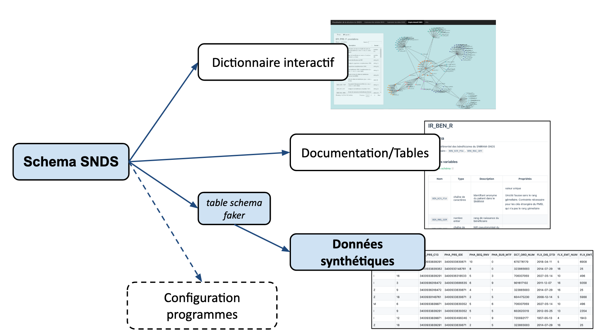

# SNDS synthétique
<!-- SPDX-License-Identifier: MPL-2.0 -->

Deux jeux de données de synthèse (fictives) du SNDS sont mis à disposition: un premier réalisé par le lab santé de la DREES accessible à tous et un second réalisé par l’équipe [EA REPÈRES]() de l’université de Rennes 1 réservé aux projets pilotes et projets issus des appels à projets du Health Data Hub et accessible sur demande.

Ces données de synthèse permettent de :
* découvrir et comprendre les données du SNDS historique (Sniiram, PMSI, CédiDC)
* se former sur la manipulation de ces données 
* commencer à préparer ses programmes en attendant d’être formellement autorisé à accéder aux données “réelles” du SNDS. 

Ces données sont générées à partir d'une description formelle du SNDS et aléatoirement à partir d’outils de génération développés l’un par le lab santé de la DREES et l’autre par l’équipe EA REPÈRES. 

## Données de synthèse du lab santé de la DREES

Ce jeu de données est généré grâce à la librairie [tsfaker](https://gitlab.com/healthdatahub/tsfaker) à partir du [schéma formel](https://gitlab.com/healthdatahub/schema-snds) du SNDS et il est disponible dans le dépôt GitLab du Health Data Hub dans le dossier synthetic-snds. Son utilisation est libre suivant la [licence ouverte](https://www.etalab.gouv.fr/licence-ouverte-open-licence).
Ces données sont identiques aux données tels que les organismes ayant un accès permanent y accèdent. La différence entre un accès permanent et une extraction DEMEX (extractions du SNDS délivrées par la CNAM) étant l’identifiant bénéficiaire dans le DCIR : BEN_NIR_PSA pour les accès permanent et NUM_ENQ pour les extractions DEMEX.
 

::: warning
Ces données sont **factices**, et ne contiennent aucune information personnelle ni aucune cohérence médicale. 
:::

### Où trouver le SNDS synthétique ?

Pour visualiser les données synthétiques, le plus simple est actuellement de parcourir le dossier `schemas` du [projet GitLab SNDS synthétiques](https://gitlab.com/healthdatahub/synthetic-snds).

Voici par exemple 10 lignes synthétiques de la [table ER_PHA_F du DCIR](../files/images/extrait_ER_PHA_R_synthetique_github.png)

Vous pouvez également [télécharger une archive zip du projet](https://gitlab.com/healthdatahub/synthetic-snds/-/archive/master/synthetic-snds-master.zip). 

### Génération des données

Les données synthétiques sont générées à partir du [schéma formel du SNDS](https://gitlab.com/healthdatahub/schema-snds), avec la librairie Python [tsfaker](https://gitlab.com/healthdatahub/tsfaker)[^2].

[^2]: La librairie `tsfaker` a été développée par Pierre-Alain Jachiet pour le SNDS synthétiques. 
    Sa spécificité par rapport à d'autres libraires équivalentes est de s'appuyer sur le standard [Table-Schema](../glossaire/table-schema.md), et de bien gérer un grand nombre de clés étrangères. 

À chaque modification du schéma, de nouvelles données synthétiques sont automatiquement générées sur le projet [SNDS synthétique](https://github.com/indsante/synthetic-snds/). 

Seulement 10 lignes sont générées pour chaque table, de façon à limiter la taille du projet. 
Il est possible de générer plus de lignes par table en suivant les instructions en fin du README du projet. 

### Intérêts

Le SNDS synthétique a pour principal intérêt d'être libre de réutilisation, car il ne contient aucune donnée personnelle.

Les données respectent 
- la **structure** des tables, 
- les **jointures** entre tables,
- le **type** des variables,  
- les valeurs des variables associées à des **nomenclatures**,
- des **contraintes simples** sur les variables (min, max, longueur).

### Limites

#### Absence d'informations statistiques 

Les données synthétiques ne contiennent pas d'information statistiques. 
Il est donc impossible de réaliser des analyses à partir de ces données.

::: tip Note
Il serait facile d'ajouter des distributions univariés sur les variables, en ajoutant leur fréquence d'apparition dans les nomenclatures. Une petite évolution de la librairie `tsfaker` serait alors nécessaire (cf [issue 5](https://gitlab.com/healthdatahub/tsfaker/issues/5)).
::: 

En particulier, les données ne respectent aucune règle logique entre paires de variables. 
Une date de début peut par exemple être postérieure à une date de fin. 
Il serait possible d'ajouter de telles contraintes par un traitement _a posteriori_.

#### Pas de version par année

Le schéma des tables évolue chaque année, avec l'ajout ou la suppression de tables et variables.  
Ces informations sont actuellement présentes dans le schéma SNDS, mais de façon trop incomplète pour générer un SNDS synthétiques pour chaque année.

#### Erreurs dans le schéma

Le schéma des tables est imparfait et incomplet. 
Ces erreurs sont directement visibles dans les données synthétiques.

Il manque en particulier de nombreuses tables de nomenclatures, qui indiquent les valeurs prises par les variables, avec les libellés correspondant aux codes employés. 

### Amélioration des données synthétiques

Vous pouvez contribuer à améliorer les données synthétiques en améliorant le schéma formel du SNDS sur le [projet schema-snds](https://gitlab.com/healthdatahub/schema-snds). 
Vous pouvez proposer des merge-request pour ajouter des contraintes, corriger les types, ou compléter les nomenclatures.

Des liens directs pour éditer les schémas sont disponibles sur le [dictionnaire interactif](https://drees.shinyapps.io/dico-snds), et sur les pages de la [section table](../tables/README.md) de cette documentation.  

Si vous souhaitez proposer d'autres types d'améliorations, vous pouvez ouvrir des issues sur le projet [schema-snds](https://gitlab.com/healthdatahub/schema-snds), ou sur le [projet tsfaker](https://gitlab.com/healthdatahub/tsfaker/issues/) si cela concerne la procédure de génération.
  
### Citer les données
Pour toute publication autour des travaux réalisés sur ces données, merci de citer la base de données de la manière suivante : 
« SNDS synthétique développé par l’équipe du lab santé de la DREES »

## Données de synthèse de l'équipe EA REPERES

Ce jeu de données a été généré de manière aléatoire sur la base de statistiques descriptives du SNDS ainsi qu’une série de règles métier et ressemble à une livraison DEMEX et ne contient aucune donnée de santé personnelle.
Ces données ne sont pas exhaustives, la liste des tables et variables disponibles est disponible dans ce [document](../files/HDH/20201119_HDH_reperes_MLP-2.0.docx).

### Description
Le jeu de données de synthèse s’étend sur 4 ans (2015 à 2018 inclus) et représente une partie du DCIR et PMSI MCO. Dans les tables du DCIR `NUM_ENQ` est la variable identifiante, pour les tables du PMSI la variable identifiante est `NIR_ANO_17`.

### Accéder aux données
L’accès aux données de synthèse développés par l’équipe EA REPERES (dont les conditions sont décrites dans une convention entre l’équipe EA REPERES et le HDH) est soumis à la signature par tous les utilisateurs d’un [accord de confidentialité](../files/HDH/20201119_HDH_acces_reperes_MLP-2.0.docx) signé avec le Health Data Hub.

Pour demander un accès vous pouvez envoyer un mail à <opensource@health-data-hub.fr>.

Les données sont mises à disposition via une plateforme dédiée qui permet aux utilisateurs de manipuler directement les données sous deux environnements : 
- jupyterhub pour le développement de programmes en langage python
- RStudio pour le développement de programmes en langage R
Cette plateforme contient aussi les données synthétiques du lab santé de la DREES dans un dossier dédié. 

L'accès à la plateforme se fait via une url avec identifiant et un mot de passe. Ces éléments ainsi que l’adresse IP de l’utilisateur sont enregistrés (ce traitement de données est répertorié sur le registre de traitements du Health Data Hub conformément à l’article 30 du RGPD). 

Pour toutes informations sur les traitements des données à caractère personnel, veuillez vous reporter à la politique de confidentialité du Health Data Hub disponible le site internet du Health Data Hub : https://www.health-data-hub.fr/politique-de-confidentialite

### Citer les données
Pour toute publication autour des travaux réalisés sur ces données, merci de citer la base de données de la manière suivante : 
« Base de données développée par l’équipe EA REPERES [https://www.ea-reperes.com/](Recherche en Pharmaco-épidémiologie et recours aux soins, UPRES EA-7449) et propriété de l’Université de Rennes 1 »
