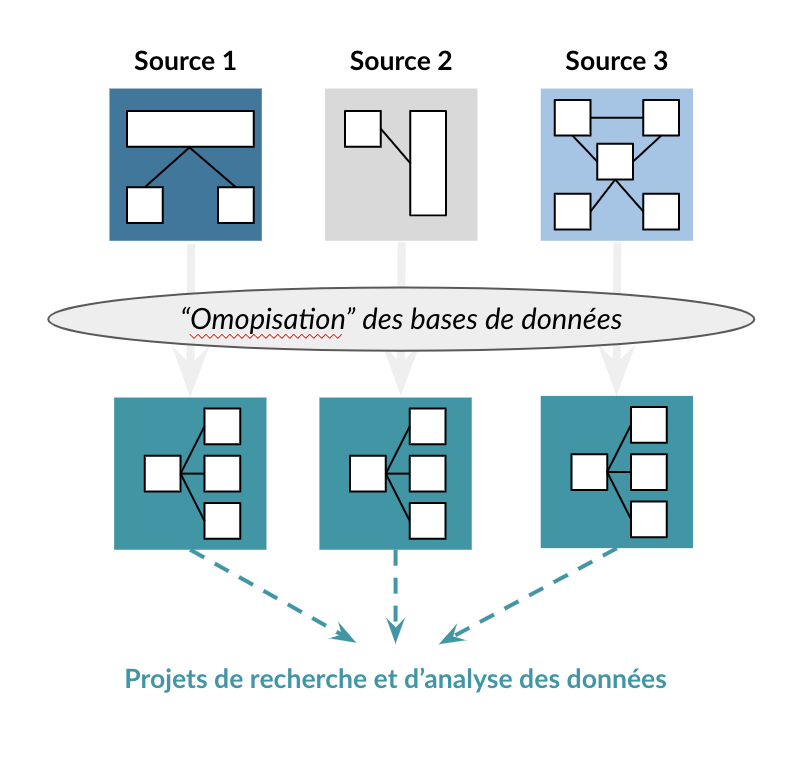
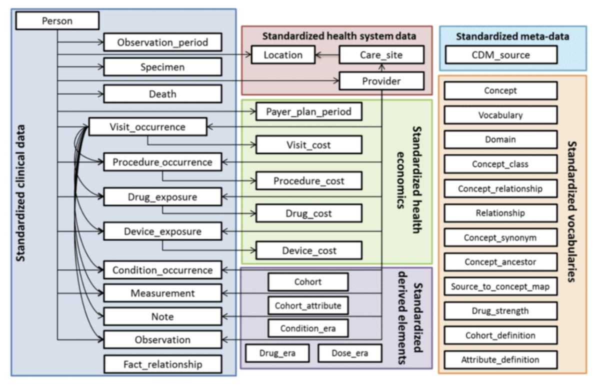

# OMOP - Common Data Model
<!-- SPDX-License-Identifier: MPL-2.0 -->

Le modèle commun de donnée OMOP-CDM (Observational medical outcomes partnership - Common Data Model) est un modèle relationnel de bases de données de santé, qui a pour objectif **l'interopérabilité** entre les différentes bases d'analyse en santé, qu'elles soient cliniques ou médico-administratives. 

Cette interopérabilité se traduit concrètement par la possibilité de partage d'outils, de méthodes, d'études et de programmes entre les centres disposant d'une base au format OMOP.

## Origine : Verrou dans l’utilisation des données de santé à l’échelle internationale
A l’échelle internationale, il existe différents types de bases de données de santé, comportant souvent des données disparates au niveau du patient. Ces bases de données sont aussi diverses que les systèmes de santé eux-mêmes, reflétant différentes populations, différents milieux de soins et différents processus de saisie des données. 
Pourtant, les données relatives aux soins de santé peuvent transformer notre compréhension de la santé, des maladies et de leurs conséquences, mais elles sont actuellement dispersées dans de multiples institutions et pays, stockées dans des formats différents et soumises à des règles différentes. Il est donc très difficile d'utiliser pleinement ces données de manière transversale.
Face à ce constat, un partenariat public-privé appelé OMOP (Observational Medical Outcomes Partnership), présidé par la [Food and Drug Administration](https://www.fda.gov/) aux États-Unis et financé par un consortium de sociétés pharmaceutiques a été créé en 2008 pour cinq ans.  
L’OMOP a collaboré avec des chercheurs universitaires et des partenaires de données sur la santé pour établir un programme de recherche visant à faire progresser la surveillance active de la sécurité des produits médicaux en utilisant des données d'observation des soins de santé. 

## Création d’un modèle de données commun OMOP-CDM
De par la complexité technique des projets de recherche due à des bases de données disparates, l'OMOP a conçu le modèle OMOP de données commun (appelé OMOP-CDM) comme un mécanisme permettant de normaliser la structure, le contenu et la sémantique des données d'observation et de rendre possible l'écriture de codes d'analyse statistique uniques qui pourraient être réutilisés sur chaque base de données. 
Après conversion de premières bases de données dans ce format, il a été démontré qu'il était possible d'établir un modèle de données commun et des vocabulaires normalisés qui pourraient accueillir différents types de données provenant de différents environnements de soins et représentés par différents vocabulaires sources d'une manière qui pourrait faciliter la collaboration entre les établissements et chercheurs au niveau international.

## Parties prenantes

Le modèle commun OMOP-CDM est maintenu et développé au sein de la communauté open-source [OHDSI](https://www.ohdsi.org/) (Observational Health Data Sciences and Informatics, acroynyme se prononcant "odyssée").

Le format OMOP-CDM est promue en europe par le Réseau européen de données et de preuves en matière de santé [(EHDEN)]()
Le format OMOP-CDM est soutenu par des universités (ex: Columbia), des industriels (ex: Iqvia) et des institutions (ex: USA, Corée du Sud, Union Européenne, etc).

## structure
La version 6 d’OMOP-CDM contient :
* 38 tables au total
* un vocabulaire standardisé
* des tables renvoyant aux principales informations médicales et orientées autour d’une table centrale “Patient”

## Références

- G. Hripcsak et al., « [Observational Health Data Sciences and Informatics (OHDSI): Opportunities for Observational Researchers](https://www.ncbi.nlm.nih.gov/pmc/articles/PMC4815923/) », Stud Health Technol Inform, vol. 216, p. 574‑578, 2015.

- Site d’[OHDSI](https://www.ohdsi.org/), la fondation promotteur d’OMOP

- [Wiki du format OMOP-CDM](https://github.com/OHDSI/CommonDataModel/wiki)
