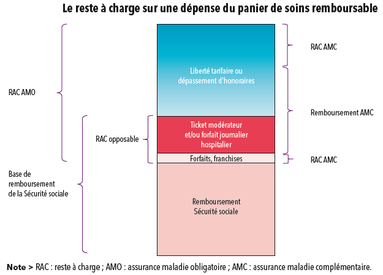

# PF - Participation forfaitaire
<!-- SPDX-License-Identifier: MPL-2.0 -->

La participation forfaitaire est un coût de 1 euro par acte médical à la charge des ménages, en supplément du ticket modérateur.

## Details

Depuis 2005 s'ajoute au ticket modérateur une **participation financière de 1 euro pour toute consultation ou acte réalisé par un médecin** (généraliste ou spécialiste), 
pour les examens de radiologie et les analyses de biologie médicale.
Elle est **plafonnée à 4 euros par jour** pour un même professionnel de santé, et à **50 euros par an** par assuré tous professionnels confondus. 

Il existe également depuis 2008 des franchises médicales de **0,50 euro par boîte de médicaments**, **0,50 euro par acte paramédical**, **2 euros par transport sanitaire**.
Elles sont plafonnées à 2 euros par jour pour les actes paramédicaux, 4 euros par jour pour les transports sanitaires, et 50 euros par an pour l‘ensemble des actes ou prestations concernés.

Une participation sur les actes coûteux, de 24 euros en 2019 (auparavant de 18 euros en 2018) s‘applique en ville et dans les établissements de santé aux actes dont le tarif est supérieur ou égal à 120 euros (ou ayant un coefficient supérieur ou égal à 60). 
Elle se substitue alors au ticket modérateur.

## Exemple

Pour une consultation dans le cadre du parcours de soins coordonnés facturée 45 euros par un spécialiste adhérant à l‘option de pratique tarifaire maîtrisée <PreviewPage text="Optam" link="OPTAM.html" /> (honoraires avec dépassements maîtrisés),
la base de remboursement de la Sécurité sociale est de 30 euros et le taux de remboursement de la Sécurité sociale de 70 %. 
Le remboursement de la Sécurité sociale est de 20 euros, soit 70 % * 30 euros - 1 euro de participation forfaitaire. 
Le <PreviewPage text="ticket modérateur" link="ticket_moderateur.html" /> à 30 % correspond à 9 euros, et est obligatoirement pris en charge si le patient est couvert par un contrat responsable. 
La complémentaire santé peut, selon le contrat souscrit, prendre en charge tout ou partie des dépassements d‘honoraires qui représentent 15 euros.

## Références

- [Panorama de la Drees](https://drees.solidarites-sante.gouv.fr/IMG/pdf/1-11.pdf) sur la Complémentaire santé, Edition 2019, Fiche 1
- [Page Wikipédia](https://fr.wikipedia.org/wiki/Participation_forfaitaire)