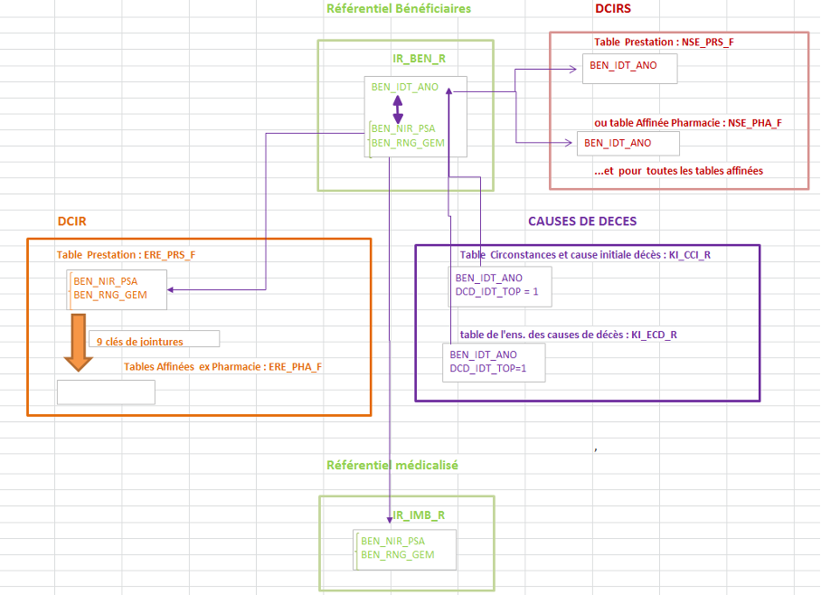
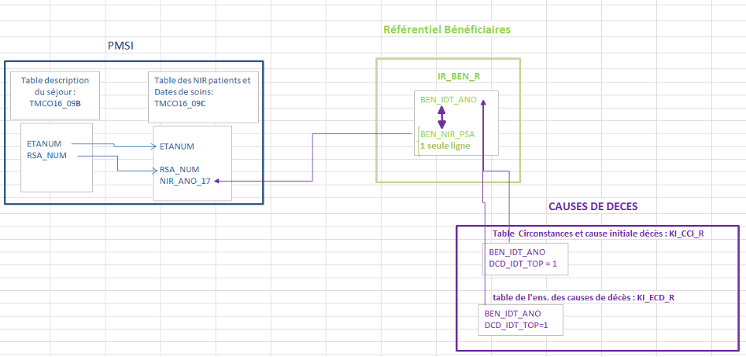

# III - Comment relier les données de santé aux causes médicales de décès
<!-- SPDX-License-Identifier: MPL-2.0 -->

Les informations sur les causes médicales de décès sont restituées dans deux tables du répertoire « oravue » du SNDS, elles sont accessibles via SAS enterprise guide :
- la table des circonstances et de la cause initiale du décès KI_CCI_R,
- la table de l’ensemble des causes de décès KI_ECD_R.

Les données contenues dans chaque table sont présentées dans le [chapitre IV](4-Chap4CausesDeces.md) de ce guide. 

Lorsqu’un décès, identifié par son code `dcd_idt_enc`, a pu être apparié avec les données de santé, les tables KI_CCI_R et KI_ECD_R contiennent :
- l’identifiant `ben_idt_ano` du bénéficiaire,
- le top associé à cet identifiant `ben_idt_top`, qui vaut 1 si l’identifiant `ben_idt_ano` est égal au NIR pseudonymisé du patient `ben_nir_ano`, 0 sinon,
- le NIR pseudonymisé du bénéficiaire `ben_nir_ano`, renseigné uniquement quand `ben_idt_top` = 1.

Par contre, lorsqu’un décès n’a pas pu être apparié avec les données de consommation de soins, les champs `ben_idt_ano`, `ben_idt_top` et `ben_nir_ano` ne sont pas renseignés dans les deux tables des causes de décès.

Un top a été alimenté pour vous permettre de distinguer facilement les décès appariés avec les données de santé des décès non appariés. 
Ce top, noté `dcd_idt_top`, vaut 1 lorsque le décès est apparié, 0 sinon. 

Le fait de disposer des informations de l’ensemble des décès vous permet d’une part de calculer des statistiques globales sur les causes médicales de décès (âge, sexe, pathologie, …), d’autre part de mesurer les biais engendrés par l’utilisation d’une méthode d’appariement indirect pour relier les causes médicales de décès aux données de consommation de soins et par la non exhaustivité de l’alimentation de la date de décès dans la table IR_BEN_R. 
Vous devrez tenir compte de ces biais et chercher à les corriger lorsque vous ferez des études sur le parcours et la consommation de soins des personnes décédées.

Le champ `ben_idt_ano` sert à identifier les patients dans l’application DCIR simplifié (tables ns_xxx_f) et le référentiel associé IR_IBA_R. Toutefois, pour l’instant, l’historique des soins retracés dans cette application démarre au 1er janvier 2016, ce qui ne vous permet pas d’étudier la consommation de soins des personnes décédées avant cette date.

Le champ `ben_idt_ano` figure également dans le référentiel des bénéficiaires du SNDS IR_BEN_R et dans le référentiel archivé IR_BEN_R_ARC, ces deux tables vous permettent d’associer à l’identifiant `ben_idt_ano` d’un patient, tous les couples {identifiant SNIIRAM `ben_nir_psa` ; rang de bénéficiaire `ben_rng_gem`} associés à ses différents ouvreurs de droits. En effet, une même personne, caractérisée par son identifiant `ben_idt_ano`, a autant de couples {identifiant SNIIRAM ; rang} qu’elle a d’ouvreurs de droits (Cf. rappel dans le [chapitre II](2-Chap2CausesDeces.md)).

Les couples {`ben_nir_psa` ; `ben_rng_gem`} du référentiel IR_BEN_R et, le cas échéant du référentiel archivé IR_BEN_R_ARC, vont vous permettre de rechercher les informations médicalisées sur les pathologies ayant donné lieu à une exonération des patients pour affection de longue durée (ALD) contenues dans le référentiel médicalisé IR_IMB_R, ainsi que les données de consommation de soins contenues dans les remboursements de soins de DCIR. L’identifiant SNIIRAM `ben_nir_psa` vous permet de faire le chaînage avec les informations hospitalières du PMSI.
 
## Recherche des informations dans le référentiel médicalisé IR_IMB_R et DCIR

- Pour les décès appariés avec le SNDS (`dcd_idt_top` = 1 dans la table des circonstances et de la cause initiale du décès KI_CCI_R), vous recherchez tous les couples {`ben_nir_psa` ;`ben_rng_gem`} associés à leur identifiant `ben_idt_ano` dans le référentiel IR_BEN_R. 
Si le champ `ben_idt_ano` ne figure pas dans IR_BEN_R, vous le recherchez dans le référentiel archivé IR_BEN_R_ARC (Cf. [Annexe 2](6-Annexe2-CausesDeces.md)).
Vous appariez donc la table KI_CCI_R et le référentiel IR_BEN_R + IR_BEN_R_ARC à l’aide de l’identifiant `ben_idt_ano` et vous constituez une table de correspondance entre les champs `ben_idt_ano`, `ben_nir_psa` et `ben_rng_gem`. 
Vous devez veiller à ce que cette table de correspondance ne contienne qu’une seule ligne par couple {`ben_nir_psa` ; `ben_rng_gem`}, afin de ne pas dupliquer les données de consommation de soins ou les données médicalisées que vous allez rechercher ensuite ;
- pour les couples {`ben_nir_psa` ; `ben_rng_gem`} de votre table de correspondance, vous allez rechercher les informations que vous souhaitez dans le référentiel IR_IMB_R ou DCIR ;
- vous pouvez ensuite rassembler les informations que vous avez sélectionnées pour chaque identifiant `ben_idt_ano` et les rapprocher des données des causes médicales de décès au moyen de ce champ `ben_idt_ano`.

::: Note
Le champ `dcd_idt_top` figure également dans la table de l’ensemble des causes de décès KI_ECD_R mais cette table peut contenir plusieurs lignes pour un même décès. En revanche, la table KI_CCI_R contient une seule ligne par décès, ce qui simplifie les choses.
:::

**Schéma 1 – recherche des informations dans DCIR et le référentiel IR_IMB_R**

## Recherche des informations dans le PMSI

Vous devez garder présent à l’esprit que le rang de bénéficiaire n’est pas toujours alimenté dans le PMSI, surtout avant 2015. 
Il vous est donc impossible de distinguer les jumeaux, triplés, … de même sexe dans le PMSI car ils ont même identifiant SNIIRAM mais vous ne connaissez pas leur rang :

- vous constituez une table à partir du référentiel IR_BEN_R + IR_BEN_R_ARC en sélectionnant les lignes pour lesquelles un même identifiant ben_nir_psa n’y figure qu’une seule fois (exclusion des jumeaux, triplés, …) ;
- pour les décès appariés avec les données de santé (`dcd_idt_top` = 1 dans la table KI_CCI_R), vous constituez une table de correspondance entre l’identifiant `ben_idt_ano` de la table KI_CCI_R et l’identifiant SNIIRAM `ben_nir_psa` de la table que vous avez extraite du référentiel IR_BEN_R + IR_BEN_R_ARC ;
- vous recherchez ensuite dans le PMSI, les données correspondant aux identifiants `ben_nir_psa` que vous avez sélectionnnés (le champ `ben_nir_psa` des tables IR_BEN_R et IR_BEN_R_ARC se nomme `nir_ano_17` dans le PMSI) ;
- vous rassemblez ensuite les informations recueillies pour chaque identifiant ben_idt_ano et vous les rapprochez des données sur les causes médicales de décès.

**Schéma 2 – recherche des informations dans le PMSI**

