# Guide accès permanents
<!-- SPDX-License-Identifier: MPL-2.0 -->

::: tip Note
Cette fiche provient du guide pour les [accès permanents](../../../files/Cnam/2019-07_Cnam_Guide_pedagogique_SNDS_acces_permanents_MPL-2.0.docx) publié par la Cnam, sous licence MPL-2.0

:::

## Préambule et définitions

Ce guide pédagogique sous forme de fiches pratiques a été rédigé **pour tous les utilisateurs ayant un accès permanent aux données du SNDS** pour rappeler de manière succincte les procédures, les conditions et les modalités pratiques d’accès aux données. 
Il s’adresse également **à l’Autorité d’enregistrement et au Délégué à la Protection des Données des organismes** afin de préciser leur rôle et les conditions de sécurité des données SNDS à respecter.
Ce guide sera incrémenté au fur et à mesure des évolutions de procédures.

Voici quelques définitions pour la suite :

*  **Autorité d’Enregistrement** (AE) : personne désignée pour habiliter les utilisateurs à accéder au portail et à ses données.

*  **Autorité d’Enregistrement déléguée** (AEd) : personne désignée par l’Autorité d’Enregistrement pour habiliter les utilisateurs à accéder au portail et à ses données.

*  **Délégué à la Protection des Données** (DPD) : personne chargée de la protection des données au sein de son organisation et du respect au RGPD.

*  **Portail** : interface d’accès aux données du SNDS et services associés (outils d’exploration, documentation…).

*  **SNDS** : ensemble des données qui constituent le Système National des Données de Santé mentionné à l’*Article 1461-1-1 de la loi de modernisation du système de santé du 26 janvier 2016*.

*  **Utilisateur** : toute personne qui dispose d’un droit d’accès aux données du SNDS.

## Qu’est-ce que le Système National des Données de Santé SNDS ? 

*Le SNIIRAM, créé par la loi de financement de la sécurité sociale du 23 décembre 1998, article L.161-28-1 du code de la Sécurité Sociale, est un entrepôt national de données médico-administratives anonymes regroupant les informations issues des remboursements effectués par l’ensemble des régimes d’assurance maladie pour les soins du secteur libéral dont les objectifs sont de contribuer à une meilleure gestion de l’Assurance maladie et des politiques de santé, d’améliorer la qualité des soins et de transmettre aux professionnels de santé les informations pertinentes sur leur activité.*

La loi du 26 janvier 2016 de modernisation de notre système de santé instaure d’une part, en son article 193, le Système national des données de santé (SNDS) qui constitue dans la continuité du Système national d’information inter-régime de l’Assurance Maladie (SNIIRAM), une base de données unique relevant du code de la Santé Publique et, d’autre part, revoit le circuit pour accéder aux données. 

Géré par la CNAM, le SNDS permet de chaîner :

*  les données de l’assurance maladie (base SNIIRAM),
*  les données des hôpitaux (base PMSI),
*  les causes médicales de décès (base du CepiDC de l’Inserm),
*  les données relatives au handicap (en provenance des MDPH - données de la CNSA),
*  un échantillon de données en provenance des organismes complémentaires.

Les deux premières catégories de données sont déjà disponibles et constituent la première version du SNDS. Les causes médicales de décès alimentent le SNDS depuis le deuxième semestre 2017. 
Le SNDS a pour finalité la mise disposition de ces données afin de favoriser les études, recherches ou évaluation présentant un caractère d’intérêt public et contribuant à l’une des finalités suivantes :

*  l’information sur la santé ainsi que sur l’offre de soins, la prise en charge médico-sociale et leur qualité, 
*  la définition, à la mise en œuvre et à l’évaluation des politiques de santé et de protection sociale,
*  la connaissance des dépenses de santé, des dépenses d’assurance maladie et des dépenses médico-sociales,
*  l’information des professionnels, des structures et des établissements de santé ou médico-sociaux sur leur activité,
*  la surveillance, à la veille et à la sécurité sanitaires,
*  la recherche, aux études, à l’évaluation et à l’innovation dans les domaines de la santé et de la prise en charge médico-sociale.

Il est interdit de procéder à un traitement qui aurait comme finalité :

*  la promotion en direction des professionnels de santé ou des établissements des produits de santé ;
*  l’exclusion de garanties des contrats d’assurance ou la modification de cotisations ou de primes d’assurance pour un individu ou un groupe d’individus.

Pour garantir et protéger la confidentialité de ces données, un pseudonyme, code non signifiant obtenu par un procédé cryptographique irréversible du NIR, est associé aux données se rapportant à chaque personne. 

Ce procédé permet de relier, pour une même personne, l’ensemble de ses données au sein du SNDS. 
Il permet également d’apparier, pour une même personne, des données en provenance du SNDS et des données figurant dans d’autres systèmes, avec l’autorisation de la CNIL. 

Les données du SNDS sont conservées pendant une durée de dix-neuf ans, en plus de l’année au cours de laquelle elles ont été recueillies. 
Passé ce délai, ces données sont archivées pour une durée de dix ans.

L’accès aux données du SNDS et leur utilisation ne peut se faire que dans **des conditions respectant le référentiel de sécurité**, visant à garantir la confidentialité et l’intégrité des données et la traçabilité des accès et autres traitements.

Toutes les personnes traitant des données du SNDS sont soumises au secret professionnel dans les conditions et sous les peines prévues à l’*article 226-13 du code pénal*.

Par ailleurs, le SNDS étant constitué de données de santé à caractère personnel, les traitements de données qui en sont issues sont soumis aux dispositions du *chapitre IX de la loi n° 78-17 du 6 janvier 1978 relative à l'informatique, aux fichiers et aux libertés*, notamment dans sa dimension pénale.

## Qui a accès au SNDS et à quelles données ?
Le SNDS assure la mise à disposition des données selon la nature des données et le risque de ré-identification des patients, en deux modalités distinctes : 

*  Les données pour lesquelles aucune ré-identification n’est possible sont accessibles et réutilisables par tous, en [open data :](http://open-data-assurance-maladie.ameli.fr/) 

*  Les **données potentiellement ré-idenfiantes** sont accessibles en environnement maîtrisé, respectant le référentiel de sécurité, avec des accès aux données SNDS régulés :

    * **Sur autorisation pérenne**, pour l’Etat et ses agences, des établissements publics et des organismes **chargés d’une mission de service public** (recherches, sphère santé,…) listés dans le décret n°2016-1871 du 26 décembre 2016 : **accès aux données du SNDS en déclinant les accès selon les niveaux d’agrégation des données** (individuelles/agrégées bénéficiaires, …) **et les historiques accessibles**,
    
    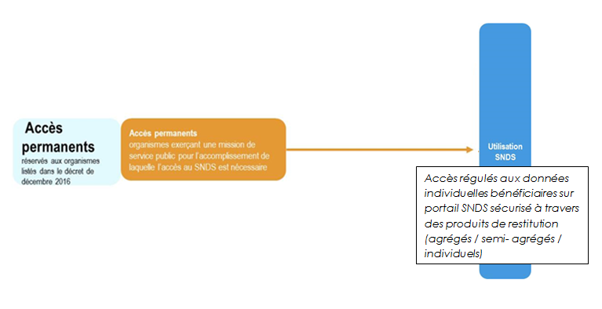

    * **Ou accès par projet**, à des fins de recherche, d’étude et d’évaluation d’intérêt public dans le domaine de la santé, pour les demandeurs publics et privés après autorisation de la CNIL : **accès à une partie du SNDS ou une extraction de données**.

### Liste des organismes habilités par décret à accéder au SNIIRAM/SNDS 
#### Quels produits et avec quel historique (accès pérenne)

| Organismes | Données agrégés et individuelles PS (Datamarts DAMIR, AMOS, SNIREP, via BO Webi) | Données individuelles bénéficiaires échantillonnées de consommation de soins (EGB/EGBS via SAS/Guide) | Données Individuelles bénéficiaires exhaustives de consommation de soins (DCIR/DCIRS, PMSI, Causes de décès via SAS Guide) ACCES | Profondeur d'historique |
|----|----|----|----|----|
|**ABM** Agence de biomédecine |	OUI |	OUI |	OUI |	19 ans +1 |
|**ANAP** Agence nationale d’appui à la performance des établissements de santé et médico-sociaux |	OUI |	OUI |	X |	X |
|**ANSM** Agence nationale de sécurité du médicament et des produits de santé |	OUI |	OUI |	OUI |	19 ans +1 |
|**ANSP** Agence nationale en sante publique |	OUI |	OUI |	OUI |	19 ans +1 |
|**AROMSA** Association régionale des organismes de MSA |	OUI |	OUI |	X |	X |
|**ARS** Agence régionale de santé |	OUI |	OUI |	OUI |	9 ans +1 |
|**ASN** Autorité de sûreté nucléaire |	OUI |	OUI |	X |	X |
|**ASSEMBLEE NATIONALE** |	OUI |	OUI |	OUI |	5 ans +1 |
|**ATIH** Agence technique de l'information sur l'hospitalisation |	OUI |	OUI |	OUI |	9 ans +1 |
|**CAMIEG** Caisse d’assurance maladie des industries électriques et gazières |	OUI |	OUI |	OUI |	5 ans +1 |
|**CANSSM** Caisse autonome nationale de la sécurité sociale dans les mines |	OUI |	OUI |	OUI |	5 ans +1 |
|**CARSAT** Alsace Moselle |	OUI |	OUI |	X |	X |
|**CAVIMAC** Caisse d'assurance vieillesse invalidité et maladie des cultes |	OUI |	OUI |	OUI |	5 ans +1 |
|**CCMSA** Caisse Centrale de la MSA |	OUI |	OUI |	OUI |	5 ans +1 |
|**CGSS** |	OUI |	OUI |	X |	X |
|**CHU** Centre hospitalier universitaire |	OUI |	OUI |	X |	X |
|**CLCC** Centre de lutte contre le cancer |	OUI |	OUI |	X |	X |
|**CNAM** Caisse Nationale d'Assurance Maladie |	OUI |	OUI |	OUI |	9 ans +1 |
|**CNMSS** Caisse nationale militaire de sécurité sociale |	OUI |	OUI |	OUI |	5 ans +1 |
|**CNSA** Caisse nationale de solidarité pour l'autonomie |	OUI |	OUI |	OUI |	9 ans +1 |
|**CPAM – DCGDR** |	OUI |	OUI |	OUI |	5 ans +1 |
|**CPAM non DCGDR** |	OUI |	OUI |	X |	X |
|**CRAMIF** |	OUI |	OUI |	X |	X |
|**CRPCEN** Caisse de retraite et de prévoyance des clercs et employés de notaires |	OUI |	OUI |	OUI |	5 ans +1 |
|**DRSM** |	OUI |	OUI |	OUI |	5 ans +1 |
|**EFS** Etablissement français du sang |	OUI |	OUI |	OUI |	19 ans +1 |
|**EHESP** Ecole des hautes études en santé publique |	OUI |	OUI |	X |	X |
|**ELSM (via DRSM)** |	OUI |	OUI |	X |	X |
|**ENIM** Etablissement national des invalides de la marine |	OUI |	OUI |	OUI |	5 ans +1 |
|**Fonds CMU** Fonds de financement de la Couverture Maladie Universelle |	OUI |	OUI |	X |	X |
|**HAS** Haute autorité de la sante |	OUI |	OUI |	OUI |	19 ans +1 |
|**HCAAM** Haut conseil pour l’avenir de l’assurance maladie |	OUI |	OUI |	X |	X |
|**INCA** Institut national du cancer |	OUI |	OUI |	OUI |	19 ans +1 |
|**INDS** (remplace IDS) Institut national des données de santé |	OUI |	OUI |	OUI |	5 ans +1 |
|**INED** Institut national d'études démographiques  |	OUI |	OUI |	OUI |	5 ans +1 |
|**INSERM** Institut national de la santé et de la recherche médicale |	OUI |	OUI |	X |	X |
|**IRDES** Institut de recherche et documentation en économie de la sante |	OUI |	OUI |	OUI |	9 ans +1 |
|**IRSN** Institut de radioprotection et de sûreté nucléaire  |	OUI |	OUI |	X |	X |
|**Ministère de l’Economie / DGT** Direction générale du trésor  |	OUI |	OUI |	OUI |	5 ans +1 |
|**Ministère des Finances / DB** Direction du Budget  |	OUI |	OUI |	X |	X |
|**Ministère de la Santé / DGOS** Direction générale de l'offre de soins |	OUI |	OUI |	OUI |	5 ans +1 |
|**Ministère de la Santé / DGS** Direction générale de la sante |	OUI |	OUI |	OUI |	5 ans +1 |
|**Ministère de la Santé / DREES** Direction de la recherche, des études, de l'évaluation et des statistiques |	OUI |	OUI |	OUI |	9 ans +1 | 
|**Ministère de la Santé / DSS** Direction de la sécurité sociale |	OUI |	OUI |	OUI |	5 ans +1 |
|**MSA** Mutualité sociale agricole |	OUI |	OUI |	X |	X |
|**OFDT** Observatoire français des drogues et toxicomanies |	OUI |	OUI |	X |	X |
|**Organismes RSI** |	OUI |	OUI |	X |	X |
|**ORS** Observatoire régional de la santé |	OUI |	OUI |	OUI |	5 ans +1 |
|**Port Autonome de Bordeaux** |	OUI |	OUI |	OUI |	5 ans +1 |
|**RATP** |	OUI |	OUI |	OUI |	5 ans +1 |
|**Sécurité Sociale des Indépendant**   |	OUI |	OUI |	OUI |	5 ans +1 |
|**Service de santé des armées** / Ministère de la défense |	OUI |	OUI |	OUI |	5 ans +1 |
|**SENAT** |	OUI |	OUI |	OUI |	5 ans +1 |
|**SLM** Section Locale Mutualiste |	OUI |	OUI |	X |	X |
|**SNCF** |	OUI |	OUI |	OUI |	5 ans +1 |
|**URPS** Union régionale des professionnels de santé |	OUI |	X |	X |	X |
|**Accès maintenu jusqu’au 16 septembre 2021 :** |
|**UNPS** Union nationale des professionnels de santé |	OUI |	OUI |	X |	X |
|**Accès maintenu jusqu’au 19 décembre 2021 :** |	
|**FFA** Fédération française de l’assurance |	OUI |	OUI |	X |	X |
|**FNMF** Fédération nationale de la mutualité française |	OUI |	OUI |	X |X |
|**UNOCAM** Union nationale des organismes d’assurance maladie complémentaire |	OUI |	OUI |	X |	X |

## Quelle est la sécurité au sein du SNDS ?

Le SNDS étant principalement constitué de données personnelles de santé, les traitements de données qui en sont issues doivent être strictement encadrés afin de protéger les libertés et droits fondamentaux des personnes. 
A ce titre, ces traitements sont soumis aux dispositions :

*  de la Loi Informatique et Libertés ;

*  du règlement européen sur la protection des données (à compter du 25 mai 2018) ;

*  du code de la santé publique.

La Commission Nationale de l'Informatique et des Libertés (CNIL) est chargée de surveiller l’application de ces textes. 
En cas de méconnaissance de leurs dispositions, les responsables de traitement peuvent faire l’objet de sanctions administratives importantes.

Conformément à la loi n° 2016-41 du 26 janvier 2016 de modernisation de notre système de santé, les accès aux données du SNDS doivent s’effectuer dans « des conditions assurant la confidentialité et l'intégrité des données et la traçabilité des accès et des autres traitements ». 
**Un référentiel précise ces conditions en édictant les règles de sécurité que tout système utilisant des données du SNDS se doit de mettre en place. 
Les modalités d’application de ce référentiel sont indiquées dans l’arrêté du 22 mars 2017.**

En premier lieu, la sécurité des données est garantie par l’obligation pour chaque gestionnaire de système de réaliser une analyse de risque. 
C’est cette analyse qui permet au gestionnaire de s’assurer que les données sont correctement protégées par des mesures de sécurité adéquates.

Le référentiel s’appuie notamment sur les mesures techniques et organisationnelles suivantes pour garantir la sécurité des traitements, en imposant :

*  **la pseudonymisation** : pour chaque individu, l’ensemble des informations permettant de facilement l’identifier (NIR, …) doit être remplacé par un pseudonyme, c’est-à-dire par un code alphanumérique irréversible ne permettant pas le rattachement à son identité ; La pseudonymisation systématique des données constitue une des mesures fondamentales du dispositif dans le but de conserver la confidentialité des données manipulées.

**La pseudonymisation des identifiants des patients ne rend pas les données du SNDS anonymes strictement ; le croisement de certaines variables, appelées « identifiants potentiels », peut permettre de ré-identifier les patients.** 
**Ce sont les données suivantes :**

1.  **Commune de résidence du bénéficiaire**
2.  **Année et mois de naissance**
3.  **Date de soins en jour, mois, année (et dérivés : date d’entrée, date de prescription …)**
4.  **Date de décès en jour, mois, année**
5.  **Commune de décès**

Ainsi, des **profils d’accès aux données ont été mis en place** afin de n’autoriser l’accès qu’à un seul identifiant potentiel à la fois **selon les autorisations décrites dans le décret**.

*  **l’authentification** : elle permet d’une part de contrôler les accès et d’autre part d’imputer les actions effectuées sur le système à une personne désignée. Une authentification forte sur le portail SNDS sera donc mise en place dès mars 2019 à travers la concaténation d’au moins deux facteurs d’authentification ; 

*  **la traçabilité** : l’ensemble des événements relatifs à la sécurité du système doit être tracé. Cette traçabilité (entrées, sorties, utilisateurs….) permet de contrôler l’utilisation de données et de disposer de preuves pouvant être instruites en justice ;

*  **le contrôle** : il permet de s’assurer d’une utilisation des données conforme à la loi et au référentiel. Effectué a posteriori par le biais d’audits, de la revue annuelle des habilitations et de contrôles de la CNIL a posteriori, il est notamment rendu possible par l’utilisation conjointe de la traçabilité et de l’authentification. En cas de non-respect des conditions d’utilisation des données, des sanctions adéquates peuvent être prononcées, notamment la suspension de l’accès aux données pour tout l’organisme.

*  **la sensibilisation et la formation des utilisateurs**  avec la mise en place d’un dispositif de formation aux données, certains modules rendus obligatoires, notamment ceux présentant le référentiel de sécurité du SNDS ainsi que ceux permettant l’accès aux données individuelles bénéficiaires (Cf fiche 6 : Quels sont les différents parcours de formation ?).

*  **Les Conditions Générales d’Utilisation** (CGU) qui formalisent l’engagement individuel au respect des conditions d’accès aux données doivent être signées en ligne dès la première utilisation du portail SNDS (Cf. fiche 4 : Quelles sont les conditions d’ouverture d’un compte ?).

En plus de ces règles spécifiques, les traitements de données du SNDS sont soumis à l’ensemble des référentiels généraux applicables aux systèmes d’information du Ministère des Affaires sociales et de la santé, à savoir : la Politique Générale de Sécurité des Systèmes d’Information en Santé (PGSSI-S), la Politique de Sécurité des Systèmes d’Information pour les ministères chargés des affaires sociales (PSSI MCAS), et le Référentiel Général de Sécurité (RGS).

## Quelles sont les conditions d’ouverture d’un compte ?

**- Pour obtenir l’ouverture d’un compte SNDS, l’utilisateur doit avoir suivi les formations pré-requises** préalablement à l’attribution de droits d’accès aux données du SNDS :

*  Le module « **Architecture et données du SNDS** » pour les utilisateurs ayant un accès permanent est un prérequis obligatoire pour être habilité à accéder aux données du SNDS sur le portail SNDS. 

*  Les modules « **DCIRS-DCIR** » et « **EGBS** », deux produits de restitution de données de consommation individuelles bénéficiaires exhaustives ou échantillonnées, nécessitent également d’avoir suivi les formations associées pour accéder à ces données du SNDS.

**- L’utilisateur doit ensuite effectuer une demande d’ouverture de compte SNDS par l’intermédiaire de l’Autorité d’Enregistrement (AE) de son organisme ou l’Autorité d’Enregistrement déléguée (AEd)** ; la création de compte ne s’effectue pas automatiquement après avoir participé à la formation. 
L’utilisateur doit être habilité nominativement par l’AE ou AEd de son organisme.

**- L’utilisateur doit signer les Conditions Générales d’Utilisation** (CGU) du SNDS, à la première connexion au portail d’accès aux données, qui formalisent : 

*  l’engagement individuel de l’utilisateur au respect des conditions d’accès aux données :
- le respect des finalités d’utilisation autorisées et interdites du SNDS,
- l’absence d’action visant la ré-identification,
- l’obligation de ne diffuser que des données anonymes,
- l’engagement du respect du référentiel de sécurité.

*  les conditions d’utilisation du portail et des services associés :

L’utilisateur a interdiction d’exporter hors portail SNDS des données non anonymes du SNDS : Il ne doit pas être possible, à partir des données, de déduire ou revenir à une information personnelle sur un individu. 

L’utilisateur est informé que ses actions font l’objet de traces qui seront exploitées pour détecter tout comportement considéré comme anormal (dont non respect des engagements pris).

Une personne n’ayant pas signé les CGU ne pourra pas techniquement accéder aux services du portail et donc aux données du SNDS.

**- L’utilisateur doit utiliser les données du SNDS dans un cadre sécurisé** qui respecte le référentiel de sécurité, dans le portail ou dans un système fils.

## Quels sont les rôles de l’Autorité d’Enregistrement et de l’Autorité d’Enregistrement déléguée ?

Pour chaque organisme, le décret indique **le responsable habilité à délivrer des accès nominatifs aux données** : il s’agit de **l’Autorité d’Enregistrement** (AE) pour le SNDS. 
Il est **responsable** de toute action faite par un utilisateur du SNDS sur les données, y compris de supprimer les accès si les conditions d’utilisation ne sont pas conformes.

**Son rôle** :

*  **Il demande l’ouverture d’un compte pour les utilisateurs de son organisme** ; 
Conformément au référentiel de sécurité SNDS, il est obligatoire de renseigner une date de fin de droits pour chaque compte SNDS, cohérente avec les missions des collaborateurs. 
Cet accès se formalise par un N° de profil de connexion au portail donnant un accès précis à un périmètre de données (profondeur d’historique notamment)  selon les organismes et selon la nature des données (Cf fiche 7 : Quelles sont les modalités de connexion sur le portail ?). Il y a 3 grandes catégories de profils :

    * profils dédiés à l’interrogation des produits agrégés et semi-agrégés,

    * profils dédiés à l’interrogation des produits contenant des données individuelles bénéficiaires échantillonnées,

    * profils dédiés à l’interrogation des produits contenant des données individuelles bénéficiaires exhaustives.

*  **Il demande les modifications de droits associés aux comptes des utilisateurs de son organisme.**

*  **Il demande la clôture des comptes des utilisateurs ayant quitté l’organisme ou dont les missions ne justifient plus un accès au SNDS.**

Il doit procéder régulièrement à des revues d’habilitations.

Il peut déléguer ses pouvoirs à une ou deux **Autorités d’Enregistrement Déléguées** (AEd) du SNDS.

Pour effectuer les opérations afférentes à un compte SNDS, l’AE (ou AEd) dispose d’une **application internet nommée AUCAS à laquelle elle peut accéder grâce à une carte sécurisée** (à l’exception des AE des organismes locaux des régimes qui effectuent les demandes via bordereau papier).

Le gestionnaire de sécurité à Evreux traitera la demande après vérification des pré-requis de formations pour l’utilisateur.

Une fois le compte créé, le gestionnaire des habilitations adresse à l’AE ou l’AEd à l’origine de la demande une calculette associée au nouveau compte créé. 
Au retour de la feuille d’émargement, la calculette est activée et l’utilisateur est informé par messagerie (copie AE), de son identifiant de connexion au portail SNIIRAM / SNDS. 

## Quel est le parcours de formation ?

Dans le cadre de l’accès aux données du SNDS, au titre d’un accès permanent défini par le décret 2016-1887, un schéma de formations a été mis en place par la Cnam, au travers de plusieurs modules indispensables.

### Parcours de formation pour les utilisateurs ayant un accès permanent aux SNDS

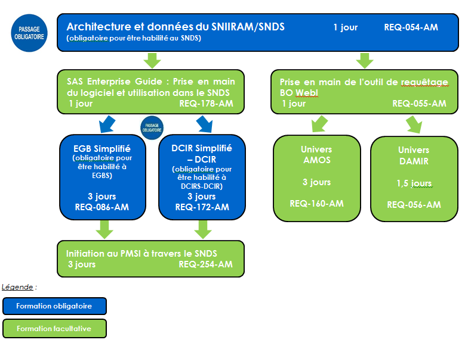

Pour être habilité à consulter les données du SNDS sur le portail, le futur utilisateur doit obligatoirement suivre le module de formation “Architecture et données du SNIIRAM/SNDS” (réf. Institut 4.10 REQ-054-AM).
Il est, d’autre part, obligatoire de suivre les formations « DCIR Simplifié/DCIR » (réf. Institut 4.10 REQ-172-AM) et/ou « EGB Simplifié » (réf. Institut 4.10 REQ-086-AM) avant de demander des habilitations pour consulter les données du DCIRS/DCIR et/ou de l’EGB.

Les formations se déroulent en partenariat avec l’Institut 4.10, sur les sites de Paris, Lyon et Tours. 
Pour choisir les formations et connaitre les modalités d’inscription l’utilisateur doit consulter le fichier «Formations SNIIRAM/SNDS – Planning et descriptif - version Jour Mois Année » situé sur l’accueil du portail SNDS ou consulter le planning directement [le site de l’Institut 4.10.](https://catalogue-quatredix.valsoftware.cloud/CATALOGUE/default.aspx) 

A la suite à sa formation, l’utilisateur doit faire une demande d’ouverture de compte auprès de son AE. 

## Quelles sont les modalités de connexion sur le portail ?

*  Une fois habilité par l’AE, l’utilisateur dispose d’un compte identifiant qui est transmis par messagerie et une calculette qui lui est adressée par courrier. 
Ces éléments sont personnels et ne doivent pas être utilisés par un tiers.

*  Les droits d’un utilisateur sur les données du SNDS se traduisent par un numéro de profil de connexion au portail, tels qu’ils sont demandés par l’AE. 
Ce numéro de profil correspond à l’accès à un périmètre de données, selon les droits des organismes spécifiés dans le décret SNDS et la nature des données (profondeur d’historique, identifiants potentiels,…).

*  L’adresse URL du portail est la suivante : 

    * pour les partenaires de l’assurance maladie : https://portail.sniiram.ameli.fr 
    * pour le réseau de l’assurance maladie: https://portail.sniiram.ramage

*  Les différents produits de restitutions des données SNDS sont interrogeables pour certains via des datamarts accessibles sous le logiciel BO Webi (Onglet TABLEAUX ET REQUETES) et pour d’autres via des tables accessibles par SAS guide (onglet STATISTIQUES) 

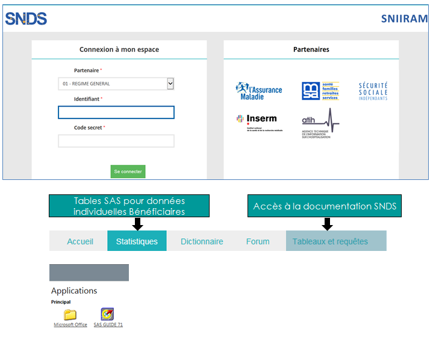

*  Le guide d’utilisation du portail et la procédure d’installation de certains modules (certificats, citrix) est disponible sur l’accueil du portail.

### Liste des produits de restitution selon le niveau d’agrégation et outil d’interrogation.

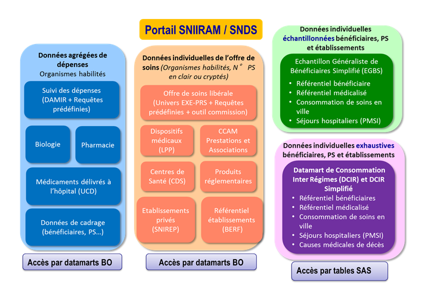

## Comment accéder à un espace projet SAS ? et gérer un espace personnel SAS sur le portail SNDS ?

*  **L’espace projet SAS** est un espace commun à plusieurs utilisateurs du SNDS. 
Cet espace vous permet de **partager des tables SAS, des programmes,… pour effectuer un travail en collaboration**. 
Cet espace projet est temporaire et généralement dédié à un seul profil.

Pour demander la création d’un espace projet SAS, le responsable du projet doit remplir le formulaire «Gestion des espaces projet SAS » qui sera adressé sur simple demande à la boîte aux lettres : suivi.moise.cnam@assurance-maladie.fr ou que vous trouverez sur la Documentation du portail SNDS.

::: warning Attention 
**Pour votre information**

*  L’espace projet porte un nom de projet fonctionnel, et un nom court sur 5 caractères. 
*  Le format du nom de la librairie associée est « LIB+ (Nom court) » et le format du nom du répertoire associé est « REP+ (Nom court) ».
*  A la création de l’espace projet, la liste des comptes et profils habilités avec le droit (R pour lecture ou W pour écriture) doit être fournie. Si cette liste est vide ou contient moins de 2 utilisateurs, l’espace n’est pas créé.
*  Il est possible de demander de nouveaux accès par la suite mais il est impossible d’ajouter des membres si l’espace projet est échu.
*  L’espace projet est créé à la taille demandée dans la mesure de la place disponible, il est ensuite possible de le réduire ou de l’étendre.

:::

A tout moment, la durée et la taille de l’espace projet peuvent être modifié. 
Enfin, l’espace projet peut être fermé, s’il n’est plus utilisé ou si la date d’échéance est atteinte.

Pour être habilité à cet espace projet, l’utilisateur doit se rapprocher du responsable du projet qui effectue une demande en remplissant le formulaire « Gestion des accès utilisateurs à un espace projet SAS »  et remplir le formulaire «Gestion des espaces projet SAS » qui sera adressé sur simple demande à la boîte aux lettres : suivi.moise.cnam@assurance-maladie.fr.

L’utilisateur de l’espace projet doit s’engager à n’y stocker que des données en lien avec le projet, à respecter les durées légales de conservation des données du SNDS stockées dans cet espace, à supprimer les données dès la fin du projet.

Son responsable hiérarchique s’engage à informer le responsable de l’espace projet de tout changement de fonction impactant l’accès à cet espace projet.

*  Lors de la création d’un compte sur le portail SNDS autorisant un accès aux données SAS, **l’espace personnel SAS** situé sur le répertoire SASDATA1est délimité par un quota ; le quota attribué par défaut est de 1Go. 
Les paliers suivants sont : 50Go, 100Go, 150Go, 200Go, et 300Go. Au-delà de 100 Go, la Cnam doit valider la demande d’augmentation.

::: warning Attention 
**Avant toute demande d’augmentation de quota, avez-vous pensé à** :

*  supprimer des objets inutiles dans votre espace,

*  compresser les tables et ajustement des tables (champs et données) selon votre besoin,

*  demander de sauvegarder de tables car vous aurez la possibilité de les restaurer sur demande.

:::

Pour changer de quota, la demande doit être saisie directement via le portail du Support National PSN : www.support-national.cnamts.fr, sur l’application « SNIIRAM-SAS » avec l’intitulé « Extension d’espace personnel SAS» ou bien en faire la demande à l’adresse support-national@assurance-maladie.fr.

## Comment partager des tables SAS entre utilisateurs de profils différents sur le portail SNDS ?

**La bibliothèque DEPOT permet aux utilisateurs de partager des tables SAS entre profils différents.**

Le transfert de tables est soumis à un contrôle réalisé par la Cnam. 
Ce contrôle s’assure que le transfert des données échangées entre profils est autorisé, si les droits entre les profils sont différents.

*  **Quelle est la procédure pour déposer les tables SAS ?**

1-	Le demandeur dépose la ou les tables SAS dans la bibliothèque DEPOT sur le portail SNDS.

2-	Le demandeur adresse à la boîte aux lettres : **suivi.moise.cnam@assurance-maladie.fr**, le formulaire « SNDS : Bordereau de demande - Gestion transfert de tables via DEPOT » disponible sur le portail, dans lequel il précise des informations sur le demandeur et le destinataire, ainsi que les caractéristiques de la table (profil, données sensibles, PS en clair, périmètre des données, …) accompagné du message type suivant renseigné :

*Exemple de message type attendu :*

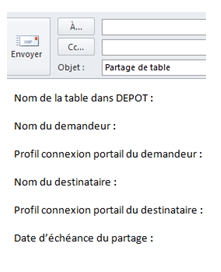

*  **Comment récupérer les tables SAS ?**

*Si le contrôle est conforme :*

1-	La Cnam dépose la ou les tables SAS dans la bibliothèque PRFINT dans le profil demandé.

2-	La Cnam en informe le demandeur via un courriel.

3-	Le destinataire va chercher la ou les tables SAS déposées dans PRFINT.

4-	Le destinataire copie la ou les tables SAS dans son espace personnel SASDATA1.

5-	Le destinataire informe le demandeur que les fichiers ont été récupérés et qu’ils peuvent être supprimés.

*Si le contrôle n’est pas conforme :*

La Cnam revient vers le demandeur pour correction de la ou les tables SAS

Dans le cas d’un partage vers le profil externe, la table sera mise à disposition du destinataire dans la bibliothèque PRFEXT.

## Quelles données du SNDS peuvent être exportées et importées ?

**Le référentiel de sécurité du SNDS impose l’interdiction de :**

*  **Exporter des données individuelles bénéficiaires et Professionnel de Santé non anonymes du portail SNDS** 

→	Le Référentiel Sécurité impose de ne pas de sortir de données tant que l’on n’a pas la certitude qu’elles sont anonymes c’est à dire qu’il ne doit pas être possible à partir de ces données de déduire une information personnelle sur un individu, bénéficiaire ou professionnel de santé.

::: warning Attention
**Quelques bonnes pratiques :**

1. ne pas restituer de petits effectifs,

2. une information de santé sur un individu ne doit pas pouvoir être déduite à partir d'autres attributs, en particulier les données médicales (ALD, CIM10, GHS …)

3. **ne pas sortir les identifiants potentiels (le croisement des identifiants potentiels peut permettre de ré-identifier un individu)** 

4. **ne pas sortir d’identifiants bénéficiaires ou professionnels de santé. 
Pour ces derniers**, l’export n’est pas autorisé même avec un identifiant Professionnel de Santé crypté.

:::

*  **Importer dans le portail SNDS des données potentiellement identifiantes**

→	L’import de données dans le portail SNIIRAM/SNDS n’est autorisé que pour des données anonymes.

→	En cas de besoin d’import de données non anonymes (par exemple ajout de données d’une cohorte), une autorisation CNIL est nécessaire.

**Une exigence de traçabilité de ces actions d’import / export de données permet d’identifier et d’agir contre les comportements frauduleux.**

Aussi, l’utilisateur doit-il changer ses habitudes de travail et traiter les données de détail dans le portail SNDS, puis exporter du portail des données agrégées.
Par ailleurs, pour éviter les imports des mêmes tables par de nombreux utilisateurs, une mise à disposition de tables dans RFCOMMUN est possible (si vous souhaitez mutualiser des tables utiles à tous les utilisateurs, contacter nous par mail : snds.cnam@assurance-maladie.fr)

**Une solution d’import/export est proposée sur le portail** dans la rubrique « Téléchargement des fichiers dans le répertoire Download » de l’onglet `STATISTIQUE` du portail SNDS avec création d’un encart dédié. 

### Téléchargement des fichiers

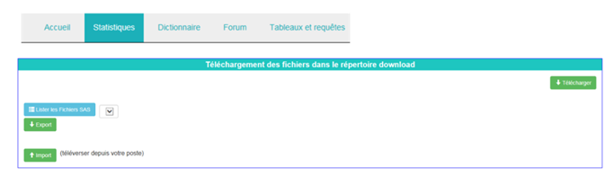

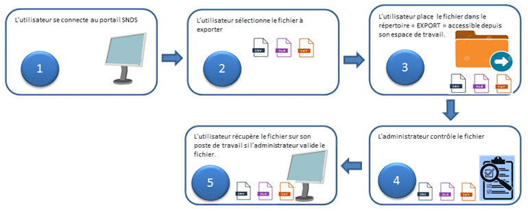

## Comment le Délégué à la Protection des Données doit-il remplir le document décrivant les caractéristiques des traitements portant sur des données individuelles ?

Conformément à l’arrêté du 6 avril 2017, un document-type est porté en modèle afin que le **Délégué à la Protection des Données** (DPD), présent dans chaque organisme, puisse **tenir un registre précisant les caractéristiques des traitements portant sur des données individuelles du SNDS**.
Le DPD doit veiller à la **traçabilité** des traitements réalisés par la tenue de ces registres (enregistrement des utilisateurs, des projets).

Ce dernier doit comporter a minima les informations suivantes, sur l’utilisation des données individuelles bénéficiaires, professionnels de santé ou établissements ainsi que les identifiants potentiels utilisés et pourra faire l’objet d’un contrôle par la CNIL :

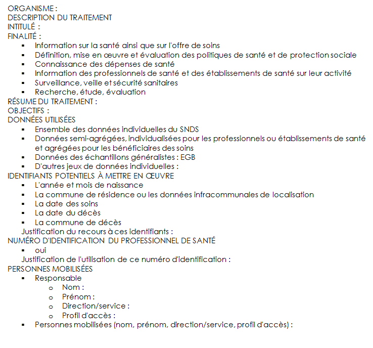

## Quel accompagnement autour du SNDS ? 

La CNAM propose le dispositif d’accompagnement suivant en se connectant sur le portail SNDS et en se référant aux différents onglets et espaces. 
L’ensemble des profils permet d’interroger la documentation.

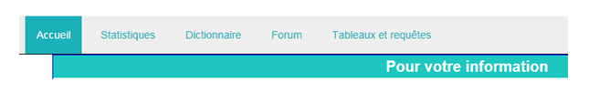

### Le Support

Pour exploiter les données du SNDS, le support aux utilisateurs est différent selon qu’il s’agit d’une aide fonctionnelle ou technique.

::: warning Attention
1.	**S’il s’agit d’un besoin d’aide fonctionnelle** (sur la donnée, le contenu des bases, l’explication d’une méthode, d’une requête)

:::

::: tip Note
L’onglet `FORUM` propose des **forums sur chaque produit du SNDS** (DCIR-PMSI, EGB, datamarts AMOS, DAMIR…) ; ils permettent aux utilisateurs de trouver des réponses à leurs interrogations, d’échanger sur **un sujet d’ordre fonctionnel avec la communauté des utilisateurs.** 

Des experts-métiers y répondent également. 
Ces forums sont accessibles en se connectant sur le portail du SNDS, quel que soit le profil.

:::

::: warning Attention

2.	**Si la question de l’utilisateur porte sur un problème technique d’accès aux données, ou une suspicion d’anomalie des données**

:::

::: tip Note

Le [`Portail du Support National`](https://portail.sniiram.ramage/vpn/index.html) pour le régime général de l’assurance maladie ou **le mail** support-national@assurance-maladie.fr pour les partenaires et organismes des autres régimes d’assurance maladie permet de déposer **un Ticket de support**.
L’objet du message doit impérativement comporter les mots « *Création de demande – SNIIRAM/SNDS – Suivi du nom du produit* » car un automate traite dans un premier temps les messages reçus. 
Il est indispensable de préciser dans le corps du message son identifiant, son organisme, région et profil de connexion, le produit SNDS exploité. 
Un modèle de mail est proposé sur la page d’accueil du portail dans la rubrique « Pour votre Information ».

:::

::: warning Attention

3.	Par ailleurs pour toutes questions **sur les formations ou la procédure d’obtention d’une habilitation**, vous pouvez écrire sur la boite aux lettres générique : 
**snds.cnam@assurance-maladie.fr**

:::

### La Documentation du portail

1.	L’onglet `DICTIONNAIRE` **vous permet d’ouvrir le Dictionnaire des données du SNDS en version WEB et d’interroger les informations et définition sur la donnée par produit, table ou variable.**

2.	Vous retrouverez toute la **‘documentation essentielle’ sur la page d’accueil du portail**, dans la rubrique `POUR VOTRE INFORMATION`, entre autres : 

*  **Le catalogue offre de service d’accompagnement** qui résume tout l’accompagnement proposé autour des produits du SNIIRAM/SNDS : formations et comités utilisateurs, selon le profil des utilisateurs et les objectifs suivis.

*  **Le planning des formations**

*  **Le récapitulatif des anomalies recensées** sur les produits de restitution du SNIIRAM/SNDS et leur statut de résolution.

*  **Les titres des principales actualités** (communiqués) des 2 derniers mois sont positionnés pour une 1ère information rapide.

*  **Les bonnes pratiques SAS et BO**.

*  Et **divers documents d’actualité forte** (par exemple évolutions dues à la mise en œuvre du référentiel sécurité, nouvelle version de SAS,…)

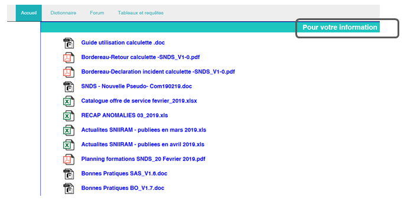

3.	En cliquant sur l’onglet `TABLEAUX ET REQUETES`, vous accédez à une **arborescence de documentations insérées dans Business Object**.

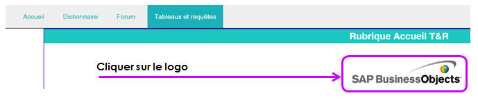

**La documentation est détaillée dans l’arborescence :**
Dossiers publics / SNIIRAM / _Documentation SNIIRAM

| Dans ces dossiers | Vous trouverez | 
|----|----|
|Actualités SNIIRAM-SNDS |	Tous les communiqués généraux d’information sur le SNIIRAM (nouveau produit, alerte sur une anomalie, …) |
Cartographie |	La méthodologie, la description des tables disponibles sur ORAVUE |
DCIR - DCIR simplifié |	Toute la documentation relative aux applications DCIR et DCIR simplifié : les informations, la liste des variables par table, les supports de formation et des comités utilisateurs, le niveau de chargement, les profils pour accéder à DCIR-DCIRS, la liste des données sensibles et médicales dans DCIR-DCIRS et une bibliothèque de requêtes. Vous y trouverez également la FAQ DCIR-PMSI*. |
Documentation |	Toute la documentation générale du SNIIRAM-SNDS : la liste et objectifs des produits de restitution, le Kwikly ‘K’atalgue des données du SNDS, les diaporamas des différents comités utilisateurs et amphis SNDS, la FAQ des datamarts BO*, les règles de gestion de la statistique mensuelle, la nomenclature des variables SNIIRAM, les profils pour accéder au portail/produits, les textes officiels  SNIIRAM-SNDS, les mises en œuvre du référentiel sécurité… |
EGB	| Toute la documentation relative à l’EGB et aux tables simplifiées de l’EGB : les informations spécifiques, la liste des variables par table, la documentation pour les tables du PMSI et BGNA intégrées, le niveau de chargement, les profils pour accéder à l’EGB, la liste des données sensibles et médicales dans l’EGB. Vous y trouverez également la FAQ EGB*. |
Formation |	Le planning des formations SNIIRAM / SNDS et les supports de cours et exercices des formations SNIIRAM / SNDS |
Manuels utilisateurs |	les manuels utilisateurs de tous les produits SNIIRAM / SNDS en dehors de DCIR, DCIR simplifié, EGB et PMSI (par exemple dénombrement des bénéficiaires et PS, tables EHPAD, les Causes médicales de décès tout récemment…) |
Offre de service |	Le fichier informant du niveau de chargement des produits agrégés bénéficiaires accessibles via BO WebI. |
PMSI |	Toute la documentation relative aux tables du PMSI : liste des variables, liste des profils pour y accéder, liste des données médicales et sensibles dans le PMSI…. |
	
*Les foires aux questions permettent de récapituler les demandes d’assistance

### La Documentation sous ameli réseau

Dans l’intranet de la CNAM, vous trouverez toute la documentation présente sur le portail SNDS : 

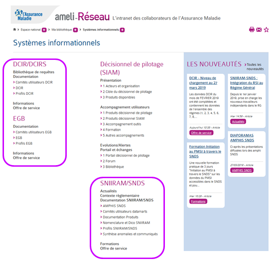

### La documentation collaborative du Health Data Hub 

Le [site public collaboratif du Health Data Hub](https://documentation-snds.health-data-hub.fr) met à disposition des utilisateurs de la documentation alimentée par des contributeurs qui utilisent la technologie du GitHub. 
  

